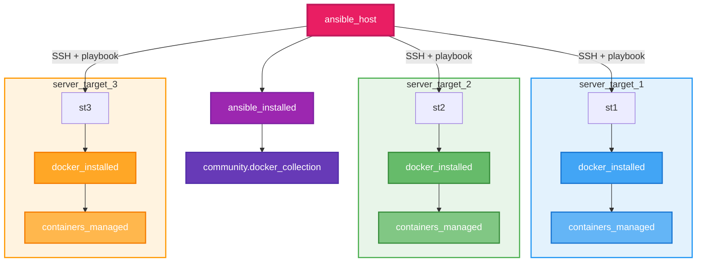
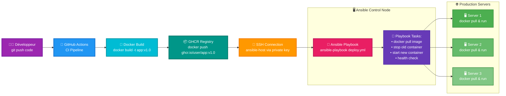

```mermaid
flowchart LR
    dev["👨‍💻 Développeur<br/>git push code"]
    ci["🦊 GitLab CI/CD<br/>Pipeline Runner"]
    img["🐳 Docker Build<br/>docker build -t app:latest"]
    reg["📦 GitLab Registry<br/>registry.gitlab.com/project/app"]
    webhook["🔔 Webhook/SSH<br/>Trigger deployment"]
    ans["🎯 Ansible Execution<br/>ansible-playbook site.yml"]
    
    dev --> ci
    ci --> img
    img --> reg
    reg --> webhook
    webhook --> ans

    subgraph "🖥️ Ansible Control Node"
        ans --> inventory["📋 Inventory Check<br/>• production servers<br/>• staging servers"]
        inventory --> tasks["📄 Deployment Tasks:<br/>• login to registry<br/>• pull new image<br/>• rolling update<br/>• rollback if failed"]
    end

    subgraph "🌐 Target Infrastructure"
        prod1["🖥️ Production 1<br/>app:latest running"]
        prod2["🖥️ Production 2<br/>app:latest running"]
        stage1["🔧 Staging<br/>testing environment"]
    end

    tasks --> stage1
    stage1 --> prod1
    stage1 --> prod2
    
    subgraph "📊 Monitoring"
        health["❤️ Health Checks<br/>• container status<br/>• application metrics<br/>• logs monitoring"]
    end
    
    prod1 --> health
    prod2 --> health

    style dev fill:#9c27b0,stroke:#7b1fa2,stroke-width:3px,color:#fff
    style ci fill:#fc6d26,stroke:#e24329,stroke-width:3px,color:#fff
    style img fill:#00bcd4,stroke:#0097a7,stroke-width:3px,color:#fff
    style reg fill:#fc6d26,stroke:#e24329,stroke-width:3px,color:#fff
    style webhook fill:#ff9800,stroke:#f57c00,stroke-width:3px,color:#fff
    style ans fill:#e91e63,stroke:#c2185b,stroke-width:3px,color:#fff
    style inventory fill:#673ab7,stroke:#512da8,stroke-width:2px,color:#fff
    style tasks fill:#3f51b5,stroke:#303f9f,stroke-width:2px,color:#fff
    style prod1 fill:#4caf50,stroke:#388e3c,stroke-width:2px,color:#fff
    style prod2 fill:#66bb6a,stroke:#388e3c,stroke-width:2px,color:#fff
    style stage1 fill:#ffeb3b,stroke:#fbc02d,stroke-width:2px,color:#000
    style health fill:#f44336,stroke:#d32f2f,stroke-width:2px,color:#fff
```

<a name="intro-ansible" id="intro-ansible"></a>

# Module 1 : Introduction à Ansible

---

# Ansible - Automatisation Infrastructure 🎯

### Infrastructure as Code moderne et simple

Ansible est l'outil d'automatisation de référence : **sans agent, idempotent, déclaratif**.

> l'idempotence signifie qu'une opération a le même effet qu'on l'applique une ou plusieurs fois.

---

# Ansible - Perfect pour Docker

### Pourquoi Ansible + Docker ?

Parfait pour orchestrer Docker et automatiser l'infrastructure.

Exemple concret : Automatiser le déploiement d’une app Dockerisée sur plusieurs serveurs en une seule commande, sans se connecter manuellement à chaque machine, pour installer Docker, copier le code, builder l’image, lancer le conteneur, et gérer les mises à jour ou redémarrages.

---

# Pourquoi Ansible ? 💡

### Les avantages clés

🎯 **Simple** : Configuration YAML lisible

🔄 **Idempotent** : Même résultat à chaque exécution

🚀 **Sans agent** : SSH/WinRM/API uniquement

---

# Pourquoi Ansible ? (suite) 💡

### Plus d'avantages

📈 **Scalable** : De 1 à 10,000+ serveurs

🔒 **Sécurisé** : Utilise vos connexions existantes

---
layout: new-section
routeAlias: 'installation-setup'
---

<a name="installation-setup" id="installation-setup"></a>

# Module 2 : Installation et Setup 2026

---

# Installation et setup 2026 ⚙️

### Installation rapide

```bash
# Installation via pip (recommandé)
python3 -m pip install --user ansible
# Collections essentielles
# community.general : collection avec plein de modules pour gérer fichiers, paquets, services, réseau, clouds, etc.
# ansible.posix : modules spécifiques POSIX/Linux comme gestion utilisateurs, groupes, permissions, tâches cron, commandes système.
# ansible.windows : modules spécifiques Windows comme gestion services, tâches planifiées, partage de fichiers.
ansible-galaxy collection install community.general ansible.posix
# Vérification
ansible --version
```

> Si vous avez : Nothing to do. All requested collections are already installed. If you want to reinstall them, consider using `--force`.

<br/>

> Cela veut dire que vous avez déjà installé les collections ou que vous avez déjà installé ansible qui les comporte maintenant par défaut.

---

# Installation Windows

```bash
# Si Windows et pas de python :
# Installer python via chocolatey
choco install python
# Installer ansible via pip
python3 -m pip install --user ansible
# Vérification
ansible --version
```

---

# Solution environnement virtuel

Si vous avez un problème d'installation, voici une solution :

> Sur python 3 vous devez mettre en place un venv :

```bash
python3 -m venv .venv
source .venv/bin/activate
pip3 install ansible
```

> Cela créer un environnement virtuel avec ansible installé dedans. (mode sandbox par défaut de python 3 pour ne pas polluer votre environnement global)

---

# Fonctionnement d'Ansible

Pour bien comprendre schématiquement le fonctionnement d'ansible, voici un schéma :



---

Vous pouvez avoir plusieurs buts à l'utilisation d'ansible :

- Vous voulez automatiser des tâches répétitives (installation de paquets, configuration de services, etc.)
- Vous voulez déployer des applications sur plusieurs serveurs
- Vous voulez configurer des serveurs de manière uniforme
- Vous voulez gérer des secrets de manière sécurisée

---
layout: new-section
routeAlias: 'ci-cd-integration'
---

<a name="ci-cd-integration" id="ci-cd-integration"></a>

# Module 3 : Intégration CI/CD

---

# Intégration d’Ansible dans un workflow CI/CD

## Option 1 — Utilisation avec GitHub Actions

<br/>

> Il est tout à fait possible d’intégrer Ansible dans un pipeline GitHub Actions afin d’automatiser le déploiement à chaque git push.
Deux approches sont possibles :

- Exécution distante : GitHub Actions peut se connecter en SSH à un serveur (via une clé privée stockée dans les secrets) pour exécuter un ansible-playbook depuis ce serveur.
- Runner auto-hébergé : Vous pouvez utiliser un runner GitHub hébergé sur un serveur interne, avec Ansible installé, afin de lancer localement les déploiements via les playbooks.

>💡 Attention : dans ce modèle, Ansible ne copie pas directement le code applicatif. Le code est packagé dans une image Docker (via GitHub Actions), poussée vers un registry (comme GHCR), puis Ansible se charge uniquement de récupérer et d’exécuter cette image sur les serveurs cibles (docker pull, docker_container…).

---



---

## 🧩 Option 2 — Intégration avec GitLab CI/CD

GitLab permet un fonctionnement similaire :

- Le pipeline CI build l’image Docker de votre application.
- Cette image est poussée automatiquement vers le GitLab Container Registry.
- Ensuite, plusieurs options sont possibles :
- Exécution Ansible depuis le pipeline, si le runner dispose d’Ansible.
- Connexion SSH à un hôte distant pour exécuter un playbook.

- Déclenchement via webhook d’un outil externe tel que Jenkins, qui se chargera lui-même de lancer Ansible.

---



---
layout: new-section
routeAlias: 'inventaires'
---

<a name="inventaires" id="inventaires"></a>

# Module 4 : Inventaires et serveurs

---

# Qu'est-ce qu'un Inventaire ? 📋

### Le carnet d'adresses de vos serveurs

L'**inventaire** est un fichier qui liste tous vos serveurs et leurs informations :

- 📍 **Adresses IP** : Où sont vos serveurs

- 👥 **Groupes** : Organiser par fonction (web, base de données...)

- ⚙️ **Variables** : Configuration spécifique à chaque serveur

- 🔑 **Connexion** : Comment se connecter (utilisateur, clés SSH...)

**Analogie** : C'est comme un carnet d'adresses pour vos serveurs !

---

# Inventaire : Définir vos serveurs 📋

```yaml
# inventory/hosts.yml - Fichier d'inventaire principal
all:  # Groupe racine qui contient TOUS les serveurs
  vars:  # Variables globales applicables à tous les serveurs
    ansible_user: ubuntu  # Utilisateur par défaut pour se connecter via SSH
    ansible_python_interpreter: /usr/bin/python3  # Chemin vers Python sur les serveurs cibles

  children:  # Sous-groupes organisés par fonction
    docker_hosts:  # Groupe des serveurs qui hébergent Docker
      hosts:  # Liste des serveurs dans ce groupe
        docker-01: {ansible_host: 10.0.1.10}  # Nom logique : adresse IP réelle
        docker-02: {ansible_host: 10.0.1.11}  # Deuxième serveur Docker

    databases:  # Groupe des serveurs de base de données
      hosts:  # Serveurs de BDD
        db-01: {ansible_host: 10.0.1.20}  # Serveur de base de données principal

    webservers:  # Groupe des serveurs web (déclaration vide ici)
databases:  # Redéfinition du groupe databases (peut créer confusion)
  hosts:  # Liste des serveurs de BDD
    db-01: {ansible_host: 10.0.1.20}  # Même serveur que plus haut

webservers:  # Définition du groupe webservers
  hosts:  # Serveurs web avec notation de plage
    web-[01:03]:  # Notation de plage : génère web-01, web-02, web-03
      ansible_host: 10.0.1.30  # IP de base (sera incrémentée)
```

**💡 Note** : La notation `[01:03]` est une fonctionnalité Ansible pour générer plusieurs hôtes automatiquement.

---

# 📝 Notation de plage expliquée

### Générer plusieurs serveurs automatiquement

**Syntaxe** : `nom-[debut:fin]`

```yaml
# Exemple 1 : Notation numérique
webservers:
  hosts:
    web-[01:03]:  # Génère : web-01, web-02, web-03
      ansible_host: 10.0.1.10

# Résultat équivalent :
webservers:
  hosts:
    web-01: {ansible_host: 10.0.1.10}
    web-02: {ansible_host: 10.0.1.10}
    web-03: {ansible_host: 10.0.1.10}
```

---

# 📝 Notation de plage expliquée (suite)

### Avec des IPs différentes

```yaml
# Pour des IPs différentes, il faut les définir explicitement
webservers:
  hosts:
    web-01: {ansible_host: 10.0.1.31}
    web-02: {ansible_host: 10.0.1.32}
    web-03: {ansible_host: 10.0.1.33}

# Ou avec des variables d'inventaire
webservers:
  hosts:
    web-01:
      ansible_host: 10.0.1.31
      server_id: 1
    web-02:
      ansible_host: 10.0.1.32
      server_id: 2
    web-03:
      ansible_host: 10.0.1.33
      server_id: 3
```

---

# 📝 Notation de plage : Cas d'usage

### Quand l'utiliser ?

**✅ Bon usage** : Serveurs avec configuration identique
```yaml
docker_nodes:
  hosts:
    node-[01:10]:  # 10 nœuds Docker identiques
      ansible_host: 10.0.1.100  # Même réseau, Docker gère le routage
      ansible_connection: docker
```

**❌ Mauvais usage** : Serveurs avec IPs différentes
```yaml
# ❌ Ne fonctionne pas comme attendu
web-[01:03]: {ansible_host: '10.0.1.{{ 30 + item }}'}
# La variable {{ item }} n'est pas disponible dans l'inventaire
```

**💡 Pour des IPs incrémentées** : Listez-les explicitement ou utilisez un script de génération.

---

# Un inventaire déjà fait pour vous en local pour s'entraîner

```yaml
all:
  children:
    local:
      hosts:
        localhost:
          ansible_connection: local
          ansible_python_interpreter: /usr/bin/python3
```

```bash
ansible-inventory --graph
```

Vous aurez un graphique qui ressemblera à ça :

```bash
@all:
  |--ungrouped: # logique, vous n'avez rien qui n'est pas dans un groupe, donc ungrouped est vide
  |--@local:
  |  |--localhost
```

---

# ✅ Inventory : Nom vs Adresse

### Différence critique

```yaml
all:
  children:
    webservers:
      hosts:
        web-01:  # ⚠️ CECI EST LE NOM (alias logique)
          ansible_host: 10.0.1.10  # ⚠️ CECI EST L'ADRESSE RÉELLE
```

**Dans vos playbooks, vous utilisez le NOM, pas l'adresse !**

---

# Inventory : Utilisation du nom

```yaml
# ✅ CORRECT : Utiliser le nom défini dans l'inventory
- name: Déployer sur un serveur spécifique
  hosts: web-01  # Le nom logique
  tasks:
    - debug: msg="Je suis sur {{ inventory_hostname }}"
    # Affiche : "Je suis sur web-01"
```

```yaml
# ❌ INCORRECT : Utiliser l'IP directement
- name: Déployer
  hosts: 10.0.1.10  # ❌ Ansible ne trouvera pas ce host
```

---

# 🧠 Règle à retenir : Inventory

> **Nom = Ce que vous utilisez dans vos playbooks**
> 
> **ansible_host = Où Ansible se connecte vraiment**

Avantage : Vous pouvez changer l'IP sans toucher aux playbooks !

```yaml
# Avant
web-01: {ansible_host: 10.0.1.10}

# Après migration vers nouveau serveur
web-01: {ansible_host: 192.168.50.10}
# ✅ Vos playbooks fonctionnent toujours sans modification !
```

---

# ✅ Mini-QCM : Module 4 - Inventaires

**Question 1** : Quelle est la différence entre le nom d'hôte et `ansible_host` ?
- A) Il n'y a pas de différence
- B) Le nom est un alias, `ansible_host` est l'adresse réelle
- C) `ansible_host` est obsolète

**Question 2** : Comment grouper des serveurs dans un inventaire ?
- A) Avec `children:` en YAML
- B) Avec `[nom_groupe]` en INI
- C) Les deux sont possibles

**Question 3** : Quelle variable définit l'utilisateur SSH ?
- A) `ansible_ssh_user`
- B) `ansible_user`
- C) `ssh_username`

---

# 📝 Réponses Mini-QCM Module 4

**Question 1** : **B** ✅
Le nom (ex: web-01) est un alias logique. `ansible_host` contient l'IP/FQDN réel.

**Question 2** : **C** ✅
Les deux formats sont valides : `children:` en YAML ou `[groupe]` en INI.

**Question 3** : **B** ✅
`ansible_user` est la variable standard (anciennement `ansible_ssh_user`).

---

# 🎯 Mini-exercice : Module 4 (5 min)

**Objectif** : Créer un inventaire multi-groupes

```yaml
# Créer inventory.yml avec :
# - Groupe "web" : 2 serveurs (web01: 10.0.1.10, web02: 10.0.1.11)
# - Groupe "db" : 1 serveur (db01: 10.0.1.20)
# - Variable globale : ansible_user: ubuntu
```

**Test** :
```bash
ansible-inventory -i inventory.yml --graph
# Doit afficher la structure complète
```

---

# 🔧 Variables globales Ansible

### Variables magiques utilisées par Ansible

Ansible utilise des **variables spéciales** pour configurer la connexion et le comportement sur les hôtes cibles :

- 🔌 **ansible_connection** : Type de connexion à utiliser
- 👤 **ansible_user** : Utilisateur pour se connecter
- 🐍 **ansible_python_interpreter** : Chemin vers l'interpréteur Python
- 🔑 **ansible_ssh_private_key_file** : Clé SSH personnalisée
- 🚪 **ansible_port** : Port de connexion (défaut: 22 pour SSH)

Ces variables peuvent être définies :
- Globalement (dans `all: vars:`)
- Par groupe (dans `nom_groupe: vars:`)
- Par hôte (directement sur l'hôte)

---

# 🔌 ansible_connection : Les 3 types

### Type 1 : SSH (par défaut)

```yaml
all:
  vars:
    ansible_connection: ssh  # Connexion SSH classique (défaut)
    ansible_user: ubuntu
  hosts:
    serveur-distant:
      ansible_host: 192.168.1.100
```

**Utilisation** : Connexion à des serveurs distants via SSH
**Prérequis** : Accès SSH configuré, clés SSH recommandées

---

# 🔌 ansible_connection : Type 2 - Local

```yaml
all:
  children:
    local:
      hosts:
        localhost:
          ansible_connection: local  # Exécution locale
          ansible_python_interpreter: /usr/bin/python3
```

**Utilisation** : Exécuter des tâches sur la machine de contrôle Ansible
**Avantage** : Pas besoin de SSH, exécution directe
**Cas d'usage** : Configuration de la machine locale, tests

---

# 🔌 ansible_connection : Type 3 - Docker

```yaml
all:
  children:
    containers:
      vars:
        ansible_connection: docker  # Connexion via Docker
      hosts:
        web01:
          # Pas besoin d'ansible_host, utilise le nom du container
        web02:
```

**Utilisation** : Gérer des conteneurs Docker directement
**Avantage** : Pas besoin de SSH dans les conteneurs
**Prérequis** : Docker installé sur la machine de contrôle

---

# 🐳 Exemple complet : Inventory Docker

```yaml
all:
  children:
    docker_containers:
      vars:
        ansible_connection: docker
        ansible_user: root  # Utilisateur dans le container
      hosts:
        web01:  # Nom du container Docker
        web02:
        db01:
```

```bash
# Les containers doivent être démarrés avant
docker ps
# CONTAINER ID   IMAGE     COMMAND   CREATED   STATUS   NAMES
# abc123def456   nginx     ...       ...       Up       web01
# 789ghi012jkl   nginx     ...       ...       Up       web02
# 345mno678pqr   postgres  ...       ...       Up       db01
```

---

# 👤 ansible_user : L'utilisateur de connexion

```yaml
all:
  vars:
    ansible_user: ubuntu  # Utilisateur par défaut pour tous les hôtes
  
  children:
    databases:
      vars:
        ansible_user: postgres  # Surcharge pour le groupe databases
      hosts:
        db01:
          ansible_host: 10.0.1.20
    
    webservers:
      hosts:
        web01:
          ansible_host: 10.0.1.10
          ansible_user: nginx  # Surcharge pour cet hôte spécifique
```

**Ordre de priorité** : Hôte > Groupe > Global

---

# 🐍 ansible_python_interpreter

### Pourquoi cette variable ?

Ansible a besoin de Python sur les machines cibles pour exécuter ses modules.

```yaml
all:
  vars:
    # Spécifier explicitement le chemin vers Python
    ansible_python_interpreter: /usr/bin/python3
```

**Cas d'usage courants** :
- `/usr/bin/python3` : Python 3 système (le plus courant)
- `/opt/homebrew/bin/python3` : Python installé via Homebrew (macOS)
- `/usr/local/bin/python3` : Python compilé manuellement
- `auto` : Laisser Ansible découvrir automatiquement

---

# ⚠️ Le warning de découverte Python

```bash
[WARNING]: Host 'web01' is using the discovered Python 
interpreter at '/usr/bin/python3.10', but future installation 
of another Python interpreter could cause a different 
interpreter to be discovered.
```

**Que signifie ce warning ?**

Ansible a découvert automatiquement Python, mais prévient qu'une installation future pourrait changer l'interpréteur utilisé.

---

# ⚠️ Comment résoudre ce warning ?

### Solution 1 : Spécifier explicitement le chemin

```yaml
all:
  vars:
    ansible_python_interpreter: /usr/bin/python3.10
  hosts:
    web01:
      ansible_host: 192.168.1.10
```

### Solution 2 : Utiliser la découverte automatique (recommandé)

```yaml
all:
  vars:
    ansible_python_interpreter: auto_silent  # Découverte sans warning
```

---

# 🎯 Cas pratique : Homebrew sur macOS

Sur macOS avec Homebrew, Python est installé ailleurs :

```yaml
all:
  children:
    macos_hosts:
      vars:
        ansible_connection: ssh
        ansible_user: admin
        ansible_python_interpreter: /opt/homebrew/bin/python3
      hosts:
        mac-dev:
          ansible_host: 192.168.1.50
```

**Sans cette config** : Ansible pourrait utiliser le Python système (ancien)
**Avec cette config** : Ansible utilise le Python récent de Homebrew

---

# 📋 Récapitulatif : Variables Ansible

| Variable | Usage | Exemple |
|----------|-------|---------|
| `ansible_connection` | Type de connexion | `ssh`, `local`, `docker` |
| `ansible_user` | Utilisateur de connexion | `ubuntu`, `root`, `admin` |
| `ansible_python_interpreter` | Chemin Python | `/usr/bin/python3` |
| `ansible_host` | Adresse IP/FQDN réelle | `192.168.1.10` |
| `ansible_port` | Port de connexion | `22`, `2222` |

---

# ✅ Mini-QCM : Variables Ansible

**Question 1** : Quelle valeur pour `ansible_connection` avec Docker ?
- A) `ssh`
- B) `docker`
- C) `container`

**Question 2** : Comment éviter le warning Python ?
- A) Ignorer le warning
- B) Spécifier `ansible_python_interpreter`
- C) Désinstaller Python

**Question 3** : Quel type de connexion pour un hôte distant ?
- A) `local`
- B) `ssh`
- C) `remote`

---

# 📝 Réponses Mini-QCM Variables Ansible

**Question 1** : **B** ✅
`ansible_connection: docker` pour gérer des conteneurs Docker.

**Question 2** : **B** ✅
Définir explicitement `ansible_python_interpreter` évite la découverte automatique.

**Question 3** : **B** ✅
`ansible_connection: ssh` est le type par défaut pour les connexions distantes.

---

# 📄 Le fichier ansible.cfg (Configuration)

### Configurer Ansible pour votre projet

Le fichier `ansible.cfg` permet de définir les paramètres par défaut :

```ini
[defaults]
# Chemin vers les rôles
roles_path = ./roles

# Inventaire par défaut
inventory = ./inventory.yml

# Désactiver la vérification SSH (pratique pour Docker/tests)
host_key_checking = False

# Affichage coloré
force_color = True

# Ne pas créer de fichiers .retry
retry_files_enabled = False

# Format d'affichage (Ansible 2.13+)
stdout_callback = yaml
```

---

# 📍 Où placer ansible.cfg ?

### Ansible cherche dans cet ordre :

```
1. Variable d'environnement ANSIBLE_CONFIG
   ↓
2. ./ansible.cfg (répertoire courant) ← ✅ RECOMMANDÉ
   ↓
3. ~/.ansible.cfg (home utilisateur)
   ↓
4. /etc/ansible/ansible.cfg (système)
```

**Bonne pratique** : Créer un `ansible.cfg` à la racine de votre projet !

```
projet-ansible/
├── ansible.cfg        # ← Configuration locale du projet
├── inventory.yml      # ← Défini dans ansible.cfg
├── playbook.yml
└── roles/
```

---
layout: new-section
routeAlias: 'playbooks'
---

<a name="playbooks" id="playbooks"></a>

# Module 5 : Playbooks

---

# Qu'est-ce qu'un Playbook ? 🎭

### La recette de cuisine pour vos serveurs

Un **playbook** est un fichier qui décrit les actions à effectuer :

- 📝 **Recette** : Suite d'étapes ordonnées

- 🎯 **Cibles** : Sur quels serveurs agir

- 🔧 **Tâches** : Quoi installer, configurer, démarrer

- 🎭 **Rôles** : Qui fait quoi (utilisateur admin ou normal)

**Analogie** : C'est comme une recette de cuisine, mais pour configurer vos serveurs !

---

#### Premier playbook 🎭

<small>

```yaml
- name: Configuration serveurs Docker
  hosts: local
  become: true
  vars:
    docker_compose_version: '2.24.0'
    ansible_ssh_public_key: "{{ lookup('file', '~/.ssh/id_rsa.pub') }}"

  tasks:
    - name: Installation Docker
      apt:
        name:
          - docker.io
        state: present
        update_cache: true

    - name: Creer utilisateur ansible
      user:
        name: ansible
        groups: sudo,docker
        append: true
        shell: /bin/bash
        create_home: true

    - name: Creer le dossier .ssh
      file:
        path: /home/ansible/.ssh
        state: directory
        owner: ansible
        group: ansible
        mode: '0700'

    - name: Copier la clef publique dans authorized_keys
      copy:
        content: "{{ ansible_ssh_public_key }}"
        dest: /home/ansible/.ssh/authorized_keys
        owner: ansible
        group: ansible
        mode: '0600'

    - name: Creer le dossier /etc/sudoers.d si absent
      file:
        path: /etc/sudoers.d
        state: directory
        owner: root
        group: root
        mode: '0750'

    - name: Ajouter sudo sans mot de passe pour ansible
      copy:
        dest: /etc/sudoers.d/ansible
        content: "ansible ALL=(ALL) NOPASSWD: ALL\n"
        mode: '0440'

    - name: Demarrage et activation Docker
      systemd:
        name: docker
        state: started
        enabled: true
      when: ansible_facts.virtualization_type != "docker"
```

</small>

---

# ✅ become : Les privilèges sudo

### Comprendre `become: true`

```yaml
- name: Installer un package
  hosts: webservers
  become: true  # ⚠️ Exécuter avec sudo (root)
  tasks:
    - apt:
        name: nginx
        state: present
```

**Sans `become: true`** : Ansible se connecte avec votre utilisateur normal.

**Avec `become: true`** : Ansible exécute les commandes avec `sudo` (comme root).

---

# become : Quand l'utiliser ?

### Actions nécessitant les droits root

**Nécessite `become: true`** ✅
- Installer des packages (`apt`, `yum`)
- Modifier des fichiers système (`/etc/`)
- Gérer des services (`systemd`)
- Créer des utilisateurs
- Modifier les permissions système

---

**Ne nécessite PAS `become: true`** ❌
- Créer des fichiers dans `/home/user/`
- Lire des fichiers accessibles
- Exécuter des commandes utilisateur
- Manipuler des fichiers de l'utilisateur

---

# become : Niveaux de granularité

### Global vs par tâche

```yaml
# Global : Toutes les tâches avec sudo
- hosts: web
  become: true  # ✅ Appliqué à TOUTES les tâches
  tasks:
    - apt: name=nginx state=present
    - file: path=/tmp/test state=touch
```

```yaml
# Par tâche : Seulement certaines tâches
- hosts: web
  tasks:
    - apt: name=nginx state=present
      become: true  # ✅ Seulement cette tâche
    
    - file: path=/home/user/file state=touch
      # Pas de sudo ici
```

---

# ❌ Erreur courante : Oublier become

```yaml
- name: Installer nginx
  hosts: web
  tasks:
    - apt: name=nginx state=present
      # ❌ ERREUR : Permission denied !
```

**Message d'erreur typique** :
```
Failed to lock apt for exclusive operation
```

**Solution** : Ajouter `become: true`

---

# 🧠 Règle à retenir : become

> **`become: true` = sudo = droits root**

Si la commande nécessite `sudo` en ligne de commande, elle nécessite `become: true` dans Ansible !

---

# Exécution du playbook

```bash
# Exécution
ansible-playbook -i inventory/hosts.yml deploy.yml
```

---

# ✅ Comprendre `state` dans les modules

### Le paramètre le plus important !

```yaml
# Packages
- apt:
    name: nginx
    state: present  # ⚠️ Installé (mais pas forcément démarré)
```

```yaml
# Services
- systemd:
    name: nginx
    state: started  # ⚠️ Démarré (mais pas forcément installé avant)
```

**Important** : `state` a des valeurs différentes selon le module !

---

# state : Modules de packages

### apt, yum, dnf, package

| State | Signification |
|-------|---------------|
| `present` | Package installé (version quelconque) |
| `absent` | Package désinstallé |
| `latest` | Package installé à la dernière version |

```yaml
# ✅ Installer nginx
- apt: name=nginx state=present

# ✅ Désinstaller nginx
- apt: name=nginx state=absent

# ✅ Mettre à jour vers la dernière version
- apt: name=nginx state=latest
```

---

# state : Modules de services

### service (recommandé pour Docker)

| State | Signification |
|-------|---------------|
| `started` | Service démarré |
| `stopped` | Service arrêté |
| `restarted` | Service redémarré |
| `reloaded` | Configuration rechargée (sans redémarrage complet) |

```yaml
# ✅ Démarrer nginx (compatible Docker)
- service: name=nginx state=started

# ✅ Arrêter nginx
- service: name=nginx state=stopped

# ✅ Redémarrer nginx
- service: name=nginx state=restarted
```

💡 **Note** : Utilisez `service` au lieu de `systemd` pour la compatibilité avec Docker

---

# state : Modules de fichiers/dossiers

### file, copy, template

| State | Signification |
|-------|---------------|
| `file` | Fichier existe (ne crée pas) |
| `directory` | Dossier existe (crée si besoin) |
| `absent` | Fichier/dossier supprimé |
| `touch` | Fichier vide créé (comme `touch`) |
| `link` | Lien symbolique |

```yaml
# ✅ Créer un dossier
- file: path=/opt/app state=directory

# ✅ Supprimer un fichier
- file: path=/tmp/old.txt state=absent
```

---

# state : Modules Docker

### community.docker.docker_container

| State | Signification |
|-------|---------------|
| `started` | Container lancé |
| `stopped` | Container arrêté |
| `absent` | Container supprimé |
| `present` | Container créé (mais pas démarré) |

```yaml
# ✅ Lancer un container
- community.docker.docker_container:
    name: webapp
    image: nginx
    state: started
```

---

# ❌ Erreur courante : Confusion de state

```yaml
# ❌ ERREUR : state=started n'existe pas pour apt !
- apt:
    name: nginx
    state: started  # ❌ InvalidArgumentError
```

```yaml
# ✅ CORRECT : Deux tâches distinctes
- apt: name=nginx state=present  # 1. Installer
- service: name=nginx state=started  # 2. Démarrer (compatible Docker)
```

💡 **Note** : Utilisez `service` au lieu de `systemd` pour la compatibilité avec Docker

---

# 🧠 Règle à retenir : state

> **Chaque module a ses propres valeurs de `state`**

Vérifiez toujours la documentation du module :
```bash
ansible-doc apt
ansible-doc service
ansible-doc file
```

---

# ✅ Mini-QCM : Module 5 - Playbooks

**Question 1** : Que signifie `become: true` ?
- A) Devenir administrateur système
- B) Exécuter les tâches avec sudo (privilèges root)
- C) Se connecter en tant que root

**Question 2** : Quelle est la différence entre `state: present` et `state: started` ?
- A) Aucune différence
- B) `present` installe, `started` démarre un service
- C) `present` est obsolète

**Question 3** : Un playbook s'exécute sur :
- A) Les hôtes définis dans `hosts:`
- B) Tous les serveurs de l'inventaire
- C) Uniquement localhost

---

# 📝 Réponses Mini-QCM Module 5

**Question 1** : **B** ✅
`become: true` exécute les commandes avec `sudo`. Nécessaire pour installer des packages, modifier `/etc/`, gérer des services.

**Question 2** : **B** ✅
`state: present` pour les packages (installer), `state: started` pour les services (démarrer). Chaque module a ses propres valeurs de `state`.

**Question 3** : **A** ✅
Le playbook s'exécute sur les hôtes spécifiés dans `hosts:` (ex: `hosts: webservers` ou `hosts: all`).

---

# 🎯 Mini-exercice : Module 5 (10 min)

**Objectif** : Créer votre premier playbook fonctionnel

```yaml
# Créer playbook.yml qui :
# 1. Cible localhost
# 2. Utilise become: true
# 3. Installe git (state: present)
# 4. Crée le dossier /tmp/ansible-test
# 5. Affiche un message "Playbook terminé !"
```

**Exécution** :
```bash
ansible-playbook -i localhost, playbook.yml
```

---
layout: new-section
routeAlias: 'modules'
---

<a name="modules" id="modules"></a>

# Module 6 : Modules essentiels

---

# Qu'est-ce qu'un Module ? 📦

### Les outils prêts à l'emploi

Un **module** est une fonction prête à utiliser dans Ansible :

- 🛠️ **Outil spécialisé** : Une action précise (installer, copier, démarrer...)

- 🎛️ **Paramètres** : Options pour personnaliser l'action

- ✅ **Idempotent** : Peut être exécuté plusieurs fois sans problème

- 📚 **Bibliothèque** : Des centaines de modules disponibles

**Analogie** : C'est comme avoir une boîte à outils avec chaque outil pour une tâche précise !

---

# Modules essentiels 📦

### Les modules indispensables pour Docker/Infrastructure

```yaml
# Gestion des packages
- name: Installation packages
  apt:
    name: [nginx, git, docker.io, python3-pip]
    state: present
```

---

# Modules : Fichiers et templates

```yaml
# Gestion des fichiers/templates
- name: Configuration nginx
  template:
    src: nginx.conf.j2
    dest: /etc/nginx/nginx.conf
    backup: true
  notify: restart nginx
```

---

# Modules : Commandes et scripts

```yaml
# Commandes et scripts
- name: Build application
  shell: |
    cd /opt/app
    docker build -t myapp:{{ app_version }} .
  changed_when: true
```

---

# Modules : Containers Docker

```yaml
# Gestion des containers Docker
- name: Lancer container webapp
  community.docker.docker_container:
    name: webapp
    image: 'myapp:{{ app_version }}'
    ports:
      - '80:8080'
    state: started
    restart_policy: always
```

---

# ✅ Mini-QCM : Module 6 - Modules essentiels

**Question 1** : Qu'est-ce qu'un module Ansible ?
- A) Un fichier de configuration
- B) Une fonction prête à l'emploi pour une tâche spécifique
- C) Un type de playbook

**Question 2** : Quel module utilise-t-on pour gérer des containers Docker ?
- A) `docker_container`
- B) `community.docker.docker_container`
- C) Les deux peuvent fonctionner

**Question 3** : Pourquoi utiliser le module `template` plutôt que `copy` ?
- A) `template` est plus rapide
- B) `template` permet d'utiliser des variables Jinja2
- C) Pas de différence

---

# 📝 Réponses Mini-QCM Module 6

**Question 1** : **B** ✅
Un module est une fonction réutilisable qui exécute une tâche précise (installer, copier, démarrer...). Ansible a des centaines de modules.

**Question 2** : **B** ✅
Le nom complet avec namespace est requis depuis Ansible 2.10+ : `community.docker.docker_container`. Il faut installer la collection d'abord.

**Question 3** : **B** ✅
`template` permet d'utiliser des variables Jinja2 (`{{ variable }}`), des conditions, des boucles. `copy` copie le fichier tel quel.

---

# 🎯 Mini-exercice : Module 6 (10 min)

**Objectif** : Utiliser différents modules

```yaml
# Créer playbook-modules.yml avec :
# 1. Module apt: installer nginx
# 2. Module file: créer /var/www/html/test
# 3. Module copy: créer index.html avec "Hello Ansible"
# 4. Module service: démarrer nginx
```

**Test** :
```bash
ansible-playbook -i localhost, playbook-modules.yml --become
curl localhost
```

---
layout: new-section
routeAlias: 'variables'
---

<a name="variables" id="variables"></a>

# Module 7 : Variables

---

# Qu'est-ce qu'une Variable ? 🔧

### Les données personnalisables

Une **variable** permet de personnaliser vos playbooks :

- 📊 **Données** : Valeurs réutilisables (version, nom, chemin...)

- 🎯 **Flexibilité** : Même playbook pour différents environnements

- 🔄 **Réutilisabilité** : Évite la duplication de code

- 🌍 **Environnements** : Dev, test, production avec des valeurs différentes

**Analogie** : C'est comme des champs à remplir dans un formulaire !

---

# Variables et templates 🔧

### Configuration dynamique

```yaml
# group_vars/all.yml
app_version: 'v1.2.0'
db_password: '{{ vault_db_password }}'
nginx_worker_processes: '{{ ansible_processor_vcpus }}'
```

---

# Variables par environnement

```yaml
# Variables par environnement
environments:
  dev:
    domain: 'dev.myapp.com'
    replicas: 1
  prod:
    domain: 'myapp.com'
    replicas: 3
```

---

# Variables spéciales : Les Facts

### Les variables automatiques d'Ansible

**Facts** = Informations système collectées automatiquement

```yaml
- hosts: all
  tasks:
    - debug:
        msg: "Serveur {{ ansible_facts['hostname'] }} sous {{ ansible_facts['distribution'] }}"
```

**Collecte automatique au début du playbook** (sauf si `gather_facts: no`)

**💡 Les facts sont des variables en lecture seule**

---

# Facts : Les plus utilisés

### Variables système courantes

```yaml
# Système
{{ ansible_facts['hostname'] }}              # web01
{{ ansible_facts['fqdn'] }}                  # web01.example.com
{{ ansible_facts['distribution'] }}          # Ubuntu
{{ ansible_facts['distribution_version'] }}  # 22.04

# Matériel
{{ ansible_facts['processor_vcpus'] }}       # 4
{{ ansible_facts['memtotal_mb'] }}           # 8192
{{ ansible_facts['architecture'] }}          # x86_64

# Réseau
{{ ansible_facts['default_ipv4']['address'] }}  # 192.168.1.10
{{ ansible_facts['all_ipv4_addresses'] }}       # ['192.168.1.10', '10.0.0.5']
```

---

# Facts vs Variables classiques

### Différence fondamentale

**Variables classiques** → Vous les définissez

```yaml
vars:
  app_name: "myapp"
  app_port: 8080
```

**Facts** → Ansible les découvre

```yaml
# Automatiquement disponibles
{{ ansible_facts['hostname'] }}
{{ ansible_facts['memtotal_mb'] }}
```

**💡 Les facts permettent d'adapter la config selon le serveur**

---

# Exemple pratique : Facts + Variables

### Adaptation automatique

```yaml
- hosts: webservers
  vars:
    app_name: "myapp"
    base_memory: 512
  
  tasks:
    - name: Calculer mémoire selon serveur
      debug:
        msg: |
          App: {{ app_name }}
          Serveur: {{ ansible_facts['hostname'] }}
          RAM totale: {{ ansible_facts['memtotal_mb'] }} MB
          RAM allouée: {{ (ansible_facts['memtotal_mb'] * 0.5) | int }} MB
```

**🎯 Combinaison** : Variables fixes + Facts dynamiques = Configuration intelligente

---

# ✅ Mini-QCM : Module 7 - Variables

**Question 1** : Comment définir une variable dans un playbook ?
- A) `set: var_name value`
- B) `vars:` puis `var_name: value`
- C) `define var_name = value`

**Question 2** : Comment utiliser une variable dans une tâche ?
- A) `$var_name`
- B) `{{ var_name }}`
- C) `%var_name%`

**Question 3** : Quelle est la priorité des variables ?
- A) Playbook > Inventaire > extra-vars (-e)
- B) extra-vars (-e) > Playbook > Inventaire
- C) Inventaire > extra-vars (-e) > Playbook

---

# 📝 Réponses Mini-QCM Module 7

**Question 1** : **B** ✅
On définit les variables avec `vars:` suivi d'une liste clé-valeur en YAML (`var_name: value`).

**Question 2** : **B** ✅
Syntaxe Jinja2 : `{{ var_name }}`. Fonctionne partout : tâches, templates, conditions.

**Question 3** : **B** ✅
Ordre de priorité (du + fort au + faible) : extra-vars (-e) > vars du playbook > group_vars > defaults. Les extra-vars gagnent toujours.

---

# Variables : Précédence détaillée 🔧

### Les 5 niveaux les plus courants

**Du plus FAIBLE au plus FORT** :

1. **role defaults** (`roles/*/defaults/main.yml`)
2. **group_vars** (`group_vars/all.yml`)
3. **playbook vars** (`vars:` dans le playbook)
4. **role vars** (`roles/*/vars/main.yml`) ⚠️
5. **extra-vars** (`-e` en ligne de commande)

---

# Variables : Précédence détaillée (suite)

### Pourquoi c'est important ?

```yaml
# roles/nginx/defaults/main.yml
nginx_port: 80  # Priorité 1 (faible)

# group_vars/production.yml  
nginx_port: 443  # Priorité 2 (surcharge defaults ✅)

# roles/nginx/vars/main.yml
nginx_service: nginx  # Priorité 4 (très forte!)

# Commande
ansible-playbook site.yml -e "nginx_port=8080"
# Priorité 5 (surcharge TOUT ✅)
```

**Résultat final** : `nginx_port` = `8080` (extra-vars gagne)

---

# 💡 Règle d'or : defaults/ vs vars/

### Quand utiliser defaults/ ou vars/ dans un rôle ?

**roles/*/defaults/main.yml** → Ce que l'utilisateur **PEUT** changer

```yaml
# roles/nginx/defaults/main.yml
nginx_port: 80
nginx_worker_processes: auto
nginx_max_clients: 1024
```

---

# 💡 Règle d'or : defaults/ vs vars/ (suite)

**roles/*/vars/main.yml** → Ce que l'utilisateur **NE DOIT PAS** changer

```yaml
# roles/nginx/vars/main.yml  
nginx_package: nginx
nginx_service: nginx
nginx_config_path: /etc/nginx/nginx.conf
nginx_pid_path: /var/run/nginx.pid
```

**Bonne pratique Ansible 2026** :
- `defaults/` = Configuration (valeurs personnalisables)
- `vars/` = Constantes système (chemins, noms de services)

---

# 🧪 Exemple concret de précédence

### Comprendre l'ordre avec un cas réel

**Situation** : Vous avez un rôle `webapp` et vous voulez définir le port.

```yaml
# roles/webapp/defaults/main.yml
app_port: 3000  # ← Valeur par défaut du rôle
```

---

# 🧪 Exemple concret de précédence (suite)

```yaml
# group_vars/production.yml
app_port: 8080  # ← Surcharge pour production

# playbook.yml
- hosts: webservers
  vars:
    app_port: 9000  # ← Surcharge dans le playbook
  roles:
    - webapp
```

**Question** : Quel port sera utilisé ?

**Réponse** : `9000` (playbook vars > group_vars > defaults)

---

# 🧪 Exemple concret de précédence (suite 2)

### Et si on ajoute role vars ?

```yaml
# roles/webapp/vars/main.yml
app_name: "MyApp"  # ← Nom de l'app (constante)
app_user: "www-data"  # ← Utilisateur système

# group_vars/production.yml
app_user: "nginx"  # ← Tentative de surcharge
```

**Question** : Quel utilisateur sera utilisé ?

**Réponse** : `www-data` (role vars > group_vars !)

**💡 C'est pour ça qu'on met les constantes dans vars/**

---

# 📊 Tableau récapitulatif complet

### Toutes les sources de variables (2026)

<small>

| Priorité | Source | Fichier/Emplacement | Usage |
|----------|--------|---------------------|-------|
| 1 (faible) | Role defaults | `roles/*/defaults/main.yml` | Config par défaut |
| 2-4 | Inventory vars | `inventory.yml` | Config serveurs |
| 5-8 | group_vars/host_vars | `group_vars/all.yml` | Config environnement |
| 9-12 | Play vars | `vars:` dans playbook | Config ponctuelle |
| 13 (fort) | Role vars | `roles/*/vars/main.yml` | Constantes rôle |
| 14-17 | Task vars | `vars:` dans task | Config task |
| 18 (+ fort) | extra-vars | `-e` ligne de commande | Override total |

</small>

---

# 🎯 Mini-exercice : Module 7 (5 min)

**Objectif** : Utiliser des variables

```yaml
# Créer playbook-vars.yml avec :
# - Variable app_name: "mon-app"
# - Variable app_version: "1.0.0"
# - Tâche debug affichant : "Deploying {{ app_name }} v{{ app_version }}"
```

**Test avec extra-vars** :
```bash
ansible-playbook playbook-vars.yml -e app_version=2.0.0
# Doit afficher version 2.0.0 (override)
```

---

# 📝 Récapitulatif Module 7 : Variables & Facts

### Ce que vous devez retenir

**1. Types de variables** :
- Variables statiques (`vars:`, `defaults/`, `group_vars/`)
- Facts (infos système automatiques)
- Variables dynamiques (créées avec `set_fact`)

**2. Précédence** :
- extra-vars (`-e`) > role vars > playbook vars > group_vars > defaults
- Les extra-vars gagnent toujours !

**3. Facts** :
- Collectés automatiquement au début (`gather_facts: yes`)
- Lecture seule (infos système)
- Exemples : `ansible_facts['hostname']`, `ansible_facts['memtotal_mb']`

**4. Bonnes pratiques** :
- `defaults/` pour config modifiable
- `vars/` pour constantes système
- Utiliser facts pour adapter la config au serveur

---
layout: new-section
routeAlias: 'templates'
---

<a name="templates" id="templates"></a>

# Module 8 : Templates Jinja2

---

# Qu'est-ce qu'un Template ? 📄

### Les fichiers configurables automatiquement

Un **template** est un fichier modèle avec des variables :

- 📄 **Modèle** : Fichier avec des zones à remplir automatiquement

- 🔧 **Variables** : Placeholders remplacés par des vraies valeurs

- 🎯 **Génération** : Crée des fichiers personnalisés pour chaque serveur

- ⚙️ **Configuration** : Fichiers de config adaptés à chaque environnement

**Analogie** : C'est comme un document Word avec des champs à compléter automatiquement !

---

# Template : Exemple concret 📄

### De la théorie à la pratique

**Situation** : Vous devez configurer une application web sur 10 serveurs différents, chacun avec son IP et sa configuration spécifique.

**Sans template** : 10 fichiers de config différents à maintenir manuellement 😰

**Avec template** : 1 seul fichier modèle + variables = 10 configs générées automatiquement ! 🎉

---

# Template : Exemple simple 📄

### Fichier de configuration d'application

```bash
{# templates/app.conf.j2 - Le template (modèle) #}
# Configuration pour {{ inventory_hostname }}
server_name={{ inventory_hostname }}
server_ip={{ ansible_default_ipv4.address }}
database_host={{ db_host }}
database_port={{ db_port | default(5432) }}
debug_mode={{ debug | default('false') }}

# Génération conditionnelle

log_level=ERROR

log_level=DEBUG

```

---

# Template : Résultat généré 📄

### Ce que produit le template sur le serveur web-01

```bash
# Configuration pour web-01
server_name=web-01
server_ip=10.0.1.31
database_host=db-01.mondomaine.com
database_port=5432
debug_mode=false

# Génération conditionnelle
log_level=ERROR
```

**🎯 Magie** : Même template → Configs différentes selon le serveur !

---

# Template nginx avancé

```bash
{# templates/nginx.conf.j2 #}
worker_processes {{ nginx_worker_processes }};
# On peut utiliser des boucles pour générer des fichiers de config dynamiquement
upstream app {
# autant de x le nombre de replicas dans le ".env" alors on fais l'action
# (si replicas = 3 => on écrira dans la conf de nginx 3 x la commande server app-)

    server app-{{ i+1 }}:8080;

}
```

---

# Template nginx (suite)

```bash
server {
    server_name {{ environments[env].domain }};
    
    location / {
        proxy_pass http://app;
    }
}
```

---

# Template : Syntaxe Jinja2 📄

### Les éléments essentiels à retenir

```bash
{# Ceci est un commentaire (ne sera pas dans le fichier final) #}

{{ variable }}                    # Affiche la valeur d'une variable
{{ variable | default('valeur') }} # Valeur par défaut si variable vide
{{ ansible_hostname }}            # Variable automatique d'Ansible

                # Structure conditionnelle
  contenu si vrai

  contenu si faux


           # Boucle
  traiter {{ item }}

```

**💡 Astuce** : Les templates utilisent l'extension `.j2` (pour Jinja2)

---

# ✅ Template : Extension et chemins

### Comprendre .j2 et les chemins

```yaml
- name: Déployer config nginx
  template:
    src: nginx.conf.j2  # ⚠️ Fichier LOCAL (sur votre machine Ansible)
    dest: /etc/nginx/nginx.conf  # ⚠️ Fichier DISTANT (sur le serveur cible)
```

**Important** :
- `src` : Cherche dans `templates/` par défaut
- `dest` : Chemin absolu sur le serveur distant
- `.j2` : Extension pour Jinja2 (le moteur de template)

---

# Template : Où Ansible cherche le fichier source

### Ordre de recherche automatique

```
Quand vous faites : src: nginx.conf.j2

Ansible cherche dans cet ordre :
1. templates/nginx.conf.j2  ✅ (dans votre playbook)
2. roles/ROLE_NAME/templates/nginx.conf.j2  ✅ (si dans un rôle)
```

Vous n'avez PAS besoin d'écrire `templates/nginx.conf.j2` !

---

# ❌ Erreurs courantes avec les templates

```yaml
# ❌ ERREUR : Mettre le chemin complet local
- template:
    src: /home/user/ansible/templates/nginx.conf.j2
    # Ansible cherche déjà dans templates/ !

# ✅ CORRECT : Juste le nom du fichier
- template:
    src: nginx.conf.j2
    dest: /etc/nginx/nginx.conf
```

```yaml
# ❌ ERREUR : Oublier le chemin absolu pour dest
- template:
    src: app.conf.j2
    dest: app.conf  # ⚠️ Où ça ? Ansible ne sait pas !

# ✅ CORRECT : Chemin absolu complet
- template:
    src: app.conf.j2
    dest: /etc/app/app.conf
```

---

# 🧠 Règle à retenir : Templates

> **`src` = relatif au dossier templates/ (automatique)**
> 
> **`dest` = chemin ABSOLU sur le serveur distant**

L'extension `.j2` n'est qu'une convention, pas une obligation !

---

# ✅ Mini-QCM : Module 8 - Templates Jinja2

**Question 1** : Où Ansible cherche-t-il les templates par défaut ?
- A) Dans le dossier courant
- B) Dans `templates/`
- C) Dans `/etc/ansible/templates/`

**Question 2** : Quelle est la syntaxe pour afficher une variable dans un template ?
- A) `${ variable }`
- B) `{{ variable }}`
- C) `<%= variable %>`

**Question 3** : Le paramètre `dest:` du module template doit être :
- A) Relatif au dossier templates/
- B) Un chemin absolu sur le serveur distant
- C) N'importe quel chemin

---

# 📝 Réponses Mini-QCM Module 8

**Question 1** : **B** ✅
Ansible cherche automatiquement dans `templates/` (playbook) ou `roles/ROLE/templates/` (rôle). Pas besoin du chemin complet.

**Question 2** : **B** ✅
Jinja2 utilise `{{ variable }}` pour afficher, `` pour conditions, `` pour boucles.

**Question 3** : **B** ✅
`src` est relatif (cherche dans templates/), `dest` doit être absolu sur le serveur cible (ex: `/etc/app/config.conf`).

---

# 🎯 Mini-exercice : Module 8 (10 min)

**Objectif** : Créer et déployer un template

```yaml
# 1. Créer templates/app.conf.j2 :
app_name={{ app_name }}
environment={{ environment | default('dev') }}
port={{ app_port }}

# 2. Créer playbook avec :
vars:
  app_name: "myapp"
  app_port: 8080
tasks:
  - template:
      src: app.conf.j2
      dest: /tmp/app.conf
```

**Test** : `cat /tmp/app.conf` doit afficher les valeurs.

---
layout: new-section
routeAlias: 'handlers'
---

<a name="handlers" id="handlers"></a>

# Module 9 : Handlers

---

# 🎯 Avant de commencer : Segmentation & Organisation

### Handlers et Rôles = Organisation des tâches

**Concept clé** : Les handlers et les rôles ne sont pas des concepts magiques !

- 📦 **Segmentation** : Découper et organiser vos tâches de manière logique
- 🔄 **Toujours des tâches** : Au final, ce sont juste des tâches Ansible rangées différemment
- 📁 **Organisation** : Structure pour gérer la complexité
- 🧩 **Modularité** : Réutiliser et maintenir plus facilement

**Pensez-y comme** : Ranger votre code dans des dossiers/fichiers plutôt que tout mettre dans un seul fichier de 10 000 lignes !

---

# Qu'est-ce qu'un Handler ? 🎯

### Les actions déclenchées automatiquement

Un **handler** est une tâche qui se déclenche uniquement si nécessaire :

- 🔔 **Réaction** : Se déclenche quand quelque chose change

- ⚡ **Efficacité** : Évite les redémarrages inutiles

- 🎯 **Précision** : Action ciblée (redémarrer service, recharger config...)

- 🔄 **Idempotence** : Ne s'exécute que si vraiment nécessaire

**Analogie** : C'est comme un système d'alarme qui ne sonne que s'il y a un problème !

---

# Handlers et conditions 🎯

### Réactivité et logique

```yaml
tasks:
  - name: Configuration Docker daemon
    template:
      src: daemon.json.j2
      dest: /etc/docker/daemon.json
    notify: restart docker
    when: configure_docker_daemon | default(false)
```

---

# Handlers : Déploiement multi-réplicas

```yaml
- name: Déploiement app selon environnement
  community.docker.docker_container:
    name: 'webapp-{{ item }}'
    image: 'myapp:{{ app_version }}'
    ports:
      - '{{ 8080 + item }}:8080'
    env:
      ENV: '{{ env }}'
      REPLICA: '{{ item }}'
  loop: '{{ range(1, environments[env].replicas + 1) | list }}'
```

---

# Handlers : Définition

```yaml
handlers:
  - name: restart docker
    service:
      name: docker
      state: restarted

  - name: reload nginx
    service:
      name: nginx
      state: reloaded
```

💡 **Note** : Utilisez `service` pour la compatibilité avec Docker

---

# ✅ Comment un Handler est déclenché

### Le nom est la clé !

```yaml
tasks:
  - name: Modifier config nginx
    template:
      src: nginx.conf.j2
      dest: /etc/nginx/nginx.conf
    notify: restart nginx  # ⚠️ CE NOM DOIT CORRESPONDRE EXACTEMENT
```

```yaml
handlers:
  - name: restart nginx  # ⚠️ CE NOM DOIT CORRESPONDRE EXACTEMENT
    service:
      name: nginx
      state: restarted
```

💡 **Note** : Utilisez `service` pour la compatibilité Docker

---

# ❌ Erreurs courantes avec les Handlers

### Ces handlers ne seront JAMAIS déclenchés :

```yaml
notify: restart nginx

handlers:
  - name: Restart nginx  # ❌ Majuscule différente
  - name: restart_nginx  # ❌ Underscore vs espace
  - name: restart nginx service  # ❌ Mots supplémentaires
  - name: reload nginx  # ❌ Action différente
```

**Le nom dans `notify` DOIT être identique au nom dans `handlers`**

---

# 🧠 Règle à retenir : Handlers

> **Le nom du handler = l'identifiant unique**

- Sensible à la casse (`restart` ≠ `Restart`)
- Sensible aux espaces (`restart nginx` ≠ `restart_nginx`)
- Pas d'alias possible
- Un notify = un handler exactement

---

# 📁 Où ranger les Handlers ?

### Handlers : C'est juste des tâches déclenchées conditionnellement !

```
projet-ansible/
│
├── playbook.yml          # Playbook principal
│   ├── tasks:            # ← Vos tâches normales
│   └── handlers:         # ← Vos tâches "réactives"
│
└── inventory.ini
```

**Simple** : Les handlers sont dans la même structure que les tasks, juste dans une section différente !

---

# 📁 Handlers dans un fichier séparé

### Pour les gros projets

```
projet-ansible/
│
├── playbook.yml
├── handlers/
│   ├── main.yml          # Handlers principaux
│   └── docker.yml        # Handlers Docker
│
└── tasks/
    └── setup.yml
```

```yaml
# playbook.yml
---
- hosts: all
  tasks:
    - include_tasks: tasks/setup.yml
  handlers:
    - include: handlers/main.yml
```

---

# ✅ Mini-QCM : Module 9 - Handlers

**Question 1** : Quand un handler est-il exécuté ?
- A) Immédiatement quand il est notifié
- B) À la fin du playbook, seulement si notifié et que la tâche a changé
- C) Au début du play

**Question 2** : Comment appeler un handler ?
- A) `trigger: handler_name`
- B) `notify: handler_name`
- C) `call: handler_name`

**Question 3** : Le nom du handler doit être :
- A) Identique au nom dans `notify:` (sensible à la casse)
- B) Peu importe, Ansible trouve automatiquement
- C) En majuscules uniquement

---

# 📝 Réponses Mini-QCM Module 9

**Question 1** : **B** ✅
Les handlers s'exécutent à la FIN du playbook, uniquement si notifiés ET que la tâche a changé quelque chose (`changed: true`).

**Question 2** : **B** ✅
On utilise `notify: handler_name` dans une tâche. Le handler doit avoir exactement le même nom.

**Question 3** : **A** ✅
Le nom doit être EXACTEMENT identique : sensible à la casse, aux espaces, aux underscores. `restart nginx` ≠ `Restart nginx`.

---

# 🐛 Troubleshooting : Handlers

### Mon handler ne se déclenche pas ! Pourquoi ?

**Les 4 raisons principales** :

1. ❌ Nom différent entre `notify` et `handlers`
2. ❌ La tâche n'a rien changé (`changed: false`)
3. ❌ Le playbook a échoué avant la fin
4. ❌ Mode `--check` activé

---

# 🐛 Raison 1 : Nom différent

### Le piège le plus fréquent

```yaml
tasks:
  - name: Config nginx
    template:
      src: nginx.conf.j2
      dest: /etc/nginx/nginx.conf
    notify: restart nginx  # ⚠️ Minuscules

handlers:
  - name: Restart nginx  # ❌ Majuscule → Ne marchera JAMAIS
```

**Solution** : Noms identiques à 100%

```yaml
notify: restart nginx
handlers:
  - name: restart nginx  # ✅ Parfait
```

---

# 🐛 Raison 2 : changed: false

### Le handler ne se déclenche QUE si quelque chose change

```yaml
# 1ère exécution
TASK [template nginx.conf] *** changed: true
RUNNING HANDLER [restart nginx] ***  # ✅ Se déclenche

# 2ème exécution (fichier identique)
TASK [template nginx.conf] *** ok
# ❌ Pas de handler (c'est NORMAL, c'est l'idempotence!)
```

**C'est voulu** : Pourquoi redémarrer si rien n'a changé ?

---

# 🐛 Raison 3 : Playbook échoué

### Les handlers s'exécutent à la FIN

```yaml
tasks:
  - name: Config nginx
    template: ...
    notify: restart nginx  # Handler notifié ✅
  
  - name: Tâche qui échoue
    command: /bin/false  # ❌ Échec → Playbook s'arrête
    
# ❌ Handler jamais exécuté car playbook arrêté avant la fin
```

---

# 🐛 Raison 3 : Playbook échoué (suite)

**Solution** : Forcer l'exécution des handlers même en cas d'erreur

```bash
# Les handlers s'exécutent même si le playbook échoue
ansible-playbook site.yml --force-handlers
```

**Cas d'usage** : Quand vous DEVEZ redémarrer le service même si une tâche ultérieure échoue.

---

# 🐛 Raison 4 : Mode check

### En mode check, les handlers ne s'exécutent jamais

```bash
# Mode dry-run : simule sans exécuter
ansible-playbook site.yml --check

# Résultat :
# - Tasks simulées ✅
# - Handlers listés mais PAS exécutés ❌
```

**C'est normal** : Le mode `--check` ne modifie rien réellement.

---

# 🎯 Test de handlers en pratique

### Exercice pour comprendre l'idempotence

```bash
# 1ère exécution - handler doit se déclencher
ansible-playbook playbook.yml -v

# Cherchez dans la sortie :
# TASK [Config nginx] *** changed: true
# RUNNING HANDLER [restart nginx] ***  ✅

# 2ème exécution - handler NE doit PAS se déclencher  
ansible-playbook playbook.yml -v

# Cherchez :
# TASK [Config nginx] *** ok (pas changed)
# Pas de RUNNING HANDLER  ✅ C'est normal !
```

---

# 🎯 Test de handlers en pratique (suite)

### Si le handler se déclenche à CHAQUE exécution

**Symptôme** : Handler s'exécute même quand rien ne change

```yaml
tasks:
  - name: Template
    template:
      src: app.conf.j2
      dest: /tmp/app.conf
    notify: restart app
# À chaque exécution : changed: true → handler ✅
```

**Diagnostic** : Votre template n'est pas idempotent !

---

# 🎯 Test de handlers en pratique (suite 2)

**Causes possibles** :

1. Template contient une date/timestamp qui change
   ```jinja
   # ❌ Problème
   Generated on: {{ ansible_date_time.iso8601 }}
   ```

2. Permissions différentes
   ```yaml
   # Vérifier mode, owner, group
   template:
     src: app.conf.j2
     dest: /tmp/app.conf
     mode: '0644'  # ← Important !
     owner: root
     group: root
   ```

---

# 💡 Bonnes pratiques handlers 2026

### Ce qu'il faut retenir

1. **Noms identiques** : `notify` = nom exact du handler
2. **Idempotence** : Handler se déclenche seulement si changement
3. **Fin de playbook** : Handlers s'exécutent à la fin
4. **Une seule fois** : Même notifié 10x, handler ne s'exécute qu'1x
5. **--force-handlers** : Pour forcer l'exécution en cas d'erreur

---

# Handlers vs Tasks normales : Quand utiliser quoi ?

### La règle de décision

**Utilisez un HANDLER si** :
- ✅ L'action ne doit se faire QUE si quelque chose change
- ✅ C'est une réaction (restart, reload, rebuild...)
- ✅ Plusieurs tâches peuvent déclencher la même action
- ✅ L'action peut être différée à la fin

**Utilisez une TASK normale si** :
- ✅ L'action doit TOUJOURS s'exécuter
- ✅ L'ordre d'exécution est critique
- ✅ Vous avez besoin du résultat immédiatement (register)

---

# Handlers vs Tasks : Exemples

### ❌ Mauvais usage de handler

```yaml
# ❌ MAUVAIS : Besoin du résultat immédiatement
- name: Check disk space
  shell: df -h /
  register: disk_space
  notify: handle disk check

handlers:
  - name: handle disk check
    debug:
      msg: "{{ disk_space.stdout }}"  # ❌ disk_space pas encore dispo !
```

---

# Handlers vs Tasks : Exemples (suite)

### ✅ Bon usage de handler

```yaml
# ✅ BON : Redémarrage différé
- name: Update nginx config
  template:
    src: nginx.conf.j2
    dest: /etc/nginx/nginx.conf
  notify: restart nginx

- name: Update SSL cert
  copy:
    src: cert.pem
    dest: /etc/nginx/ssl/cert.pem
  notify: restart nginx

# Handler ne s'exécute qu'1x à la fin, même si 2 tâches le notifient
handlers:
  - name: restart nginx
    service:
      name: nginx
      state: restarted
```

---

# Handlers : notify multiple

### Notifier plusieurs handlers à la fois

```yaml
tasks:
  - name: Update app config
    template:
      src: app.conf.j2
      dest: /etc/app/app.conf
    notify:
      - restart app
      - send notification
      - update monitoring

handlers:
  - name: restart app
    service:
      name: myapp
      state: restarted

  - name: send notification
    slack:
      msg: "App config updated on {{ inventory_hostname }}"

  - name: update monitoring
    uri:
      url: "https://monitoring.example.com/api/update"
      method: POST
```

---

# Handlers : listen (groupement)

### Alternative à notify pour grouper handlers

**Problème** : Plusieurs handlers à notifier partout

```yaml
# ❌ Répétitif
notify:
  - restart nginx
  - reload haproxy
  - flush cache
  - update monitoring
```

**Solution** : `listen` pour grouper

```yaml
tasks:
  - name: Update config
    template:
      src: app.conf.j2
      dest: /etc/app.conf
    notify: update webserver
```

---

# Handlers : listen (suite)

```yaml
handlers:
  - name: restart nginx
    service:
      name: nginx
      state: restarted
    listen: update webserver

  - name: reload haproxy
    service:
      name: haproxy
      state: reloaded
    listen: update webserver

  - name: flush cache
    command: redis-cli FLUSHALL
    listen: update webserver

  - name: update monitoring
    uri:
      url: "https://monitoring.example.com/api/update"
    listen: update webserver
```

**💡 Avec `listen`** : Un seul `notify: update webserver` déclenche les 4 handlers !

---

# Handlers : listen - Cas d'usage

### Quand utiliser listen ?

**✅ Utilisez listen quand** :
- Plusieurs handlers doivent s'exécuter ensemble
- Vous voulez un nom logique pour un groupe d'actions
- Éviter de répéter la liste de notify partout

**Exemple réel** : Déploiement web

```yaml
- name: Deploy frontend
  copy:
    src: dist/
    dest: /var/www/app/
  notify: deploy web stack

- name: Update backend config
  template:
    src: api.conf.j2
    dest: /etc/api/config.yml
  notify: deploy web stack
```

---

# Handlers : listen - Cas d'usage (suite)

```yaml
handlers:
  - name: restart nginx
    service: name=nginx state=restarted
    listen: deploy web stack

  - name: restart api
    service: name=api state=restarted
    listen: deploy web stack

  - name: clear cache
    redis: command=flush_db
    listen: deploy web stack

  - name: notify team
    slack: msg="Deploy completed on {{ inventory_hostname }}"
    listen: deploy web stack
```

**🎯 Résultat** : Toute modification déclenche le "web stack" complet

---

# Handlers : meta flush_handlers

### Forcer l'exécution IMMÉDIATE des handlers

**Par défaut** : Handlers s'exécutent à la FIN

**Besoin** : Parfois, vous devez exécuter un handler MAINTENANT

```yaml
tasks:
  - name: Update nginx config
    template:
      src: nginx.conf.j2
      dest: /etc/nginx/nginx.conf
    notify: restart nginx

  - name: Forcer l'exécution du handler MAINTENANT
    meta: flush_handlers

  - name: Vérifier que nginx répond
    uri:
      url: http://localhost
      status_code: 200
```

---

# Handlers : meta flush_handlers - Cas d'usage

### Quand utiliser flush_handlers ?

**✅ Cas d'usage typiques** :

1. **Vérification immédiate** après redémarrage
   ```yaml
   - template: ...
     notify: restart nginx
   - meta: flush_handlers
   - uri: url=http://localhost  # Vérifier que nginx est up
   ```

2. **Dépendance entre tâches**
   ```yaml
   - copy: src=cert.pem dest=/etc/ssl/
     notify: reload nginx
   - meta: flush_handlers
   - command: curl --cert /etc/ssl/cert.pem https://api  # Besoin du reload
   ```

---

# Handlers : meta flush_handlers - Cas d'usage (suite)

3. **Redémarrage avant installation**
   ```yaml
   - name: Update kernel
     apt: name=linux-image-generic state=latest
     notify: reboot server
   
   - meta: flush_handlers  # Redémarre MAINTENANT
   
   - name: Installer app (sur nouveau kernel)
     apt: name=myapp state=present
   ```

**⚠️ Attention** : `flush_handlers` exécute TOUS les handlers notifiés jusqu'ici !

---

# Handlers en chaîne

### Un handler qui notifie un autre handler

**Cas d'usage** : Séquence d'actions

```yaml
tasks:
  - name: Update app code
    git:
      repo: https://github.com/user/app.git
      dest: /opt/app
    notify: rebuild app

handlers:
  - name: rebuild app
    command: npm run build
    args:
      chdir: /opt/app
    notify: restart app  # Handler notifie un autre handler

  - name: restart app
    service:
      name: myapp
      state: restarted
    notify: notify team  # Chaîne continue

  - name: notify team
    slack:
      msg: "App restarted on {{ inventory_hostname }}"
```

---

# Handlers en chaîne : Ordre d'exécution

### Comment ça marche ?

**Ordre d'exécution** (dans l'ordre de définition dans `handlers:`)

```yaml
# Résultat de l'exemple précédent :
# 1. rebuild app
# 2. restart app  
# 3. notify team

# ⚠️ PAS dans l'ordre des notify ! Ordre de déclaration !
```

**💡 Astuce** : L'ordre dans la section `handlers:` définit l'ordre d'exécution

---

# Handlers : Exemples concrets du quotidien

### Cas réel 1 : Déploiement application web

```yaml
tasks:
  - name: Update app code
    git:
      repo: https://github.com/company/webapp.git
      dest: /var/www/app
      version: "{{ app_version }}"
    notify:
      - build frontend
      - restart backend

handlers:
  - name: build frontend
    command: npm run build
    args:
      chdir: /var/www/app

  - name: restart backend
    service:
      name: webapp-api
      state: restarted
```

💡 **Note** : Utilisez `service` pour la compatibilité Docker

---

# Handlers : Exemples concrets du quotidien (2)

### Cas réel 2 : Configuration SSL/TLS

```yaml
tasks:
  - name: Deploy SSL certificate
    copy:
      src: "{{ item }}"
      dest: "/etc/nginx/ssl/"
    loop:
      - cert.pem
      - key.pem
      - ca-bundle.crt
    notify:
      - validate nginx config
      - reload nginx

handlers:
  - name: validate nginx config
    command: nginx -t
    listen: validate nginx config

  - name: reload nginx
    service:
      name: nginx
      state: reloaded
    listen: reload nginx
```

---

# Handlers : Exemples concrets du quotidien (3)

### Cas réel 3 : Mise à jour base de données

```yaml
tasks:
  - name: Deploy database migrations
    copy:
      src: migrations/
      dest: /opt/app/migrations/
    notify: run migrations

  - name: Update app config
    template:
      src: database.yml.j2
      dest: /etc/app/database.yml
    notify: restart app after db update

handlers:
  - name: run migrations
    command: /opt/app/bin/migrate
    environment:
      DB_HOST: "{{ db_host }}"
    notify: restart app after db update

  - name: restart app after db update
    service:
      name: webapp
      state: restarted
```

💡 **Note** : Utilisez `service` pour la compatibilité Docker

---

# Handlers : Exemples concrets du quotidien (4)

### Cas réel 4 : Monitoring et alertes

```yaml
tasks:
  - name: Update monitoring config
    template:
      src: prometheus.yml.j2
      dest: /etc/prometheus/prometheus.yml
    notify: monitoring stack reload

handlers:
  - name: reload prometheus
    service:
      name: prometheus
      state: reloaded
    listen: monitoring stack reload

  - name: reload alertmanager
    service:
      name: alertmanager
      state: reloaded
    listen: monitoring stack reload

  - name: validate alerts
    command: amtool check-config /etc/alertmanager/config.yml
    listen: monitoring stack reload
```

💡 **Note** : Utilisez `service` pour la compatibilité Docker

---

# Handlers : Exemples concrets du quotidien (5)

### Cas réel 5 : Backup avant modification

```yaml
tasks:
  - name: Backup current config
    copy:
      src: /etc/nginx/nginx.conf
      dest: "/backup/nginx.conf.{{ ansible_date_time.epoch }}"
      remote_src: yes

  - name: Deploy new config
    template:
      src: nginx.conf.j2
      dest: /etc/nginx/nginx.conf
    notify:
      - validate nginx
      - reload nginx safe

handlers:
  - name: validate nginx
    command: nginx -t
    register: nginx_test
    failed_when: nginx_test.rc != 0

  - name: reload nginx safe
    service:
      name: nginx
      state: reloaded
```

---

# Handlers : Debugging

### Vérifier quels handlers sont notifiés

**Mode verbose** :

```bash
ansible-playbook site.yml -v

# Output :
# TASK [Update config] ***
# changed: [web01]
# => notify: ['restart nginx', 'send notification']
```

**Mode très verbose** :

```bash
ansible-playbook site.yml -vvv

# Montre :
# - Quand handlers sont notifiés
# - Quand handlers sont exécutés
# - Résultat de chaque handler
```

---

# Handlers : Debugging (suite)

### Handler notifié mais pas exécuté ?

**Checklist de debug** :

```bash
# 1. Vérifier le nom exact
ansible-playbook site.yml -v | grep "notify:"

# 2. Vérifier si la tâche a changé
ansible-playbook site.yml -v | grep "changed:"

# 3. Forcer le handler
ansible-playbook site.yml --force-handlers

# 4. Flush handlers pour test
# Ajouter temporairement dans le playbook :
- meta: flush_handlers
- debug: msg="Handler devrait avoir été exécuté"
```

---

# Handlers : Ordre d'exécution détaillé

### Comprendre le mécanisme

**Scénario** :

```yaml
tasks:
  - name: Task A
    copy: ...
    notify: handler 2

  - name: Task B
    template: ...
    notify: handler 1

  - name: Task C
    file: ...
    notify: handler 2
```

**Question** : Dans quel ordre les handlers s'exécutent ?

---

# Handlers : Ordre d'exécution détaillé (suite)

```yaml
handlers:
  - name: handler 1
    debug: msg="Handler 1"

  - name: handler 2
    debug: msg="Handler 2"

  - name: handler 3
    debug: msg="Handler 3"
```

**Réponse** :
1. **handler 1** (déclaré en premier dans handlers:)
2. **handler 2** (déclaré en deuxième, notifié 2x mais exécuté 1x)

**⚠️ Règle** : Ordre = ordre de déclaration dans `handlers:`, PAS ordre de notify !

---

# Handlers avec when (condition)

### Handler conditionnel

```yaml
tasks:
  - name: Update app
    copy:
      src: app.jar
      dest: /opt/app/
    notify: restart app

handlers:
  - name: restart app
    service:
      name: myapp
      state: restarted
    when: env == "production"
```

💡 **Note** : Utilisez `service` pour la compatibilité Docker

**💡 Comportement** :
- Handler notifié → OK
- Handler exécuté → Seulement si `when: true`

---

# Handlers avec when (cas d'usage)

### Exemples pratiques

```yaml
handlers:
  # Redémarrer seulement en production
  - name: restart nginx
    service: name=nginx state=restarted
    when: env == "production"

  # Notification seulement la nuit
  - name: send slack alert
    slack: msg="Deployment completed"
    when: ansible_date_time.hour | int > 20 or ansible_date_time.hour | int < 8

  # Action seulement sur serveurs avec assez de RAM
  - name: clear cache
    command: redis-cli FLUSHALL
    when: ansible_facts['memtotal_mb'] > 4096
```

---

# Récapitulatif : Handlers - Concepts clés

### Ce que vous devez retenir

**1. Qu'est-ce qu'un handler ?**
- Tâche qui s'exécute UNIQUEMENT si notifiée ET si changement
- S'exécute à la FIN du playbook (sauf `flush_handlers`)
- Même notifié 10x, s'exécute 1x

**2. Quand utiliser ?**
- Actions réactives (restart, reload, rebuild...)
- Quand plusieurs tâches déclenchent la même action
- Quand l'action peut être différée

**3. Syntaxe** :
- `notify: handler_name` dans la task
- Nom EXACT dans `handlers:`

---

# Récapitulatif : Handlers - Fonctionnalités avancées

### Techniques importantes

**1. listen** : Grouper plusieurs handlers

```yaml
notify: deploy web stack
handlers:
  - name: restart nginx
    listen: deploy web stack
  - name: restart app
    listen: deploy web stack
```

**2. flush_handlers** : Exécuter immédiatement

```yaml
- notify: restart nginx
- meta: flush_handlers
- uri: url=http://localhost  # Nginx redémarré avant cette tâche
```

---

# Récapitulatif : Handlers - Fonctionnalités avancées (2)

**3. Handlers en chaîne** : Handler notifie un autre

```yaml
handlers:
  - name: build app
    command: npm run build
    notify: restart app
  
  - name: restart app
    service: name=app state=restarted
```

**4. Notify multiple** : Plusieurs handlers à la fois

```yaml
notify:
  - restart nginx
  - reload haproxy
  - clear cache
```

---

# Aide-mémoire : Handlers

### Syntaxe rapide

```yaml
# Basique
tasks:
  - template: src=app.conf.j2 dest=/etc/app.conf
    notify: restart app

handlers:
  - name: restart app
    service: name=app state=restarted

# Avec listen (groupement)
tasks:
  - template: ...
    notify: update stack

handlers:
  - name: restart nginx
    listen: update stack
  - name: restart app
    listen: update stack

# Avec flush_handlers (exécution immédiate)
tasks:
  - template: ...
    notify: restart app
  - meta: flush_handlers
  - uri: url=http://localhost
```

---

# Arbre de décision : Handler ou Task normale ?

### Quel mécanisme utiliser ?

```
Vous avez une action à exécuter ?
│
├─ L'action doit TOUJOURS s'exécuter ?
│  └─ ✅ Task normale
│
├─ Vous avez besoin du résultat immédiatement (register) ?
│  └─ ✅ Task normale
│
├─ L'ordre d'exécution est critique (pas de différé) ?
│  └─ ✅ Task normale (ou handler + flush_handlers)
│
└─ L'action ne doit se faire QUE si quelque chose change ?
   ├─ C'est une réaction (restart, reload, notify...) ?
   │  └─ ✅ Handler
   │
   └─ Plusieurs tâches peuvent déclencher cette action ?
      └─ ✅ Handler (avec listen pour grouper)
```

---

# ❌ Erreurs courantes : Handlers - Récapitulatif

### Les pièges à éviter

**1. Nom différent entre notify et handler**

```yaml
# ❌ MAUVAIS
notify: restart nginx
handlers:
  - name: Restart nginx  # Majuscule différente !
```

**2. Utiliser handler pour action immédiate**

```yaml
# ❌ MAUVAIS
- command: service nginx stop
  notify: start nginx
- uri: url=http://localhost  # ❌ nginx pas encore démarré !

# ✅ BON
- command: service nginx stop
  notify: start nginx
- meta: flush_handlers
- uri: url=http://localhost  # ✅ nginx démarré maintenant
```

💡 **Note Docker** : Dans les containers, utilisez `service` au lieu de `systemctl`

---

# ❌ Erreurs courantes : Handlers - Récapitulatif (2)

**3. Handler pour action qui doit toujours s'exécuter**

```yaml
# ❌ MAUVAIS
tasks:
  - debug: msg="Starting deployment"
    notify: send start notification

# ✅ BON
tasks:
  - name: Send start notification
    slack: msg="Starting deployment"
  
  - debug: msg="Starting deployment"
```

**4. Oublier que handler s'exécute 1x même si notifié plusieurs fois**

```yaml
# Handler restart nginx notifié 5x → s'exécute 1x à la fin
# C'est VOULU (idempotence)
```

---

# Checklist : Debugging handlers

### Handler ne se déclenche pas ?

**✅ Vérifications dans l'ordre** :

1. **Nom identique ?**
   ```bash
   grep -n "notify:" playbook.yml
   grep -n "name:" playbook.yml | grep handler
   ```

2. **Tâche a changé quelque chose ?**
   ```bash
   ansible-playbook site.yml -v | grep "changed:"
   ```

3. **Handler défini ?**
   ```bash
   ansible-playbook site.yml --syntax-check
   ```

4. **Playbook s'est terminé sans erreur ?**
   ```bash
   ansible-playbook site.yml --force-handlers  # Pour tester
   ```

---

# Pour aller plus loin : Handlers

### Cas d'usage avancés

**1. Handler avec delegate_to**

```yaml
handlers:
  - name: update load balancer
    uri:
      url: "http://{{ item }}:8080/reload"
    delegate_to: localhost
    with_items: "{{ groups['load_balancers'] }}"
```

**2. Handler avec serial (déploiement progressif)**

```yaml
- hosts: webservers
  serial: 1  # Un serveur à la fois
  tasks:
    - template: ...
      notify: restart nginx
  
  handlers:
    - name: restart nginx
      service: name=nginx state=restarted
  # Chaque serveur redémarre avant de passer au suivant
```

---

# 📚 Documentation officielle : Handlers

### Ressources

**Documentation Ansible** :
- Handlers : [docs.ansible.com/ansible/latest/user_guide/playbooks_handlers.html](https://docs.ansible.com/ansible/latest/user_guide/playbooks_handlers.html)
- meta: flush_handlers : [docs.ansible.com/ansible/latest/collections/ansible/builtin/meta_module.html](https://docs.ansible.com/ansible/latest/collections/ansible/builtin/meta_module.html)

**Exemples pratiques** :
- Ansible Galaxy roles : [galaxy.ansible.com](https://galaxy.ansible.com)
- GitHub : Cherchez "ansible handlers" pour des exemples réels

---

# 🎯 Mini-exercice : Module 9 (10 min)

**Objectif** : Créer un handler fonctionnel

```yaml
# Créer playbook-handler.yml avec :
tasks:
  - name: Créer fichier config
    copy:
      content: "test config"
      dest: /tmp/app.conf
    notify: show message

handlers:
  - name: show message
    debug:
      msg: "Config changed!"
```

**Test** : Exécuter 2x, le handler ne s'exécute que la 1ère fois.

---
layout: new-section
routeAlias: 'roles'
---

<a name="roles" id="roles"></a>

# Module 10 : Rôles

---

# Qu'est-ce qu'un Rôle ? 📦

### Les modules réutilisables

Un **rôle** est un ensemble organisé de tâches réutilisables :

- 📁 **Organisation** : Structure claire (tâches, variables, templates...)

- 🔄 **Réutilisabilité** : Utilisable dans plusieurs playbooks

- 📚 **Bibliothèque** : Partageable avec d'autres équipes

- 🧩 **Modularité** : Combine plusieurs rôles pour une solution complète

**Analogie** : C'est comme une application mobile que vous installez pour une fonction précise !

---

# 🧠 Rôles = Segmentation avancée des tâches

### Concept fondamental

**Un rôle n'est rien d'autre qu'une collection de tâches organisées !**

```
Playbook simple (tout mélangé)
    ↓
  Tasks dispersées
    ↓
Playbook avec rôles (organisé)
    ↓
  Tasks rangées par fonction
```

**Pourquoi ?** Imaginez un playbook de 500 lignes... impossible à maintenir !

**Solution** : Découper en rôles (docker, nginx, app, monitoring...)

---

# 📁 Structure complète d'un Rôle

### Le rangement standardisé

```
roles/
└── nom_du_role/           # ← Le nom du dossier = nom du rôle !
    ├── tasks/             # ← VOS TÂCHES (obligatoire)
    │   └── main.yml       #    Point d'entrée
    ├── handlers/          # ← VOS HANDLERS (optionnel)
    │   └── main.yml       #    Réactions aux changements
    ├── templates/         # ← VOS TEMPLATES Jinja2 (optionnel)
    │   └── config.j2      #    Fichiers de config dynamiques
    ├── files/             # ← FICHIERS STATIQUES (optionnel)
    │   └── script.sh      #    Fichiers à copier tels quels
    ├── vars/              # ← VARIABLES (optionnel)
    │   └── main.yml       #    Variables du rôle
    ├── defaults/          # ← VARIABLES PAR DÉFAUT (optionnel)
    │   └── main.yml       #    Valeurs par défaut
    └── meta/              # ← MÉTADONNÉES (optionnel)
        └── main.yml       #    Dépendances, infos
```

---

# 📁 Structure minimale vs complète

### Ce qui est VRAIMENT obligatoire

**Minimal** (fonctionnel) :
```
roles/nginx/
└── tasks/
    └── main.yml           # ← Suffit pour un rôle fonctionnel !
```

**Complet** (production) :
```
roles/nginx/
├── tasks/main.yml         # ← Tâches d'installation
├── handlers/main.yml      # ← Redémarrage nginx
├── templates/nginx.conf.j2 # ← Config dynamique
├── files/index.html       # ← Page par défaut
├── vars/main.yml          # ← Variables
└── defaults/main.yml      # ← Valeurs par défaut
```

**Règle** : Commencez simple, ajoutez ce dont vous avez besoin !

---

# 📁 defaults/ vs vars/ : La différence cruciale

### Deux dossiers de variables, mais rôles différents !

**Question fréquente** : Pourquoi 2 dossiers de variables dans un rôle ?

```
roles/nginx/
├── vars/main.yml       # ← Variables "dures"
└── defaults/main.yml   # ← Variables "souples"
```

**Réponse** : Précédence différente !

- `defaults/` = Priorité **FAIBLE** (facilement surchargeable)
- `vars/` = Priorité **FORTE** (difficilement surchargeable)

---

# 📁 defaults/main.yml : Configuration

### Ce que l'utilisateur PEUT personnaliser

```yaml
# roles/nginx/defaults/main.yml
---
# Configuration personnalisable par l'utilisateur
nginx_port: 80
nginx_worker_processes: auto
nginx_worker_connections: 1024
nginx_keepalive_timeout: 65
nginx_client_max_body_size: 10M

# Features optionnelles
nginx_enable_gzip: true
nginx_enable_ssl: false
```

**Usage** : Valeurs par défaut raisonnables que l'utilisateur peut changer.

---

# 📁 defaults/main.yml : Configuration (suite)

### Comment surcharger defaults/ ?

**Plusieurs méthodes (par ordre de priorité)** :

```yaml
# 1. Dans group_vars/production.yml
nginx_port: 443
nginx_enable_ssl: true

# 2. Dans le playbook
- hosts: webservers
  vars:
    nginx_port: 8080
  roles:
    - nginx

# 3. En ligne de commande
ansible-playbook site.yml -e "nginx_port=9090"
```

**Tous surchargent defaults/ facilement** ✅

---

# 📁 vars/main.yml : Constantes

### Ce que l'utilisateur NE DOIT PAS changer

```yaml
# roles/nginx/vars/main.yml
---
# Constantes système (ne pas modifier)
nginx_package: nginx
nginx_service: nginx
nginx_config_path: /etc/nginx/nginx.conf
nginx_pid_path: /var/run/nginx.pid
nginx_log_path: /var/log/nginx
nginx_user: www-data
nginx_group: www-data

# Chemins internes du rôle
nginx_vhost_path: /etc/nginx/sites-available
nginx_modules_path: /etc/nginx/modules-enabled
```

**Usage** : Chemins système, noms de packages/services (dépendent de l'OS).

---

# 📁 vars/main.yml : Constantes (suite)

### Pourquoi c'est important ?

**vars/ a une priorité TRÈS FORTE** :

```yaml
# roles/nginx/vars/main.yml
nginx_user: www-data  # Priorité 13 (forte)

# group_vars/production.yml
nginx_user: nginx  # Priorité 7 (moyenne)
```

**Résultat** : `nginx_user` = `www-data` (vars/ gagne !)

**💡 Utilisez vars/ pour les valeurs qui ne doivent JAMAIS être surchargées accidentellement.**

---

# 🎯 Exemple réel : Rôle Apache2

### defaults/ : Configuration utilisateur

```yaml
# roles/apache2/defaults/main.yml
---
# L'utilisateur peut personnaliser ces valeurs
apache_port: 80
apache_server_name: localhost
apache_document_root: /var/www/html
apache_timeout: 300
apache_max_clients: 150
apache_enable_ssl: false
admin_email: admin@example.com
```

---

# 🎯 Exemple réel : Rôle Apache2 (suite)

### vars/ : Constantes système

```yaml
# roles/apache2/vars/main.yml
---
# Constantes système (ne pas modifier)
apache_package: apache2
apache_service: apache2
apache_config_path: /etc/apache2/sites-available/000-default.conf
apache_user: www-data
apache_group: www-data
apache_log_dir: /var/log/apache2
```

**Ces valeurs sont hardcodées car elles dépendent du système d'exploitation.**

---

# 🧪 Test pratique : defaults vs vars

### Exercice de compréhension

**Situation** : Vous voulez changer le port Apache

**Méthode 1** : Port dans defaults/

```yaml
# roles/apache2/defaults/main.yml
apache_port: 80

# group_vars/production.yml
apache_port: 443  # ✅ Ça marche !
```

---

# 🧪 Test pratique : defaults vs vars (suite)

**Méthode 2** : Port dans vars/ (❌ Mauvaise pratique)

```yaml
# roles/apache2/vars/main.yml
apache_port: 80

# group_vars/production.yml  
apache_port: 443  # ❌ N'a AUCUN EFFET (vars/ prioritaire)
```

**Le port restera 80 !**

**💡 Règle** : Configuration personnalisable → defaults/, Constantes → vars/

---

# 📊 Tableau récapitulatif defaults vs vars

### Quand utiliser quoi ?

| Critère | defaults/ | vars/ |
|---------|-----------|-------|
| **Priorité** | Faible (1) | Forte (13) |
| **Surchargeable** | ✅ Facilement | ❌ Difficilement |
| **Usage** | Configuration | Constantes |
| **Exemples** | Ports, timeouts | Chemins, packages |
| **Modifiable par** | group_vars, playbook | extra-vars uniquement |

---

# 💡 Bonnes pratiques 2026 : Variables de rôles

### Ce qu'il faut retenir

1. **defaults/** : Valeurs que l'utilisateur personnalise souvent
   - Ports, domaines, tailles, timeouts
   - Features on/off

2. **vars/** : Valeurs système qui ne changent jamais
   - Noms de packages/services
   - Chemins de configuration
   - Utilisateurs système

3. **Si vous hésitez** : Mettez dans defaults/ (plus flexible)

4. **Documentation** : Documentez vos defaults/ dans README.md

---

# 📦 Exemple concret : Projet multi-rôles

```
projet-ansible/
│
├── playbook.yml           # Orchestrateur principal
├── inventory.yml          # Vos serveurs
│
└── roles/                 # ← Tous vos rôles ici
    ├── common/            # Rôle 1 : Config de base
    │   ├── tasks/
    │   │   └── main.yml   # Install packages de base
    │   └── handlers/
    │       └── main.yml   # Restart services
    │
    ├── docker/            # Rôle 2 : Docker
    │   ├── tasks/
    │   │   └── main.yml   # Install Docker
    │   ├── templates/
    │   │   └── daemon.json.j2
    │   └── handlers/
    │       └── main.yml   # Restart docker
    │
    └── webapp/            # Rôle 3 : Application
        ├── tasks/
        │   └── main.yml   # Deploy app
        ├── templates/
        │   └── app.conf.j2
        └── files/
            └── deploy.sh
```

---

# 📝 Contenu réel : tasks vs handlers

### Même syntaxe, usage différent !

**roles/docker/tasks/main.yml** (tâches normales)
```yaml
---
- name: Installation Docker
  apt:
    name: docker.io
    state: present

- name: Configuration Docker daemon
  template:
    src: daemon.json.j2
    dest: /etc/docker/daemon.json
  notify: restart docker    # ← Déclenche le handler
```

---

# 📝 Contenu réel : tasks vs handlers (suite)

**roles/docker/handlers/main.yml** (tâches réactives)
```yaml
---
- name: restart docker     # ← MÊME syntaxe qu'une task !
  service:
    name: docker
    state: restarted

- name: reload docker
  service:
    name: docker
    state: reloaded
```

💡 **Note** : Utilisez `service` pour la compatibilité Docker

**La seule différence** : Les handlers sont dans `handlers/` et s'exécutent seulement si notifiés !

---

# Rôles : Réutilisabilité 📦

### Structure modulaire

```yaml
# roles/docker/tasks/main.yml
---
- name: Installation Docker
  apt:
    name: [docker.io, docker-compose-plugin]
    state: present

- name: Configuration Docker daemon
  template:
    src: daemon.json.j2
    dest: /etc/docker/daemon.json
  notify: restart docker
```

---

# 🔄 Du Playbook monolithique aux Rôles

### Transformation d'un gros playbook

**AVANT** : Tout dans un seul fichier (difficile à maintenir)
```yaml
# playbook-monolithique.yml (200 lignes)
---
- hosts: all
  tasks:
    - name: Install Docker
      apt: name=docker.io state=present
    - name: Copy Docker daemon config
      template: src=daemon.json.j2 dest=/etc/docker/daemon.json
    - name: Install Nginx
      apt: name=nginx state=present
    - name: Copy Nginx config
      template: src=nginx.conf.j2 dest=/etc/nginx/nginx.conf
    # ... 50 autres tâches ...
```

---

# 🔄 Du Playbook monolithique aux Rôles (suite)

**APRÈS** : Organisé en rôles (clair et maintenable)
```yaml
# playbook.yml (10 lignes)
---
- name: Setup infrastructure
  hosts: all
  become: true
  roles:
    - docker    # ← Toutes les tâches Docker
    - nginx     # ← Toutes les tâches Nginx
    - app       # ← Toutes les tâches App
```

**Résultat** : Même exécution, mais code organisé !

---

# Utilisation des rôles

```yaml
# Utilisation dans un playbook
---
- name: Setup infrastructure
  hosts: all
  become: true

  roles:
    - docker
    - nginx
    - {role: app, app_version: 'v2.0.0'}
```

**Ce qui se passe** : Ansible exécute automatiquement :
1. `roles/docker/tasks/main.yml`
2. `roles/nginx/tasks/main.yml`
3. `roles/app/tasks/main.yml` (avec la variable app_version)

---

# ✅ Comment Ansible détermine le nom d'un rôle

```
roles/nginx/
```

➡️ Le rôle s'appelle `nginx` parce que le dossier s'appelle `nginx`

Rien de plus. Rien de magique.

---

# 📌 Où ce nom est utilisé

### Dans le playbook

```yaml
- hosts: web
  roles:
    - nginx
```

👉 Ansible cherche automatiquement :

```
roles/nginx/tasks/main.yml
```

---

# Si tu renommes le dossier

```
roles/webserver/
```

Alors le rôle devient :

```yaml
roles:
  - webserver
```

**C'est tout !** Le nom du dossier = le nom du rôle.

---

# ❌ Ce qui NE définit PAS le nom du rôle

- ❌ `meta/main.yml`
- ❌ `galaxy_info.name`
- ❌ Un champ dans `tasks/main.yml`
- ❌ Une variable

Tout ça est informatif, pas structurel.

---

# 🧠 Règle à retenir (ultra importante)

> **1 dossier = 1 rôle = 1 nom**

Le système de fichiers détermine le nom, pas le contenu.

---

# 🔑 Concept clé : Tasks vs Handlers dans un rôle

### C'est toujours des tâches !

```
roles/nginx/
├── tasks/main.yml         # ← Tâches "normales"
│   - Install nginx
│   - Copy config
│   - Enable service
│
└── handlers/main.yml      # ← Tâches "réactives"
    - Restart nginx        # ← MÊME SYNTAXE qu'une task !
    - Reload nginx         # ← MÊME CHOSE techniquement !
```

**La seule différence** : Les handlers s'exécutent seulement quand notifiés !

---

# 💡 Visualiser la segmentation complète

### Du plus simple au plus organisé

```
Niveau 1 : Tout dans un playbook
playbook.yml (500 lignes)

Niveau 2 : Handlers séparés
playbook.yml (300 lignes)
  ├── tasks:
  └── handlers:

Niveau 3 : Fichiers séparés
playbook.yml (50 lignes)
  ├── tasks/
  └── handlers/

Niveau 4 : Rôles (organisation maximale)
playbook.yml (10 lignes)
  └── roles/
      ├── docker/
      │   ├── tasks/
      │   └── handlers/
      ├── nginx/
      │   ├── tasks/
      │   └── handlers/
      └── app/
          ├── tasks/
          └── handlers/
```

**Même code, juste mieux rangé !**

---

# ✅ Mini-QCM : Module 10 - Rôles

**Question 1** : Comment Ansible détermine-t-il le nom d'un rôle ?
- A) Par le nom du dossier
- B) Par le contenu de meta/main.yml
- C) Par le nom dans tasks/main.yml

**Question 2** : Quelle est la structure minimale d'un rôle ?
- A) Juste le dossier tasks/
- B) tasks/, handlers/, vars/, files/
- C) Tous les dossiers sont obligatoires

**Question 3** : Comment utiliser un rôle dans un playbook ?
- A) `roles: - nom_role`
- B) `include_role: nom_role`
- C) Les deux sont possibles

---

# 📝 Réponses Mini-QCM Module 10

**Question 1** : **A** ✅
Le nom du rôle = le nom du dossier. Si le dossier s'appelle `nginx`, le rôle s'appelle `nginx`. Le contenu ne change rien.

**Question 2** : **A** ✅
Seul `tasks/` est obligatoire (avec main.yml). Les autres dossiers (handlers/, vars/, files/, templates/) sont optionnels.

**Question 3** : **C** ✅
Les deux syntaxes fonctionnent : `roles:` (statique, au début) ou `include_role:` (dynamique, dans les tasks).

---

# 🎯 Mini-exercice : Module 10 (15 min)

**Objectif** : Créer votre premier rôle

```bash
# 1. Créer la structure
mkdir -p roles/hello/tasks

# 2. Créer roles/hello/tasks/main.yml :
---
- name: Afficher message
  debug:
    msg: "Hello from role!"

# 3. Playbook utilisant le rôle :
---
- hosts: localhost
  roles:
    - hello
```

**Test** : Le message doit s'afficher.

---
layout: new-section
routeAlias: 'collections'
---

<a name="collections" id="collections"></a>

# Module 12 : Collections

---

# Qu'est-ce qu'une Collection ? 🌐

### Les extensions spécialisées

Une **collection** est un pack d'extensions pour Ansible :

- 📦 **Pack** : Ensemble de modules spécialisés

- 🌍 **Domaine** : Cloud (AWS, Azure), containers (Docker), orchestration (Kubernetes)

- 🔄 **Évolution** : Mises à jour indépendantes d'Ansible

- 🎯 **Spécialisation** : Outils experts pour des technologies précises

**Analogie** : C'est comme des extensions dans votre navigateur pour des fonctions spéciales !

---

# Collections et écosystème 🌐

### Extensions essentielles

```bash
# Collections Docker
ansible-galaxy collection install community.docker

# Collections Cloud
ansible-galaxy collection install amazon.aws
ansible-galaxy collection install azure.azcollection

# Collections Kubernetes
ansible-galaxy collection install kubernetes.core
```

---

# Utilisation avec collections

```yaml
# Utilisation avec collections
- name: Gestion infrastructure cloud + containers
  hosts: localhost
  tasks:
    - name: Création instance AWS
      amazon.aws.ec2_instance:
        name: 'docker-host'
        image_id: ami-0abcdef1234567890
        instance_type: t3.medium
```

---

# Collections : Attente et déploiement

```yaml
- name: Attente démarrage
  wait_for:
    host: '{{ item.public_ip_address }}'
    port: 22

- name: Déploiement containers
  community.docker.docker_container:
    name: myapp
    image: nginx:alpine
    delegate_to: '{{ item.public_ip_address }}'
```

---

# ✅ Modules avec namespace (collections)

### Comprendre `community.docker.docker_container`

```yaml
- name: Lancer un container
  community.docker.docker_container:  # ⚠️ Namespace complet !
    name: webapp
    image: nginx
    state: started
```

**Format** : `namespace.collection.module_name`
- `community` = namespace
- `docker` = collection
- `docker_container` = module

---

# Pourquoi les namespaces ?

### Organisation des milliers de modules

**Avant (Ansible < 2.10)** : Tous les modules dans un seul paquet
```yaml
- docker_container:  # ❌ Deprecated
```

**Maintenant (Ansible 2.10+)** : Modules organisés en collections
```yaml
- community.docker.docker_container:  # ✅ Moderne
```

**Avantage** : Mises à jour indépendantes, meilleure organisation

---

# ❌ Erreur courante : Module introuvable

```yaml
- name: Lancer container
  docker_container:  # ❌ ERREUR : Module not found
    name: webapp
```

**Message d'erreur** :
```
ERROR! couldn't resolve module/action 'docker_container'
```

**Solutions** :

```yaml
# ✅ Solution 1 : Utiliser le nom complet
- community.docker.docker_container:
    name: webapp
```

---

```yaml
# ✅ Solution 2 : Installer la collection
```

```bash
ansible-galaxy collection install community.docker
```

```yaml
# Puis dans votre playbook
- name: Lancer container
  community.docker.docker_container:
    name: webapp
```

---

# Collections les plus courantes

| Collection | Modules | Installation |
|------------|---------|--------------|
| `community.docker` | Docker/containers | `ansible-galaxy collection install community.docker` |
| `community.general` | Utilitaires divers | Inclus par défaut |
| `ansible.posix` | Linux/POSIX | Inclus par défaut |
| `amazon.aws` | AWS | `ansible-galaxy collection install amazon.aws` |
| `kubernetes.core` | Kubernetes | `ansible-galaxy collection install kubernetes.core` |

---

# 🧠 Règle à retenir : Collections

> **Si le module a un point (`.`) dans son nom, c'est une collection**

Toujours utiliser le nom complet : `namespace.collection.module`

---

# ✅ Mini-QCM : Module 11 - Collections

**Question 1** : Qu'est-ce qu'une collection Ansible ?
- A) Un groupe de serveurs
- B) Un pack de modules spécialisés
- C) Un type de playbook

**Question 2** : Comment installer une collection ?
- A) `ansible install community.docker`
- B) `ansible-galaxy collection install community.docker`
- C) `pip install ansible-collection-docker`

**Question 3** : Le format `community.docker.docker_container` signifie :
- A) community = namespace, docker = collection, docker_container = module
- B) C'est juste un long nom de module
- C) community.docker est obsolète

---

# 📝 Réponses Mini-QCM Module 11

**Question 1** : **B** ✅
Une collection est un pack de modules spécialisés (ex: community.docker pour Docker, amazon.aws pour AWS).

**Question 2** : **B** ✅
Commande : `ansible-galaxy collection install nom.collection`. Galaxy est le gestionnaire de collections/rôles.

**Question 3** : **A** ✅
Format : `namespace.collection.module`. Ex: `community.docker.docker_container` = namespace community, collection docker, module docker_container.

---

# 🎯 Mini-exercice : Module 11 (5 min)

**Objectif** : Installer et utiliser une collection

```bash
# 1. Installer la collection
ansible-galaxy collection install community.general

# 2. Lister les collections installées
ansible-galaxy collection list

# 3. Utiliser un module de la collection
ansible localhost -m community.general.timezone -a "name=Europe/Paris" --become
```

**Vérification** : La collection doit apparaître dans la liste.

---
layout: new-section
routeAlias: 'vault'
---

<a name="vault" id="vault"></a>

# Module 13 : Ansible Vault

---

# Qu'est-ce qu'Ansible Vault ? 🔐

### Le coffre-fort pour vos secrets

**Ansible Vault** chiffre vos données sensibles :

- 🔒 **Chiffrement** : Mots de passe, clés API, certificats

- 🔑 **Mot de passe maître** : Un seul mot de passe pour tout déchiffrer

- 📁 **Fichiers sécurisés** : Stockage chiffré dans votre projet

- 👥 **Partage sécurisé** : Équipe peut utiliser sans voir les secrets

**Analogie** : C'est comme un coffre-fort numérique pour vos mots de passe !

---

# Ansible Vault : Secrets 🔐

### Gestion sécurisée des secrets

```bash
# Créer un fichier chiffré
ansible-vault create secrets.yml
ansible-vault edit secrets.yml

# Utilisation
ansible-playbook -i inventory deploy.yml --ask-vault-pass
```

---

# Vault : Utilisation des secrets

### Charger les secrets chiffrés dans vos playbooks

Il existe plusieurs méthodes pour utiliser les fichiers chiffrés avec Ansible Vault.

---

# Vault : Méthode 1 - vars_files dans le playbook

### Charger directement dans le playbook

```yaml
# playbook-deploy.yml
---
- name: Déploiement avec secrets
  hosts: webservers
  become: true
  
  vars_files:
    - secrets.yml  # ← Fichier chiffré avec Vault
  
  tasks:
    - name: Configuration de la base de données
      template:
        src: database.conf.j2
        dest: /etc/app/database.conf
      vars:
        db_password: "{{ vault_db_password }}"  # ← Variable du fichier chiffré
    
    - name: Configuration API
      template:
        src: api.conf.j2
        dest: /etc/app/api.conf
      vars:
        api_key: "{{ vault_api_key }}"  # ← Variable du fichier chiffré
```

---

# Vault : Méthode 1 - vars_files (suite)

### Contenu du fichier secrets.yml (chiffré)

```yaml
# secrets.yml (à chiffrer avec ansible-vault)
---
vault_db_password: "P@ssw0rd_SuperSecret_2026!"
vault_api_key: "ak_1234567890abcdef_ghijklmnop"
vault_smtp_password: "smtp_secret_password"
vault_jwt_secret: "jwt_random_secret_key_xyz"
```

### Créer et chiffrer le fichier

```bash
# 1. Créer le fichier secrets.yml avec les valeurs ci-dessus
nano secrets.yml

# 2. Chiffrer le fichier
ansible-vault encrypt secrets.yml
# Entrer un mot de passe vault

# 3. Utiliser dans le playbook
ansible-playbook playbook-deploy.yml --ask-vault-pass
```

---

# Vault : Méthode 2 - group_vars

### Charger automatiquement via group_vars

**Structure recommandée** :

```
projet-ansible/
├── playbook.yml
├── inventory.yml
└── group_vars/
    ├── all.yml           # Variables non chiffrées (référence les vault_*)
    └── vault.yml         # Variables chiffrées (préfixe vault_)
```

---

# Vault : Méthode 2 - group_vars (suite)

**group_vars/all.yml** (NON chiffré, visible dans Git)

```yaml
---
# Variables publiques qui référencent les secrets
db_host: "db.example.com"
db_port: 5432
db_user: "app_user"
db_password: "{{ vault_db_password }}"  # ← Référence au secret

api_url: "https://api.example.com"
api_key: "{{ vault_api_key }}"  # ← Référence au secret

# Configuration non sensible
app_version: "v2.1.0"
app_port: 8080
```

---

# Vault : Méthode 2 - group_vars (suite 2)

**group_vars/vault.yml** (CHIFFRÉ avec ansible-vault)

```yaml
---
# Secrets réels (chiffrés)
vault_db_password: "P@ssw0rd_SuperSecret_2026!"
vault_api_key: "ak_1234567890abcdef_ghijklmnop"
vault_smtp_password: "smtp_secret_password"
vault_jwt_secret: "jwt_random_secret_key_xyz"
```

**Playbook simplifié** :

```yaml
# playbook.yml
---
- name: Déploiement
  hosts: webservers
  tasks:
    - debug:
        msg: "DB Password: {{ db_password }}"  # ← Utilise la variable publique
```

**💡 Avantage** : Pas besoin de `vars_files:`, Ansible charge automatiquement group_vars/ !

---

# Vault : Méthode 3 - Fichier de mot de passe

### Éviter --ask-vault-pass à chaque fois

```bash
# 1. Créer un fichier de mot de passe vault
echo "mon_mot_de_passe_vault_secret" > .vault_pass

# 2. Sécuriser le fichier
chmod 600 .vault_pass

# 3. Ajouter au .gitignore
echo ".vault_pass" >> .gitignore

# 4. Utiliser avec --vault-password-file
ansible-playbook playbook.yml --vault-password-file .vault_pass
```

**Ou dans ansible.cfg** :

```ini
[defaults]
vault_password_file = .vault_pass
```

Ensuite, plus besoin de spécifier le mot de passe :

```bash
ansible-playbook playbook.yml  # ← Déchiffre automatiquement !
```

---

# Vault : Exemple complet de bout en bout

### Workflow complet avec Vault

```bash
# 1. Créer la structure
mkdir -p group_vars templates
```

---

# Vault : Exemple complet (suite)

```bash
# 2. Créer group_vars/all.yml (public)
cat > group_vars/all.yml << 'EOF'
---
db_host: "localhost"
db_user: "app_user"
db_password: "{{ vault_db_password }}"
api_key: "{{ vault_api_key }}"
EOF

# 3. Créer group_vars/vault.yml (à chiffrer)
cat > group_vars/vault.yml << 'EOF'
---
vault_db_password: "P@ssw0rd_2026"
vault_api_key: "secret_key_xyz"
EOF

# 4. Chiffrer vault.yml
ansible-vault encrypt group_vars/vault.yml
```

---

# Vault : Exemple complet (suite 2)

```bash
# 5. Créer un template qui utilise les secrets
cat > templates/config.j2 << 'EOF'
[database]
host={{ db_host }}
user={{ db_user }}
password={{ db_password }}

[api]
key={{ api_key }}
EOF

# 6. Créer le playbook
cat > playbook.yml << 'EOF'
---
- name: Déploiement avec secrets
  hosts: localhost
  tasks:
    - name: Générer config
      template:
        src: config.j2
        dest: /tmp/app.conf
EOF
```

---

# Vault : Exemple complet (suite 3)

```bash
# 7. Exécuter
ansible-playbook playbook.yml --ask-vault-pass

# 8. Vérifier le résultat
cat /tmp/app.conf
# Affichera :
# [database]
# host=localhost
# user=app_user
# password=P@ssw0rd_2026
#
# [api]
# key=secret_key_xyz
```

**✅ Les secrets sont déchiffrés automatiquement lors de l'exécution !**

---

# Vault : Comparaison des 3 méthodes

### Quand utiliser quoi ?

| Méthode | Avantages | Inconvénients | Cas d'usage |
|---------|-----------|---------------|-------------|
| **vars_files** | Explicite, contrôle total | Doit être dans chaque playbook | Secrets spécifiques à 1 playbook |
| **group_vars** | Automatique, organisé | Structure à respecter | Secrets partagés (recommandé) |
| **vault-password-file** | Pas de saisie manuelle | Fichier sensible à protéger | Automatisation CI/CD |

**💡 Recommandation** : Utilisez **group_vars/** pour la plupart des projets.

---

# ✅ Vault : Convention de nommage

### Pourquoi préfixer avec `vault_` ?

```yaml
# secrets.yml (chiffré)
vault_db_password: 'super_secret_password'  # ✅ Préfixé
vault_api_key: '1234567890abcdef'  # ✅ Préfixé
```

**Ce n'est PAS obligatoire, mais c'est une bonne pratique !**

---

# Vault : Pourquoi cette convention ?

### Traçabilité et sécurité

```yaml
# group_vars/all.yml (NON chiffré, visible dans Git)
db_password: '{{ vault_db_password }}'  # Variable utilisée partout
api_key: '{{ vault_api_key }}'

# group_vars/vault.yml (CHIFFRÉ avec ansible-vault)
vault_db_password: 'le_vrai_secret'  # Secret protégé
vault_api_key: 'la_vraie_clé'
```

**Avantage** : On voit dans le code NON chiffré qu'une variable vient du vault !

---

# ❌ Sans convention : Risque de confusion

```yaml
# Tout dans le même fichier non chiffré = DANGER
db_password: 'super_secret'  # ⚠️ Secret en clair dans Git !
api_key: 'mon_api_key'  # ⚠️ Secret exposé !
```

```yaml
# Avec la convention vault_ : Plus clair
db_password: '{{ vault_db_password }}'  # ✅ On sait que c'est chiffré ailleurs
api_key: '{{ vault_api_key }}'  # ✅ On sait que c'est chiffré ailleurs
```

---

# 🧠 Règle à retenir : Vault

> **Préfixe `vault_` = Bonne pratique, pas une obligation technique**

**Mais ça aide à :**
- 🔍 Identifier les secrets rapidement
- 🛡️ Éviter de commiter des secrets en clair
- 📖 Rendre le code plus lisible pour l'équipe

---

# ✅ Mini-QCM : Module 12 - Ansible Vault

**Question 1** : À quoi sert Ansible Vault ?
- A) Stocker les playbooks de manière sécurisée
- B) Chiffrer les données sensibles comme les mots de passe
- C) Faire des sauvegardes automatiques

**Question 2** : Comment créer un fichier chiffré ?
- A) `ansible-vault encrypt fichier.yml`
- B) `ansible-vault create fichier.yml`
- C) Les deux sont possibles

**Question 3** : Pourquoi préfixer les variables avec `vault_` ?
- A) C'est obligatoire techniquement
- B) Bonne pratique pour identifier les secrets
- C) Ansible l'exige

---

# 📝 Réponses Mini-QCM Module 12

**Question 1** : **B** ✅
Vault chiffre les données sensibles (mots de passe, clés API, certificats). Le fichier reste dans Git mais chiffré.

**Question 2** : **C** ✅
`create` : crée un nouveau fichier chiffré. `encrypt` : chiffre un fichier existant. Les deux fonctionnent.

**Question 3** : **B** ✅
Préfixe `vault_` = bonne pratique (pas obligatoire). Permet d'identifier rapidement qu'une variable vient du vault.

---

# 🎯 Mini-exercice : Module 12 (10 min)

**Objectif** : Créer et utiliser un secret chiffré

```bash
# 1. Créer fichier chiffré
ansible-vault create secrets.yml
# Ajouter : vault_api_key: "secret123"

# 2. Créer playbook utilisant le secret
---
- hosts: localhost
  vars_files:
    - secrets.yml
  tasks:
    - debug:
        msg: "API Key: {{ vault_api_key }}"

# 3. Exécuter
ansible-playbook playbook.yml --ask-vault-pass
```

---
layout: new-section
routeAlias: 'debugging'
---

<a name="debugging" id="debugging"></a>

# Module 13.5 : Debugging & Troubleshooting

---

# Pourquoi le debugging ? 🐛

### Les erreurs font partie du process

**Réalité** : Même les experts Ansible font des erreurs !

**Erreurs courantes** :
- Syntaxe YAML incorrecte
- Variables non définies
- Permissions insuffisantes
- Modules non trouvés
- Connexions SSH qui échouent

**L'objectif** : Diagnostiquer et corriger rapidement !

---

# Mode verbeux : -v, -vv, -vvv 📢

### Plus de détails = plus facile à débugger

```bash
# Niveau 1 : Basique
ansible-playbook playbook.yml -v

# Niveau 2 : Détaillé
ansible-playbook playbook.yml -vv

# Niveau 3 : Très détaillé
ansible-playbook playbook.yml -vvv

# Niveau 4 : Debug SSH
ansible-playbook playbook.yml -vvvv
```

**Usage** :
- `-v` : Voir les résultats des tâches
- `-vv` : Voir les détails des modules
- `-vvv` : Voir les commandes exécutées
- `-vvvv` : Voir le debug SSH complet

---

# Module debug : Afficher des variables 💡

### Votre meilleur ami pour le debugging

```yaml
# Afficher une variable
- debug:
    var: ansible_hostname

# Afficher un message formaté
- debug:
    msg: "App: {{ app_name }}, Version: {{ app_version }}"

# Afficher toutes les variables d'un hôte
- debug:
    var: hostvars[inventory_hostname]

# Afficher le résultat d'une tâche précédente
- debug:
    var: result.stdout
```

**💡 Astuce** : Utilisez debug pour vérifier les valeurs avant d'exécuter les vraies tâches !

---

# Mode dry-run : --check 🎯

### Tester sans modifier

```bash
# Simuler l'exécution sans rien changer
ansible-playbook playbook.yml --check

# Combiner avec diff pour voir les changements prévus
ansible-playbook playbook.yml --check --diff

# Tester sur un seul serveur
ansible-playbook playbook.yml --limit web-01 --check
```

**Avantages** :
- ✅ Voir ce qui va changer avant de le faire
- ✅ Tester en production sans risque
- ✅ Valider la logique du playbook

**⚠️ Attention** : Certains modules ne supportent pas --check

---

# Reprendre l'exécution : --start-at-task 🔄

### Éviter de rejouer tout depuis le début

```bash
# Reprendre à une tâche spécifique
ansible-playbook playbook.yml --start-at-task="Install nginx"

# Pratique après une erreur pour ne pas tout refaire
# 1. Correction du problème
# 2. Reprise à partir de la tâche qui a échoué
```

---

# Exécution pas à pas : --step ⏯️

### Contrôle total de l'exécution

```bash
# Demander confirmation avant chaque tâche
ansible-playbook playbook.yml --step
```

**Workflow** :
1. Ansible affiche la tâche suivante
2. Vous choisissez : (y)es, (n)o, (c)ontinue
3. Parfait pour tester des playbooks complexes

---

# Limiter l'exécution : --limit 🎯

### Tester sur un sous-ensemble de serveurs

```bash
# Sur un seul serveur
ansible-playbook playbook.yml --limit web-01

# Sur un groupe
ansible-playbook playbook.yml --limit webservers

# Sur plusieurs serveurs
ansible-playbook playbook.yml --limit "web-01,web-02"

# Exclure des serveurs
ansible-playbook playbook.yml --limit "all:!db-01"
```

**Usage** : Tester sur un serveur avant de déployer partout !

---

# Tags pour exécution sélective 🏷️

### Exécuter seulement certaines parties

```yaml
tasks:
  - name: Install packages
    apt: name=nginx
    tags: [install, packages]

  - name: Configure nginx
    template: src=nginx.conf.j2 dest=/etc/nginx/nginx.conf
    tags: [config]

  - name: Start nginx
    service: name=nginx state=started
    tags: [service, start]
```

```bash
# Exécuter seulement les tâches "config"
ansible-playbook playbook.yml --tags config

# Exécuter tout sauf "install"
ansible-playbook playbook.yml --skip-tags install

# Lister tous les tags disponibles
ansible-playbook playbook.yml --list-tags
```

---

# Erreurs courantes et solutions 🔧

### Les pièges classiques

**Erreur 1** : `Module not found: docker_container`
```bash
# Solution : Installer la collection
ansible-galaxy collection install community.docker
```

**Erreur 2** : `Permission denied`
```yaml
# Solution : Ajouter become
- hosts: web
  become: true  # ← Ajouter ceci
```

**Erreur 3** : `Unable to connect to host`
```bash
# Solution : Vérifier SSH
ansible web-01 -m ping
ssh ubuntu@web-01
```

---

# Erreurs courantes (suite) 🔧

**Erreur 4** : `Undefined variable: app_version`
```yaml
# Solution : Vérifier l'orthographe et définir la variable
vars:
  app_version: "1.0.0"  # ← Définir la variable
```

**Erreur 5** : `YAML syntax error`
```yaml
# ❌ Erreur : Mauvaise indentation
tasks:
- name: Install nginx
  apt:
  name: nginx  # ← Mal indenté

# ✅ Correct :
tasks:
  - name: Install nginx
    apt:
      name: nginx  # ← Bien indenté
```

---

# Stratégies de debugging 🎯

### Approche systématique

**1. Lire l'erreur attentivement**
- Le message indique souvent la solution
- Noter le numéro de ligne

**2. Vérifier la syntaxe YAML**
```bash
# Valider la syntaxe
ansible-playbook playbook.yml --syntax-check
```

**3. Tester sur localhost d'abord**
```yaml
- hosts: localhost
  connection: local  # ← Pas de SSH
```

**4. Ajouter des debug en cascade**
```yaml
- debug: var=my_var
- debug: msg="Avant la tâche problématique"
- name: Tâche qui pose problème
  ...
- debug: msg="Après la tâche"
```

---

# Outils utiles 🛠️

### Commandes de diagnostic

```bash
# Vérifier la syntaxe YAML
ansible-playbook playbook.yml --syntax-check

# Lister les tâches sans les exécuter
ansible-playbook playbook.yml --list-tasks

# Lister les hôtes ciblés
ansible-playbook playbook.yml --list-hosts

# Voir la configuration Ansible active
ansible-config dump

# Tester la connexion aux hôtes
ansible all -m ping -i inventory.yml

# Obtenir les facts d'un hôte
ansible web-01 -m setup
```

---

# 🎯 Checklist de debugging

**Avant de demander de l'aide, vérifiez** :

- [ ] La syntaxe YAML est valide (`--syntax-check`)
- [ ] Les variables sont bien définies (ajouter `debug`)
- [ ] L'inventaire est correct (`--list-hosts`)
- [ ] SSH fonctionne (`ansible host -m ping`)
- [ ] Les permissions sont suffisantes (`become: true` ?)
- [ ] Les modules/collections sont installés
- [ ] Le mode verbeux donne plus d'infos (`-vvv`)

**90% des problèmes se résolvent avec ces vérifications !**

---
layout: new-section
routeAlias: 'bonnes-pratiques'
---

<a name="bonnes-pratiques" id="bonnes-pratiques"></a>

# Module 14 : Optimisation & Bonnes pratiques (Bonus)

---

# Optimisation et bonnes pratiques 🚀

### Configuration production

```ini
# ansible.cfg
[defaults]
# Pour ne pas vérifier les clés SSH
host_key_checking = False
# Pour afficher le temps d'exécution de chaque tâche
callback_whitelist = timer, profile_tasks
# Pour afficher les résultats de chaque tâche
stdout_callback = yaml
# Pour configurer le nombre de forks
forks = 20
# Pour configurer le timeout
timeout = 60
```

---

# Structure projet

```
ansible-project/
├── ansible.cfg
├── inventory/
│   ├── production.yml
│   └── staging.yml
├── group_vars/
│   ├── all.yml
│   ├── docker.yml
│   └── webapp.yml
├── templates/
│   ├── nginx.conf.j2
│   ├── docker-compose.yml.j2
│   ├── daemon.json.j2
│   ├── .env.j2
│   └── README.md
├── playbooks/
│   ├── site.yml
│   └── deploy.yml
├── roles/
│   ├── docker/
│   ├── nginx/
│   └── app/
├── .env
├── .env.staging
├── .env.production
├── .env.development
└── secrets.yml (vault)
```

---
layout: new-section
routeAlias: 'tags'
---

<a name="tags" id="tags"></a>

# Module 15 : Tags et exécution sélective (Bonus)

---

# Qu'est-ce qu'un Tag ? 🏷️

### Les étiquettes pour l'exécution sélective

Un **tag** permet d'exécuter seulement certaines parties :

- 🏷️ **Étiquette** : Marquer des tâches par fonction

- 🎯 **Sélectif** : Exécuter seulement l'installation, ou la config...

- ⚡ **Rapidité** : Éviter de rejouer tout le playbook

- 🔧 **Maintenance** : Corrections ciblées sans tout recommencer

**Analogie** : C'est comme des filtres dans une liste de courses !

---

# Tags et exécution sélective

```yaml
- name: Installation Docker
  apt: name=docker.io
  tags: [install, docker]

- name: Configuration
  template: src=config.j2 dest=/etc/app.conf
  tags: [config]
```

---

# Exécution avec tags

```bash
# Exécution sélective
ansible-playbook site.yml --tags "docker,config"
ansible-playbook site.yml --skip-tags "install"
```

---
layout: new-section
routeAlias: 'cheatsheet-tasks'
---

<a name="cheatsheet-tasks" id="cheatsheet-tasks"></a>

# CheatSheet - Toutes les tâches possible en playbook

---

# CheatSheet Ansible : Introduction 📚

### Guide complet des modules par catégories

Ce cheatsheet regroupe tous les modules essentiels pour créer vos playbooks Ansible.

**Organisation par catégories** :
- 📦 Packages
- ⚙️ Services
- 📁 Fichiers & Dossiers
- 👥 Utilisateurs & Permissions
- 🐳 Docker
- 💻 Commandes
- 🌐 Réseau
- 🗄️ Bases de données
- 🔧 Variables & Debug
- 📝 Git & Version Control

---
layout: new-section
---

# 📦 Packages

---

# Packages : apt (Debian/Ubuntu)

### Installation de packages sur Debian/Ubuntu

```yaml
# Installer un seul package
- name: Installer nginx
  apt:
    name: nginx
    state: present
    update_cache: yes

# Installer plusieurs packages
- name: Installer plusieurs packages
  apt:
    name:
      - nginx
      - git
      - curl
      - vim
    state: present
    update_cache: yes
```

---

# Packages : apt (suite)

```yaml
# Mettre à jour un package
- name: Mettre à jour nginx
  apt:
    name: nginx
    state: latest

# Désinstaller un package
- name: Désinstaller nginx
  apt:
    name: nginx
    state: absent

# Mettre à jour tous les packages
- name: Mettre à jour tous les packages
  apt:
    upgrade: dist
    update_cache: yes
```

---

# Packages : yum (RedHat/CentOS)

### Installation de packages sur RedHat/CentOS

```yaml
# Installer un package
- name: Installer httpd
  yum:
    name: httpd
    state: present

# Installer plusieurs packages
- name: Installer packages système
  yum:
    name:
      - httpd
      - git
      - python3
    state: present
```

---

# Packages : yum (suite)

```yaml
# Mettre à jour un package
- name: Mettre à jour httpd
  yum:
    name: httpd
    state: latest

# Désinstaller un package
- name: Désinstaller httpd
  yum:
    name: httpd
    state: absent

# Installer depuis un fichier RPM
- name: Installer package depuis RPM
  yum:
    name: /tmp/package.rpm
    state: present
```

---

# Packages : dnf (Fedora/RedHat 8+)

### Installation avec dnf (nouvelle génération)

```yaml
# Installer un package
- name: Installer nginx avec dnf
  dnf:
    name: nginx
    state: present

# Installer plusieurs packages
- name: Installer plusieurs packages
  dnf:
    name:
      - nginx
      - podman
      - python3-pip
    state: present
```

---

# Packages : pip (Python)

### Installation de packages Python

```yaml
# Installer un package Python global
- name: Installer ansible via pip
  pip:
    name: ansible
    state: present

# Installer dans un virtualenv
- name: Installer dans un venv
  pip:
    name: flask
    virtualenv: /opt/myapp/venv
    virtualenv_python: python3

# Installer depuis requirements.txt
- name: Installer depuis requirements
  pip:
    requirements: /opt/myapp/requirements.txt
    virtualenv: /opt/myapp/venv
```

---

# Packages : npm (Node.js)

### Installation de packages Node.js

```yaml
# Installer un package global
- name: Installer npm package globalement
  npm:
    name: pm2
    global: yes

# Installer dans un projet
- name: Installer dépendances projet
  npm:
    path: /opt/webapp
    state: present

# Installer une version spécifique
- name: Installer version spécifique
  npm:
    name: vue
    version: '3.2.45'
```

---
layout: new-section
---

# ⚙️ Services

---

# Services : systemd (moderne)

### Gestion des services avec systemd

⚠️ **ATTENTION** : `systemd` ne fonctionne **PAS** dans Docker ! Utilisez le module `service` à la place.

Cette section est pour les **VMs et serveurs physiques uniquement**.

```yaml
# Démarrer un service
- name: Démarrer nginx
  systemd:
    name: nginx
    state: started

# Arrêter un service
- name: Arrêter nginx
  systemd:
    name: nginx
    state: stopped

# Redémarrer un service
- name: Redémarrer nginx
  systemd:
    name: nginx
    state: restarted
```

---

# Services : systemd (suite)

```yaml
# Recharger la configuration
- name: Recharger nginx
  systemd:
    name: nginx
    state: reloaded

# Activer au démarrage
- name: Activer nginx au boot
  systemd:
    name: nginx
    enabled: yes

# Désactiver au démarrage
- name: Désactiver nginx
  systemd:
    name: nginx
    enabled: no
```

---

# Services : systemd (avancé)

### Fonctionnalités avancées (VMs/serveurs uniquement)

⚠️ **Rappel** : Ces fonctionnalités ne sont **pas disponibles dans Docker**

```yaml
# Recharger les daemon systemd
- name: Recharger systemd
  systemd:
    daemon_reload: yes

# Démarrer et activer en une seule fois
- name: Démarrer et activer docker
  systemd:
    name: docker
    state: started
    enabled: yes

# Vérifier si un service est actif
- name: Vérifier status nginx
  systemd:
    name: nginx
  register: nginx_status
```

💡 **Pour Docker** : Utilisez le module `service` à la place (voir slide suivante)

---

# Services : service (recommandé pour Docker)

### Module générique compatible avec tous les systèmes

💡 **Important pour Docker** : Le module `service` fonctionne dans les containers Docker, contrairement à `systemd`

```yaml
# Démarrer un service
- name: Démarrer nginx
  service:
    name: nginx
    state: started

# Redémarrer un service
- name: Redémarrer apache2
  service:
    name: apache2
    state: restarted

# Activer au démarrage
- name: Activer mysql
  service:
    name: mysql
    enabled: yes
```

---

# Services : systemd (VMs et serveurs physiques uniquement)

### Gestion des services avec systemd

⚠️ **Attention** : `systemd` ne fonctionne **pas** dans les containers Docker ! Utilisez `service` à la place.

```yaml
# Démarrer un service (sur VM/serveur physique)
- name: Démarrer nginx
  systemd:
    name: nginx
    state: started

# Arrêter un service
- name: Arrêter nginx
  systemd:
    name: nginx
    state: stopped

# Redémarrer un service
- name: Redémarrer nginx
  systemd:
    name: nginx
    state: restarted
```

```yaml
# Supprimer un fichier
- name: Supprimer fichier temporaire
  file:
    path: /tmp/old-file.txt
    state: absent

# Supprimer un dossier et son contenu
- name: Supprimer ancien dossier
  file:
    path: /opt/old-app
    state: absent

# Créer un lien symbolique
- name: Créer symlink
  file:
    src: /opt/app/current
    dest: /var/www/app
    state: link
```

---

# Fichiers : copy (copie simple)

### Copier des fichiers sur les serveurs

```yaml
# Copier un fichier local vers distant
- name: Copier fichier de config
  copy:
    src: files/app.conf
    dest: /etc/app/app.conf
    owner: root
    group: root
    mode: '0644'

# Créer fichier avec contenu inline
- name: Créer fichier avec contenu
  copy:
    content: |
      APP_NAME=myapp
      APP_ENV=production
    dest: /opt/app/.env
    mode: '0600'
```

---

# Fichiers : copy (sauvegarde)

```yaml
# Copier avec backup automatique
- name: Copier avec backup
  copy:
    src: files/nginx.conf
    dest: /etc/nginx/nginx.conf
    backup: yes

# Copier depuis un serveur distant vers un autre
- name: Copier entre serveurs
  copy:
    src: /tmp/file.txt
    dest: /opt/app/file.txt
    remote_src: yes

# Copier avec validation
- name: Copier et valider
  copy:
    src: files/config.json
    dest: /etc/app/config.json
    validate: 'json_verify %s'
```

---

# Fichiers : template (Jinja2)

### Générer des fichiers dynamiques

```yaml
# Template simple
- name: Déployer configuration nginx
  template:
    src: nginx.conf.j2
    dest: /etc/nginx/nginx.conf
    owner: root
    group: root
    mode: '0644'
  notify: restart nginx

# Template avec variables
- name: Créer fichier .env
  template:
    src: dotenv.j2
    dest: /opt/app/.env
    mode: '0600'
```

---

# Fichiers : template (avancé)

```yaml
# Template avec backup
- name: Template avec backup
  template:
    src: app.conf.j2
    dest: /etc/app/app.conf
    backup: yes

# Template avec validation
- name: Template nginx validé
  template:
    src: nginx.conf.j2
    dest: /etc/nginx/nginx.conf
    validate: 'nginx -t -c %s'
  notify: reload nginx
```

---

# Fichiers : fetch (récupération)

### Récupérer des fichiers depuis les serveurs

```yaml
# Récupérer un fichier
- name: Récupérer logs
  fetch:
    src: /var/log/app/error.log
    dest: ./logs/{{ inventory_hostname }}/
    flat: yes

# Récupérer avec structure
- name: Récupérer config
  fetch:
    src: /etc/app/app.conf
    dest: ./backups/

# Récupérer et valider checksum
- name: Récupérer avec checksum
  fetch:
    src: /opt/app/data.db
    dest: ./backups/
    validate_checksum: yes
```

---

# Fichiers : lineinfile (édition ligne)

### Modifier des lignes spécifiques

```yaml
# Ajouter une ligne
- name: Ajouter config dans fichier
  lineinfile:
    path: /etc/hosts
    line: '192.168.1.10 myserver.local'

# Remplacer une ligne existante
- name: Changer valeur
  lineinfile:
    path: /etc/ssh/sshd_config
    regexp: '^PermitRootLogin'
    line: 'PermitRootLogin no'

# Supprimer une ligne
- name: Supprimer ligne
  lineinfile:
    path: /etc/hosts
    regexp: '^192.168.1.10'
    state: absent
```

---

# Fichiers : blockinfile (édition bloc)

### Modifier des blocs de lignes

```yaml
# Ajouter un bloc
- name: Ajouter configuration Apache
  blockinfile:
    path: /etc/apache2/apache2.conf
    block: |
      <VirtualHost *:80>
        ServerName example.com
        DocumentRoot /var/www/html
      </VirtualHost>

# Remplacer un bloc existant
- name: Remplacer bloc
  blockinfile:
    path: /etc/config.conf
    marker: "# {mark} MANAGED BLOCK"
    block: |
      option1=value1
      option2=value2
```

---

# Fichiers : synchronize (rsync)

### Synchroniser des dossiers

```yaml
# Synchroniser un dossier local vers distant
- name: Synchroniser application
  synchronize:
    src: /local/app/
    dest: /opt/app/
    delete: yes
    recursive: yes

# Synchroniser avec exclusions
- name: Sync avec exclusions
  synchronize:
    src: ./build/
    dest: /var/www/html/
    rsync_opts:
      - "--exclude=.git"
      - "--exclude=node_modules"
```

---
layout: new-section
---

# 👥 Utilisateurs & Permissions

---

# Utilisateurs : user

### Gestion des utilisateurs système

```yaml
# Créer un utilisateur
- name: Créer utilisateur deploy
  user:
    name: deploy
    shell: /bin/bash
    create_home: yes
    home: /home/deploy

# Créer utilisateur avec groupes
- name: Créer utilisateur avec groupes
  user:
    name: webapp
    groups: www-data,docker
    append: yes
    shell: /bin/bash
```

---

# Utilisateurs : user (suite)

```yaml
# Ajouter une clé SSH
- name: Ajouter clé SSH
  user:
    name: deploy
    state: present
  authorized_key:
    user: deploy
    key: "{{ lookup('file', '~/.ssh/id_rsa.pub') }}"

# Supprimer un utilisateur
- name: Supprimer utilisateur
  user:
    name: olduser
    state: absent
    remove: yes

# Changer le mot de passe
- name: Changer password
  user:
    name: deploy
    password: "{{ 'mypassword' | password_hash('sha512') }}"
```

---

# Groupes : group

### Gestion des groupes système

```yaml
# Créer un groupe
- name: Créer groupe docker
  group:
    name: docker
    state: present

# Créer groupe avec GID spécifique
- name: Créer groupe avec GID
  group:
    name: webapp
    gid: 1001
    state: present

# Supprimer un groupe
- name: Supprimer groupe
  group:
    name: oldgroup
    state: absent
```

---

# Permissions : acl (ACL avancées)

### Gestion des ACL (Access Control Lists)

```yaml
# Définir ACL pour un utilisateur
- name: ACL utilisateur
  acl:
    path: /opt/app
    entity: webapp
    etype: user
    permissions: rwx
    state: present

# ACL par défaut pour dossier
- name: ACL par défaut
  acl:
    path: /opt/shared
    entity: developers
    etype: group
    permissions: rw
    default: yes
    state: present
```

---

# SSH : authorized_key

### Gestion des clés SSH

```yaml
# Ajouter une clé SSH
- name: Ajouter clé publique
  authorized_key:
    user: ubuntu
    key: "{{ lookup('file', '~/.ssh/id_rsa.pub') }}"
    state: present

# Ajouter plusieurs clés
- name: Ajouter plusieurs clés
  authorized_key:
    user: deploy
    key: "{{ item }}"
  loop:
    - "ssh-rsa AAAAB3...key1"
    - "ssh-rsa AAAAB3...key2"

# Supprimer une clé
- name: Supprimer clé
  authorized_key:
    user: ubuntu
    key: "ssh-rsa AAAAB3...oldkey"
    state: absent
```

---
layout: new-section
---

# 🐳 Docker

---

# Docker : docker_container

### Gestion des containers Docker

```yaml
# Lancer un container simple
- name: Lancer nginx
  community.docker.docker_container:
    name: nginx
    image: nginx:alpine
    state: started
    ports:
      - "80:80"

# Container avec variables d'environnement
- name: Lancer application
  community.docker.docker_container:
    name: webapp
    image: myapp:latest
    state: started
    env:
      APP_ENV: production
      DB_HOST: db.example.com
```

---

# Docker : docker_container (volumes)

```yaml
# Container avec volumes
- name: Container avec volumes
  community.docker.docker_container:
    name: database
    image: postgres:15
    state: started
    volumes:
      - /opt/postgres/data:/var/lib/postgresql/data
      - /opt/postgres/backup:/backup
    env:
      POSTGRES_PASSWORD: "{{ vault_db_password }}"

# Container avec restart policy
- name: Container avec auto-restart
  community.docker.docker_container:
    name: app
    image: myapp:v1.0
    state: started
    restart_policy: always
```

---

# Docker : docker_container (réseau)

```yaml
# Container avec réseau personnalisé
- name: Container sur réseau custom
  community.docker.docker_container:
    name: webapp
    image: nginx
    networks:
      - name: frontend
    state: started

# Arrêter un container
- name: Arrêter container
  community.docker.docker_container:
    name: webapp
    state: stopped

# Supprimer un container
- name: Supprimer container
  community.docker.docker_container:
    name: old-app
    state: absent
```

---

# Docker : docker_image

### Gestion des images Docker

```yaml
# Pull une image
- name: Télécharger image
  community.docker.docker_image:
    name: nginx:alpine
    source: pull

# Build une image
- name: Build image custom
  community.docker.docker_image:
    name: myapp:latest
    build:
      path: /opt/myapp
      dockerfile: Dockerfile
    source: build

# Supprimer une image
- name: Supprimer image
  community.docker.docker_image:
    name: old-app:v1.0
    state: absent
```

---

# Docker : docker_network

### Gestion des réseaux Docker

```yaml
# Créer un réseau
- name: Créer réseau frontend
  community.docker.docker_network:
    name: frontend
    driver: bridge
    state: present

# Créer réseau avec subnet
- name: Réseau avec subnet custom
  community.docker.docker_network:
    name: backend
    ipam_config:
      - subnet: 172.20.0.0/16
        gateway: 172.20.0.1

# Supprimer un réseau
- name: Supprimer réseau
  community.docker.docker_network:
    name: old-network
    state: absent
```

---

# Docker : docker_volume

### Gestion des volumes Docker

```yaml
# Créer un volume
- name: Créer volume pour données
  community.docker.docker_volume:
    name: app-data
    state: present

# Volume avec driver spécifique
- name: Volume avec driver
  community.docker.docker_volume:
    name: backup-data
    driver: local
    driver_options:
      type: nfs
      o: addr=nfs-server,rw
      device: ":/path/to/data"

# Supprimer un volume
- name: Supprimer volume
  community.docker.docker_volume:
    name: old-data
    state: absent
```

---

# Docker : docker_compose

### Gestion avec Docker Compose

```yaml
# Démarrer stack docker-compose
- name: Démarrer services
  community.docker.docker_compose:
    project_src: /opt/myapp
    state: present

# Arrêter et supprimer
- name: Arrêter stack
  community.docker.docker_compose:
    project_src: /opt/myapp
    state: absent

# Rebuild et restart
- name: Rebuild services
  community.docker.docker_compose:
    project_src: /opt/myapp
    build: yes
    restarted: yes
```

---

# Docker : docker_login

### Authentification aux registries

```yaml
# Login à Docker Hub
- name: Login Docker Hub
  community.docker.docker_login:
    username: myuser
    password: "{{ vault_docker_password }}"

# Login à registry privé
- name: Login registry privé
  community.docker.docker_login:
    registry_url: registry.example.com
    username: deployer
    password: "{{ vault_registry_password }}"

# Logout
- name: Logout
  community.docker.docker_login:
    state: absent
```

---

# Docker : docker_prune

### Nettoyage Docker

```yaml
# Nettoyer containers arrêtés
- name: Nettoyer containers
  community.docker.docker_prune:
    containers: yes

# Nettoyer images non utilisées
- name: Nettoyer images
  community.docker.docker_prune:
    images: yes
    images_filters:
      dangling: false

# Nettoyage complet
- name: Nettoyage complet
  community.docker.docker_prune:
    containers: yes
    images: yes
    networks: yes
    volumes: yes
    builder_cache: yes
```

---
layout: new-section
---

# 💻 Commandes

---

# Commandes : command

### Exécuter des commandes simples

```yaml
# Commande simple
- name: Créer dossier
  command: mkdir -p /opt/app/data

# Commande avec arguments
- name: Lister fichiers
  command: ls -la /opt/app
  register: listing

# Commande avec chemin de travail
- name: Build application
  command: make build
  args:
    chdir: /opt/app

# Ne pas exécuter si fichier existe
- name: Initialiser base
  command: ./init-db.sh
  args:
    creates: /opt/app/db.sqlite
```

---

# Commandes : shell

### Exécuter des commandes shell complexes

```yaml
# Avec pipes et redirections
- name: Sauvegarder base de données
  shell: |
    mysqldump -u root -p{{ db_password }} mydb > /backup/db.sql
  no_log: yes

# Avec variables d'environnement
- name: Commande avec env vars
  shell: npm install
  args:
    chdir: /opt/webapp
  environment:
    NODE_ENV: production

# Avec condition de changement
- name: Vérifier version
  shell: node --version | grep "v18"
  register: node_version
  changed_when: false
  failed_when: false
```

---

# Commandes : script

### Exécuter un script local sur serveurs distants

```yaml
# Exécuter script bash
- name: Exécuter script setup
  script: scripts/setup.sh

# Script avec arguments
- name: Script avec args
  script: scripts/deploy.sh --env production --version 1.2.0

# Script Python
- name: Exécuter script Python
  script: scripts/migration.py
  args:
    executable: python3
```

---

# Commandes : raw

### Commande brute sans Python

```yaml
# Utile pour serveurs sans Python
- name: Installer Python
  raw: apt-get install -y python3

# Commande système basique
- name: Reboot serveur
  raw: shutdown -r now
  async: 0
  poll: 0

# Check système
- name: Vérifier uptime
  raw: uptime
  register: uptime_result
```

---

# Commandes : expect

### Automatiser des commandes interactives

```yaml
# Répondre à des prompts
- name: Changer password MySQL
  expect:
    command: mysql_secure_installation
    responses:
      'Enter password': "{{ mysql_root_password }}"
      'New password': "{{ new_mysql_password }}"
      'Remove anonymous users': 'Y'
      'Disallow root login remotely': 'Y'
```

---
layout: new-section
---

# 🌐 Réseau & API

---

# Réseau : uri (requêtes HTTP)

### Faire des appels API

```yaml
# GET simple
- name: Vérifier API health
  uri:
    url: https://api.example.com/health
    method: GET
    status_code: 200

# POST avec JSON
- name: Créer utilisateur via API
  uri:
    url: https://api.example.com/users
    method: POST
    body_format: json
    body:
      name: John Doe
      email: john@example.com
    headers:
      Authorization: "Bearer {{ api_token }}"
    status_code: 201
```

---

# Réseau : uri (suite)

```yaml
# PUT pour mise à jour
- name: Mettre à jour ressource
  uri:
    url: https://api.example.com/resource/123
    method: PUT
    body_format: json
    body:
      status: active
    return_content: yes
  register: api_response

# DELETE
- name: Supprimer ressource
  uri:
    url: https://api.example.com/resource/456
    method: DELETE
    status_code: 204
```

---

# Réseau : get_url

### Télécharger des fichiers

```yaml
# Télécharger fichier
- name: Télécharger binaire
  get_url:
    url: https://example.com/app.tar.gz
    dest: /tmp/app.tar.gz
    mode: '0644'

# Avec vérification checksum
- name: Télécharger avec checksum
  get_url:
    url: https://example.com/file.zip
    dest: /opt/file.zip
    checksum: sha256:abc123...

# Avec authentification
- name: Télécharger fichier protégé
  get_url:
    url: https://secure.example.com/data.json
    dest: /opt/data.json
    url_username: user
    url_password: "{{ vault_password }}"
```

---

# Réseau : wait_for

### Attendre une condition

```yaml
# Attendre qu'un port soit ouvert
- name: Attendre MySQL
  wait_for:
    host: db.example.com
    port: 3306
    delay: 5
    timeout: 300

# Attendre qu'un service soit down
- name: Attendre arrêt nginx
  wait_for:
    port: 80
    state: stopped
    timeout: 60

# Attendre qu'un fichier existe
- name: Attendre fichier
  wait_for:
    path: /opt/app/ready.flag
    state: present
```

---

# Réseau : wait_for_connection

### Attendre la connexion SSH

```yaml
# Attendre que le serveur soit accessible
- name: Attendre connexion SSH
  wait_for_connection:
    delay: 10
    timeout: 300

# Utile après un reboot
- name: Reboot et attendre
  reboot:
  
- name: Attendre reconnexion
  wait_for_connection:
    delay: 30
```

---
layout: new-section
---

# 🗄️ Bases de données

---

# MySQL : mysql_db

### Gestion des bases MySQL

```yaml
# Créer une base de données
- name: Créer base MySQL
  mysql_db:
    name: myapp
    state: present
    login_user: root
    login_password: "{{ vault_mysql_root }}"

# Supprimer une base
- name: Supprimer base
  mysql_db:
    name: oldapp
    state: absent

# Importer un dump SQL
- name: Importer données
  mysql_db:
    name: myapp
    state: import
    target: /tmp/backup.sql
```

---

# MySQL : mysql_user

### Gestion des utilisateurs MySQL

```yaml
# Créer utilisateur MySQL
- name: Créer user application
  mysql_user:
    name: webapp
    password: "{{ vault_mysql_password }}"
    priv: 'myapp.*:ALL'
    state: present
    login_user: root
    login_password: "{{ vault_mysql_root }}"

# User avec droits spécifiques
- name: User avec privlèges limités
  mysql_user:
    name: readonly
    password: "{{ vault_readonly_password }}"
    priv: 'myapp.*:SELECT'
    host: '192.168.1.%'
```

---

# MySQL : mysql_user (suite)

```yaml
# Supprimer utilisateur
- name: Supprimer user
  mysql_user:
    name: olduser
    state: absent

# Changer le mot de passe
- name: Changer password
  mysql_user:
    name: webapp
    password: "{{ new_password }}"
    update_password: always
```

---

# PostgreSQL : postgresql_db

### Gestion des bases PostgreSQL

```yaml
# Créer base PostgreSQL
- name: Créer base
  postgresql_db:
    name: myapp
    owner: webapp
    state: present
  become_user: postgres

# Avec encoding spécifique
- name: Base avec UTF8
  postgresql_db:
    name: myapp_prod
    encoding: UTF-8
    lc_collate: fr_FR.UTF-8
    lc_ctype: fr_FR.UTF-8
    template: template0

# Supprimer base
- name: Drop database
  postgresql_db:
    name: oldapp
    state: absent
```

---

# PostgreSQL : postgresql_user

### Gestion des utilisateurs PostgreSQL

```yaml
# Créer utilisateur PostgreSQL
- name: Créer user PostgreSQL
  postgresql_user:
    name: webapp
    password: "{{ vault_pg_password }}"
    role_attr_flags: CREATEDB,NOSUPERUSER
  become_user: postgres

# User avec droits sur base
- name: Grant privileges
  postgresql_privs:
    database: myapp
    roles: webapp
    privs: ALL
    type: database
  become_user: postgres

# Supprimer user
- name: Drop user
  postgresql_user:
    name: olduser
    state: absent
```

---

# Redis : redis (community.general)

### Gestion de Redis

```yaml
# Définir une clé Redis
- name: Set Redis key
  community.general.redis:
    command: set
    login_host: localhost
    key: myapp:config
    value: '{"env":"production"}'

# Récupérer une valeur
- name: Get Redis value
  community.general.redis:
    command: get
    key: myapp:status
  register: redis_value

# Supprimer une clé
- name: Delete key
  community.general.redis:
    command: delete
    key: old:data
```

---
layout: new-section
---

# 🔧 Variables & Debug

---

# Variables : set_fact

### Définir des variables au runtime (dynamiques)

**set_fact** crée ou modifie une variable **pendant l'exécution** du playbook.

**⚠️ Règle d'or** : Ne pas le mettre "au début par défaut" !

**🎯 Principe** : Le placer **juste avant son utilisation réelle**

---

# set_fact : Quand l'utiliser ?

### 3 cas d'usage principaux

**1. Calcul dynamique (valeur qui dépend du runtime)**

```yaml
- name: Calculer timestamp
  set_fact:
    backup_date: "{{ ansible_date_time.date }}"
```

**2. Transformation de données**

```yaml
- name: Extraire version depuis commande
  shell: node --version
  register: result

- name: Nettoyer la version
  set_fact:
    node_ver: "{{ result.stdout | regex_replace('^v', '') }}"
```

---

# set_fact : Quand l'utiliser ? (suite)

**3. Condition/logique runtime**

```yaml
- name: Déterminer mode
  set_fact:
    is_prod: "{{ env == 'prod' }}"

- name: Configurer en mode production
  template:
    src: app.conf.j2
    dest: /etc/app.conf
  when: is_prod
```

**❌ PAS pour des valeurs statiques** → Utilisez `vars:` à la place !

---

# set_fact vs vars : Le bon choix

### Comparaison pratique

**Si vous pouvez écrire sans `{{ }}` → PAS besoin de set_fact**

```yaml
# ❌ Mauvais : set_fact pour valeur statique
- set_fact:
    app_path: "/var/www/app"

# ✅ Bon : vars pour valeur statique
vars:
  app_path: "/var/www/app"
```

---

# set_fact vs vars : Le bon choix (suite)

**Si ça dépend d'un résultat → set_fact**

```yaml
# ✅ Bon : calcul dynamique
- name: Vérifier si fichier existe
  stat:
    path: /etc/app.conf
  register: config_file

- name: Déterminer si première install
  set_fact:
    first_install: "{{ not config_file.stat.exists }}"

- name: Initialiser la config
  template:
    src: default.conf.j2
    dest: /etc/app.conf
  when: first_install
```

---

# Placement de set_fact : Cas simple

### Le plus courant : juste avant usage

```yaml
- hosts: all
  tasks:
    - name: Définir chemin app
      set_fact:
        app_path: "/var/www/app"

    - name: Créer répertoire
      file:
        path: "{{ app_path }}"
        state: directory

    - name: Copier fichier
      copy:
        src: app.js
        dest: "{{ app_path }}/app.js"
```

**👉 OK partout après le set_fact**

---

# Placement de set_fact : Bonne pratique

### Juste avant l'utilisation réelle

```yaml
- hosts: all
  tasks:
    - name: Installer dépendances
      apt:
        name: nginx
        state: present

    - name: Calculer chemin config
      set_fact:
        config_path: "/etc/nginx/sites-available/{{ app_name }}.conf"

    - name: Déployer config nginx
      template:
        src: nginx.conf.j2
        dest: "{{ config_path }}"
```

**💡 Plus lisible : on voit immédiatement où la variable est utilisée**

---

# Placement de set_fact : Mauvaise pratique

### ❌ Tout définir en haut "au cas où"

```yaml
- hosts: all
  tasks:
    - set_fact:
        a: 1
        b: 2
        c: 3
        d: 4
        e: 5
        f: 6
    
    # ... 50 tâches plus bas
    
    - debug:
        msg: "{{ f }}"
```

**Problèmes** :
- 🚫 Illisible (dépendances cachées)
- 🚫 Debug difficile (quelle variable est utilisée où ?)
- 🚫 Maintenance cauchemardesque

---

# Exemple concret : Cas dynamique

### Utilisation typique de set_fact

```yaml
- hosts: webservers
  vars:
    env: "prod"
  
  tasks:
    - name: Déterminer si prod
      set_fact:
        is_prod: "{{ env == 'prod' }}"

    - name: Configurer sécurité production
      template:
        src: secure.conf.j2
        dest: /etc/app/security.conf
      when: is_prod

    - name: Activer debug mode
      lineinfile:
        path: /etc/app/app.conf
        line: "DEBUG=true"
      when: not is_prod
```

---

# Exemple concret : Transformation de données

### Parser et nettoyer des résultats

```yaml
- hosts: all
  tasks:
    - name: Récupérer version Docker
      shell: docker --version
      register: docker_output

    - name: Extraire version propre
      set_fact:
        docker_version: "{{ docker_output.stdout | regex_search('([0-9]+\\.[0-9]+\\.[0-9]+)') }}"

    - name: Vérifier compatibilité
      fail:
        msg: "Docker {{ docker_version }} trop ancien (>= 24.0.0 requis)"
      when: docker_version is version('24.0.0', '<')

    - name: Installer app
      docker_container:
        name: myapp
        image: "myapp:latest"
```

---

# Exemple concret : Construction d'objet complexe

### Assembler des données

```yaml
- hosts: all
  vars:
    app_name: "myapp"
    app_version: "1.2.3"
    environment: "prod"
  
  tasks:
    - name: Construire configuration complète
      set_fact:
        app_config:
          name: "{{ app_name }}"
          version: "{{ app_version }}"
          env: "{{ environment }}"
          deploy_time: "{{ ansible_date_time.iso8601 }}"
          server: "{{ ansible_facts['hostname'] }}"
          ip: "{{ ansible_facts['default_ipv4']['address'] }}"

    - name: Sauvegarder config JSON
      copy:
        content: "{{ app_config | to_nice_json }}"
        dest: "/etc/{{ app_name }}/config.json"
```

---

# set_fact : Portée (scope)

### Où la variable est-elle disponible ?

**set_fact** crée une variable **au niveau du host** (pas globale)

```yaml
- hosts: web1
  tasks:
    - set_fact:
        my_var: "hello"
    
    - debug:
        msg: "{{ my_var }}"  # ✅ Fonctionne

- hosts: web2
  tasks:
    - debug:
        msg: "{{ my_var }}"  # ❌ my_var n'existe pas ici !
```

---

# set_fact : Facts globales

### Rendre une variable disponible pour tous les hosts

**Méthode 1 : run_once + delegate_to**

```yaml
- hosts: all
  tasks:
    - name: Calculer timestamp commun
      set_fact:
        deploy_timestamp: "{{ ansible_date_time.epoch }}"
      run_once: true
      delegate_to: localhost
      delegate_facts: true

    - name: Utiliser timestamp
      debug:
        msg: "Deployed at: {{ hostvars['localhost']['deploy_timestamp'] }}"
```

---

# set_fact : Facts globales (suite)

**Méthode 2 : Boucle sur tous les hosts**

```yaml
- hosts: localhost
  gather_facts: yes
  tasks:
    - name: Définir version globale
      set_fact:
        app_version: "1.2.3"
      delegate_to: "{{ item }}"
      delegate_facts: true
      with_items: "{{ groups['all'] }}"

- hosts: all
  tasks:
    - debug:
        msg: "Version: {{ app_version }}"
```

---

# set_fact globales : Méthode 3 (la meilleure)

### Utiliser group_vars pour les vraies variables globales

**⚠️ Important** : Si la valeur est statique, préférez `group_vars/all.yml` !

```yaml
# group_vars/all.yml
app_version: "1.2.3"
deploy_user: "ansible"
base_path: "/opt/apps"
```

**Pourquoi c'est mieux ?** :
- ✅ Plus simple et lisible
- ✅ Pas besoin de delegate_facts
- ✅ Performance optimale
- ✅ Disponible partout automatiquement

**🎯 Règle** : set_fact global = seulement si calcul runtime nécessaire

---

# set_fact : Avec register

### Combiner set_fact et register

```yaml
- hosts: databases
  tasks:
    - name: Compter connexions MySQL
      shell: mysql -e "SHOW PROCESSLIST" | wc -l
      register: mysql_connections

    - name: Calculer seuil d'alerte
      set_fact:
        max_connections: 100
        current_usage: "{{ mysql_connections.stdout | int }}"
        usage_percent: "{{ (mysql_connections.stdout | int / 100 * 100) | round(2) }}"

    - name: Alerte si trop de connexions
      debug:
        msg: "⚠️ ALERTE : {{ usage_percent }}% de connexions utilisées !"
      when: usage_percent | float > 80
```

---

# set_fact : Cas pratiques avancés

### Exemples réels du quotidien

**1. Déterminer le gestionnaire de packages**

```yaml
- name: Détecter package manager
  set_fact:
    pkg_manager: "{{ 'apt' if ansible_facts['os_family'] == 'Debian' else 'yum' }}"

- name: Installer nginx
  package:
    name: nginx
    state: present
  vars:
    ansible_pkg_mgr: "{{ pkg_manager }}"
```

---

# set_fact : Cas pratiques avancés (suite)

**2. Construire URL dynamique**

```yaml
- name: Déterminer protocole et port
  set_fact:
    use_ssl: "{{ env == 'prod' }}"
    protocol: "{{ 'https' if env == 'prod' else 'http' }}"
    port: "{{ 443 if env == 'prod' else 80 }}"

- name: Construire URL API
  set_fact:
    api_url: "{{ protocol }}://api.{{ domain }}:{{ port }}/v1"

- name: Configurer app
  template:
    src: app.conf.j2
    dest: /etc/app.conf
  vars:
    api_endpoint: "{{ api_url }}"
```

---

# set_fact : Cas pratiques avancés (suite 2)

**3. Merger listes conditionnellement**

```yaml
- hosts: webservers
  vars:
    base_packages:
      - nginx
      - curl
      - git
    prod_packages:
      - monitoring-agent
      - security-tools
  
  tasks:
    - name: Construire liste packages
      set_fact:
        all_packages: "{{ base_packages + (prod_packages if env == 'prod' else []) }}"

    - name: Installer tous les packages
      apt:
        name: "{{ all_packages }}"
        state: present
```

---

# set_fact vs vars vs defaults : Récap

### Quel mécanisme pour quel besoin ?

| Situation | Solution | Exemple |
|-----------|----------|---------|
| Valeur statique connue d'avance | `vars:` dans playbook | `app_name: "myapp"` |
| Valeur par défaut modifiable | `defaults/main.yml` | `nginx_port: 80` |
| Constante système | `vars/main.yml` | `nginx_service: nginx` |
| Calcul au runtime | `set_fact` | `timestamp: "{{ ansible_date_time.date }}"` |
| Condition dynamique | `set_fact` | `is_prod: "{{ env == 'prod' }}"` |
| Transformation de données | `set_fact` | `version: "{{ result.stdout \| regex }}"` |

---

# Résumé : set_fact - Les règles d'or

### Ce qu'il faut retenir

**✅ Quand utiliser set_fact** :
- Calcul dynamique (timestamp, hostname...)
- Condition/logique runtime (is_prod, should_backup...)
- Transformation de résultat (register + traitement)

**❌ Quand NE PAS utiliser set_fact** :
- Valeurs statiques → `vars:`
- Valeurs par défaut → `defaults/main.yml`
- Constantes → `vars/main.yml`

**📍 Où le placer** :
- Juste avant son utilisation (pas en haut par défaut)
- Après la tâche qui génère les données nécessaires

**🎯 Règle simple** : `set_fact` = calcul runtime, pas stockage statique

---

# 💡 Aide-mémoire : Variables, Facts, set_fact

### Quelle approche pour quel besoin ?

```yaml
# 1. VARIABLES STATIQUES (valeurs connues)
vars:
  app_name: "myapp"          # ✅ Simple et clair
  app_port: 8080

# 2. FACTS (infos système automatiques)
- debug:
    msg: "{{ ansible_facts['hostname'] }}"  # ✅ Découverte auto

# 3. SET_FACT (calculs runtime)
- set_fact:
    is_prod: "{{ env == 'prod' }}"  # ✅ Condition dynamique
    
- set_fact:
    deploy_time: "{{ ansible_date_time.iso8601 }}"  # ✅ Timestamp
```

---

# Checklist : Avant d'utiliser set_fact

### Posez-vous ces questions

**1. La valeur est-elle statique ?**
- ✅ Oui → Utilisez `vars:` ou `defaults/`
- ❌ Non → Continuez

**2. La valeur dépend-elle d'une commande/calcul ?**
- ✅ Oui → `set_fact` est approprié
- ❌ Non → Retour à `vars:`

**3. Où placer le set_fact ?**
- ✅ Juste avant l'usage
- ❌ Pas en haut du playbook par défaut

**4. Pouvez-vous écrire la valeur sans `{{ }}` ?**
- ✅ Oui → Utilisez `vars:` (statique)
- ❌ Non → Utilisez `set_fact` (dynamique)

---

# Arbre de décision : Choix de variable

### Quel mécanisme utiliser ?

```
Avez-vous besoin d'une variable ?
│
├─ C'est une info système ? (OS, CPU, RAM...)
│  └─ ✅ Utilisez ansible_facts['...']
│
├─ La valeur est connue à l'avance et ne change pas ?
│  ├─ Variable modifiable par l'utilisateur ?
│  │  └─ ✅ defaults/main.yml dans un rôle
│  │
│  ├─ Constante système (chemins, noms de services) ?
│  │  └─ ✅ vars/main.yml dans un rôle
│  │
│  └─ Variable simple du playbook ?
│     └─ ✅ vars: ou group_vars/
│
└─ La valeur dépend d'un calcul/commande/condition ?
   └─ ✅ set_fact (juste avant l'usage)
```

---

# ❌ Erreurs courantes vs ✅ Bonnes pratiques

### Erreur 1 : set_fact pour valeur statique

```yaml
# ❌ MAUVAIS
- name: Définir chemin
  set_fact:
    app_path: "/var/www/app"

# ✅ BON
vars:
  app_path: "/var/www/app"
```

**Pourquoi ?** Si la valeur est statique, `vars:` est plus simple et performant.

---

# ❌ Erreurs courantes vs ✅ Bonnes pratiques (2)

### Erreur 2 : Tous les set_fact en haut

```yaml
# ❌ MAUVAIS : Tout en haut par défaut
- hosts: all
  tasks:
    - set_fact:
        var_a: "value_a"
        var_b: "value_b"
        var_c: "value_c"
    
    - name: Tâche 1
      debug: msg="Task 1"
    
    # ... 50 tâches plus tard ...
    
    - name: Utiliser var_c
      debug: msg="{{ var_c }}"
```

---

# ❌ Erreurs courantes vs ✅ Bonnes pratiques (3)

### Erreur 2 : Correction

```yaml
# ✅ BON : Juste avant l'usage
- hosts: all
  tasks:
    - name: Tâche 1
      debug: msg="Task 1"
    
    # ... autres tâches ...
    
    - name: Calculer valeur pour tâche suivante
      set_fact:
        var_c: "{{ some_calculation }}"
    
    - name: Utiliser var_c
      debug: msg="{{ var_c }}"
```

**Pourquoi ?** Plus lisible, plus maintenable, dépendances claires.

---

# ❌ Erreurs courantes vs ✅ Bonnes pratiques (4)

### Erreur 3 : Ne pas utiliser facts quand disponible

```yaml
# ❌ MAUVAIS : Récupérer hostname manuellement
- name: Get hostname
  command: hostname
  register: host_result

- set_fact:
    server_name: "{{ host_result.stdout }}"

# ✅ BON : Utiliser facts
- debug:
    msg: "Server: {{ ansible_facts['hostname'] }}"
```

**Pourquoi ?** Les facts sont déjà collectés automatiquement !

---

# ❌ Erreurs courantes vs ✅ Bonnes pratiques (5)

### Erreur 4 : set_fact global pour valeur statique

```yaml
# ❌ MAUVAIS : Compliqué pour rien
- hosts: localhost
  tasks:
    - set_fact:
        app_version: "1.2.3"
      delegate_to: "{{ item }}"
      delegate_facts: true
      with_items: "{{ groups['all'] }}"
```

```yaml
# ✅ BON : group_vars/all.yml
app_version: "1.2.3"
```

**Pourquoi ?** Si c'est statique, group_vars est infiniment plus simple.

---

# 📚 Exemples du quotidien : Quoi utiliser ?

### Cas pratiques réels

**Cas 1 : Port de l'application**

```yaml
# Valeur connue et modifiable par environnement
# ✅ group_vars/production.yml
app_port: 443

# ✅ group_vars/dev.yml
app_port: 8080
```

---

# 📚 Exemples du quotidien : Quoi utiliser ? (2)

### Cas pratiques réels

**Cas 2 : Nom du service système**

```yaml
# Constante système, ne doit pas changer
# ✅ roles/nginx/vars/main.yml
nginx_service: nginx
nginx_package: nginx
nginx_config_path: /etc/nginx/nginx.conf
```

---

# 📚 Exemples du quotidien : Quoi utiliser ? (3)

### Cas pratiques réels

**Cas 3 : Hostname du serveur**

```yaml
# Info système disponible automatiquement
# ✅ Utiliser facts
- name: Afficher hostname
  debug:
    msg: "Serveur {{ ansible_facts['hostname'] }}"

# ❌ NE PAS FAIRE
- command: hostname
  register: result
- set_fact:
    hostname: "{{ result.stdout }}"
```

---

# 📚 Exemples du quotidien : Quoi utiliser ? (4)

### Cas pratiques réels

**Cas 4 : Déterminer si environnement prod**

```yaml
# Calcul/condition basée sur variable
# ✅ set_fact
- name: Vérifier si prod
  set_fact:
    is_production: "{{ env == 'prod' }}"

- name: Config sécurisée pour prod
  template:
    src: secure.conf.j2
    dest: /etc/app/security.conf
  when: is_production
```

---

# 📚 Exemples du quotidien : Quoi utiliser ? (5)

### Cas pratiques réels

**Cas 5 : Timestamp de déploiement**

```yaml
# Valeur qui change à chaque exécution
# ✅ set_fact
- name: Générer timestamp
  set_fact:
    deploy_timestamp: "{{ ansible_date_time.iso8601 }}"

- name: Créer tag de version
  set_fact:
    version_tag: "{{ app_version }}-{{ deploy_timestamp }}"
```

---

# 📚 Exemples du quotidien : Quoi utiliser ? (6)

### Cas pratiques réels

**Cas 6 : Parser résultat de commande**

```yaml
# Transformation de données
# ✅ set_fact
- name: Récupérer version Docker
  shell: docker --version
  register: docker_result

- name: Extraire version propre
  set_fact:
    docker_version: "{{ docker_result.stdout | regex_search('([0-9]+\\.[0-9]+)') }}"

- name: Vérifier compatibilité
  fail:
    msg: "Docker {{ docker_version }} trop ancien"
  when: docker_version is version('24.0', '<')
```

---

# 🎓 Pour aller plus loin : Documentation

### Ressources officielles

**Facts** :
- Liste complète : `ansible -m setup hostname`
- Doc : [docs.ansible.com/ansible/latest/user_guide/playbooks_vars_facts.html](https://docs.ansible.com/ansible/latest/user_guide/playbooks_vars_facts.html)

**set_fact** :
- Module : [docs.ansible.com/ansible/latest/collections/ansible/builtin/set_fact_module.html](https://docs.ansible.com/ansible/latest/collections/ansible/builtin/set_fact_module.html)

**Précédence des variables** :
- [docs.ansible.com/ansible/latest/user_guide/playbooks_variables.html#variable-precedence](https://docs.ansible.com/ansible/latest/user_guide/playbooks_variables.html#variable-precedence)

---

# Debug : debug

### Afficher des informations

```yaml
# Message simple
- name: Afficher message
  debug:
    msg: "Déploiement de {{ app_name }} version {{ app_version }}"

# Afficher une variable
- name: Debug variable
  debug:
    var: ansible_hostname

# Afficher plusieurs variables
- name: Debug complet
  debug:
    msg: |
      Hostname: {{ ansible_hostname }}
      IP: {{ ansible_default_ipv4.address }}
      OS: {{ ansible_distribution }} {{ ansible_distribution_version }}
```

---

# Debug : debug (suite)

```yaml
# Avec verbosité conditionnelle
- name: Debug détaillé
  debug:
    var: hostvars[inventory_hostname]
    verbosity: 2

# Debug résultat de tâche
- name: Check disk space
  shell: df -h
  register: disk_space

- name: Show disk info
  debug:
    var: disk_space.stdout_lines

# Debug JSON pretty print
- name: Show config
  debug:
    msg: "{{ app_config | to_nice_json }}"
```

---

# Variables : include_vars

### Charger des variables depuis fichiers

```yaml
# Charger fichier de variables
- name: Charger vars environnement
  include_vars:
    file: "vars/{{ environment }}.yml"

# Charger avec nom custom
- name: Charger config
  include_vars:
    file: config.yml
    name: app_config

# Charger conditionnellement
- name: Charger vars OS-specific
  include_vars: "{{ ansible_distribution }}.yml"
```

---

# Facts vs set_fact : La différence

### Deux concepts différents

**Facts** (ansible_facts) = **Découverte automatique du système**
- Collectés par Ansible au début du playbook
- Infos système (OS, CPU, RAM, réseau, disques...)
- En lecture seule (vous ne les créez pas)

**set_fact** = **Variables que VOUS créez**
- Définies par vous pendant l'exécution
- Calculs, conditions, transformations
- Modifiables, dynamiques

---

# Facts : setup (collecte automatique)

### Récupérer les informations système

```yaml
# Par défaut : gather_facts: yes (automatique)
- hosts: all
  tasks:
    - debug:
        msg: "OS: {{ ansible_facts['distribution'] }}"

# Récupérer manuellement
- name: Collecter facts
  setup:

# Récupérer facts spécifiques (filtre)
- name: Seulement facts réseau
  setup:
    filter: ansible_*_ipv4
```

---

# Facts : Désactiver la collecte

### Optimiser la performance

```yaml
# Désactiver si pas besoin (gain de temps)
- hosts: all
  gather_facts: no
  tasks:
    - name: Juste une action simple
      ping:

# Collecter manuellement plus tard
- hosts: all
  gather_facts: no
  tasks:
    - name: Faire d'autres trucs
      debug:
        msg: "Sans facts d'abord"
    
    - name: Maintenant collecter facts
      setup:
    
    - debug:
        msg: "OS: {{ ansible_facts['distribution'] }}"
```

---

# Facts : Les facts les plus utiles

### Informations système courantes

```yaml
- hosts: all
  tasks:
    - name: Afficher facts utiles
      debug:
        msg: |
          Hostname: {{ ansible_facts['hostname'] }}
          FQDN: {{ ansible_facts['fqdn'] }}
          OS: {{ ansible_facts['distribution'] }} {{ ansible_facts['distribution_version'] }}
          Architecture: {{ ansible_facts['architecture'] }}
          Processeurs: {{ ansible_facts['processor_vcpus'] }}
          RAM totale: {{ ansible_facts['memtotal_mb'] }} MB
          IP principale: {{ ansible_facts['default_ipv4']['address'] }}
          Toutes les IPs: {{ ansible_facts['all_ipv4_addresses'] }}
```

---

# Facts : Exemples pratiques

### Utilisation dans des conditions

```yaml
- hosts: all
  tasks:
    - name: Installer package Debian
      apt:
        name: nginx
        state: present
      when: ansible_facts['os_family'] == "Debian"

    - name: Installer package RedHat
      yum:
        name: nginx
        state: present
      when: ansible_facts['os_family'] == "RedHat"

    - name: Ajuster config selon RAM
      template:
        src: app.conf.j2
        dest: /etc/app.conf
      vars:
        worker_processes: "{{ ansible_facts['processor_vcpus'] }}"
        max_memory: "{{ (ansible_facts['memtotal_mb'] * 0.7) | int }}"
```

---

# Facts personnalisés (custom facts)

### Créer vos propres facts

**Cas d'usage** : Stocker des infos custom sur le serveur
- Version d'app déployée
- Date de dernier déploiement
- Config spécifique métier

```yaml
- name: Créer custom fact
  copy:
    content: |
      [general]
      app_version=1.2.3
      deployed_at={{ ansible_date_time.iso8601 }}
      deployed_by={{ lookup('env', 'USER') }}
    dest: /etc/ansible/facts.d/myapp.fact
    mode: '0644'
```

**📁 Emplacement** : `/etc/ansible/facts.d/*.fact`

---

# Facts personnalisés : Utilisation

### Accéder aux custom facts

```yaml
# Recharger facts (pour récupérer le nouveau .fact)
- name: Refresh facts
  setup:

# Utiliser le custom fact
- name: Afficher version déployée
  debug:
    msg: "App version: {{ ansible_local.myapp.general.app_version }}"

# Utiliser dans un template
- name: Générer page status
  template:
    src: status.html.j2
    dest: /var/www/status.html
```

**status.html.j2** :

```html
<p>Version: {{ ansible_local.myapp.general.app_version }}</p>
<p>Deployed: {{ ansible_local.myapp.general.deployed_at }}</p>
```

---

# Facts personnalisés : Format JSON

### Alternative au format INI

```yaml
- name: Créer custom fact JSON
  copy:
    content: |
      {
        "app": {
          "name": "myapp",
          "version": "1.2.3",
          "environment": "production"
        },
        "database": {
          "host": "db.example.com",
          "port": 5432
        }
      }
    dest: /etc/ansible/facts.d/myapp.fact
    mode: '0644'

- setup:

- debug:
    msg: "DB host: {{ ansible_local.myapp.database.host }}"
```

---

# Comparaison complète : Facts vs set_fact

### Tableau récapitulatif

| Critère | **Facts** (setup) | **set_fact** |
|---------|-------------------|--------------|
| **Source** | Système (collecte auto) | Vous (définition manuelle) |
| **Quand** | Début du playbook | Pendant l'exécution |
| **Modifiable** | ❌ Non (lecture seule) | ✅ Oui |
| **Contenu** | Infos système | Calculs, conditions, données custom |
| **Exemples** | `ansible_facts['hostname']` | `is_prod`, `app_version` |
| **Stockage** | Mémoire Ansible | Mémoire Ansible |
| **Portée** | Par host | Par host |
| **Performance** | Coût initial (collecte) | Coût à chaque set_fact |

---

# Exemple complet : Facts + set_fact

### Combiner les deux

```yaml
- hosts: webservers
  vars:
    env: "prod"
  
  tasks:
    # Facts = collectés automatiquement
    - name: Afficher infos système
      debug:
        msg: "Server: {{ ansible_facts['hostname'] }}, OS: {{ ansible_facts['distribution'] }}"
    
    # set_fact = calculs custom
    - name: Calculer config selon RAM
      set_fact:
        is_prod: "{{ env == 'prod' }}"
        max_workers: "{{ ansible_facts['processor_vcpus'] * 2 }}"
        cache_size: "{{ (ansible_facts['memtotal_mb'] * 0.1) | int }}"
    
    # Utilisation combinée
    - name: Déployer config
      template:
        src: nginx.conf.j2
        dest: /etc/nginx/nginx.conf
```

---

# Exemple pratique : Adaptation automatique

### Déploiement intelligent basé sur facts

```yaml
- hosts: all
  tasks:
    - name: Déterminer stratégie selon ressources
      set_fact:
        deployment_type: "{{ 'high-perf' if ansible_facts['memtotal_mb'] > 8000 else 'standard' }}"
        is_ssd: "{{ ansible_facts['devices']['sda']['model'] is search('SSD') }}"
        needs_swap: "{{ ansible_facts['memtotal_mb'] < 2000 }}"

    - name: Créer swap si nécessaire
      command: |
        dd if=/dev/zero of=/swapfile bs=1M count=2048
        chmod 600 /swapfile
        mkswap /swapfile
        swapon /swapfile
      when: needs_swap

    - name: Optimiser pour SSD
      sysctl:
        name: vm.swappiness
        value: "1"
      when: is_ssd

    - debug:
        msg: "Déploiement {{ deployment_type }} configuré"
```

---
layout: new-section
---

# 📝 Git & Version Control

---

# Git : git

### Cloner et gérer des dépôts Git

```yaml
# Cloner un dépôt
- name: Cloner application
  git:
    repo: https://github.com/user/app.git
    dest: /opt/app
    version: main

# Cloner une branche spécifique
- name: Cloner branche develop
  git:
    repo: https://github.com/user/app.git
    dest: /opt/app-dev
    version: develop

# Cloner avec authentification
- name: Cloner repo privé
  git:
    repo: https://{{ github_token }}@github.com/user/private-app.git
    dest: /opt/private-app
```

---

# Git : git (suite)

```yaml
# Update vers un commit spécifique
- name: Checkout commit
  git:
    repo: https://github.com/user/app.git
    dest: /opt/app
    version: abc123def456

# Pull dernières modifications
- name: Update repository
  git:
    repo: https://github.com/user/app.git
    dest: /opt/app
    update: yes
    force: yes

# Cloner avec SSH
- name: Clone via SSH
  git:
    repo: git@github.com:user/app.git
    dest: /opt/app
    key_file: /home/deploy/.ssh/id_rsa
    accept_hostkey: yes
```

---
layout: new-section
---

# 🔄 Contrôle de flux

---

# Contrôle : when (conditions)

### Exécution conditionnelle

```yaml
# Condition simple
- name: Installer nginx sur Ubuntu
  apt:
    name: nginx
  when: ansible_distribution == "Ubuntu"

# Plusieurs conditions (AND)
- name: Action en production
  command: /opt/app/prod-script.sh
  when:
    - environment == "production"
    - app_version is version('2.0', '>=')

# Condition OR
- name: Installer sur Debian/Ubuntu
  apt:
    name: nginx
  when: ansible_distribution == "Debian" or ansible_distribution == "Ubuntu"
```

---

# Contrôle : when (suite)

```yaml
# Basé sur un résultat
- name: Check si fichier existe
  stat:
    path: /opt/app/config.yml
  register: config_file

- name: Créer config si absent
  template:
    src: config.yml.j2
    dest: /opt/app/config.yml
  when: not config_file.stat.exists

# Condition sur variable définie
- name: Use custom port
  template:
    src: nginx.conf.j2
    dest: /etc/nginx/nginx.conf
  when: custom_port is defined
```

---

# Contrôle : loop (boucles)

### Itérer sur des listes

```yaml
# Boucle simple
- name: Installer plusieurs packages
  apt:
    name: "{{ item }}"
  loop:
    - nginx
    - git
    - curl
    - vim

# Boucle avec dictionnaires
- name: Créer utilisateurs
  user:
    name: "{{ item.name }}"
    groups: "{{ item.groups }}"
  loop:
    - { name: 'alice', groups: 'sudo,docker' }
    - { name: 'bob', groups: 'docker' }
```

---

# Contrôle : loop (suite)

```yaml
# Boucle avec range
- name: Créer containers
  community.docker.docker_container:
    name: "app-{{ item }}"
    image: myapp:latest
  loop: "{{ range(1, 4) | list }}"  # 1, 2, 3

# Boucle avec when
- name: Créer dossiers
  file:
    path: "/opt/{{ item }}"
    state: directory
  loop:
    - app
    - logs
    - data
  when: item != "logs" or enable_logging

# Loop avec index
- name: Deploy replicas
  debug:
    msg: "Deploy replica {{ item.0 + 1 }}: {{ item.1 }}"
  loop: "{{ apps | enumerate }}"
```

---

# Contrôle : block (regroupement)

### Regrouper des tâches

```yaml
# Block simple
- block:
    - name: Install nginx
      apt:
        name: nginx
    
    - name: Start nginx
      service:
        name: nginx
        state: started
  when: install_webserver

# Block avec gestion d'erreur
- block:
    - name: Tâche risquée
      command: /opt/risky-command.sh
  rescue:
    - name: En cas d'erreur
      debug:
        msg: "La commande a échoué, rollback..."
  always:
    - name: Toujours exécuté
      debug:
        msg: "Nettoyage..."
```

---

# Contrôle : failed_when

### Définir les conditions d'échec

```yaml
# Custom fail condition
- name: Check application status
  shell: /opt/app/healthcheck.sh
  register: health
  failed_when: "'ERROR' in health.stdout"

# Ne pas fail sur certains codes retour
- name: Check optional service
  service:
    name: optional-service
    state: started
  register: service_result
  failed_when: 
    - service_result.failed
    - "'could not be found' not in service_result.msg"

# Fail si conditions multiples
- name: Verify deployment
  shell: curl -f http://localhost/health
  register: health_check
  failed_when:
    - health_check.rc != 0
    - health_check.stdout != "OK"
```

💡 **Note** : Utilisez `service` pour la compatibilité Docker

---

# Contrôle : changed_when

### Définir quand une tâche a changé

```yaml
# Forcer changed
- name: Always report changed
  command: /opt/notification.sh
  changed_when: true

# Jamais changed
- name: Check only command
  command: /opt/check-status.sh
  changed_when: false

# Condition custom
- name: Update config if different
  shell: diff /tmp/new.conf /etc/app.conf
  register: diff_result
  changed_when: diff_result.rc != 0
  failed_when: false
```

---

# Contrôle : ignore_errors

### Continuer malgré les erreurs

```yaml
# Ignorer les erreurs
- name: Try to stop service
  service:
    name: optional-service
    state: stopped
  ignore_errors: yes

# Continue le playbook
- name: Cleanup old files
  file:
    path: "/tmp/old-{{ item }}"
    state: absent
  loop:
    - file1
    - file2
    - file3
  ignore_errors: yes
```

---

# Contrôle : delegate_to

### Déléguer l'exécution

```yaml
# Exécuter sur un autre hôte
- name: Update load balancer
  command: /opt/update-lb.sh
  delegate_to: loadbalancer

# Exécuter localement
- name: Build artifact locally
  shell: npm run build
  delegate_to: localhost

# Loop avec delegation
- name: Register with monitoring
  uri:
    url: http://monitoring.local/api/register
    method: POST
    body: "{{ inventory_hostname }}"
  delegate_to: monitoring-server
```

---

# Contrôle : run_once

### Exécuter une seule fois

```yaml
# Une seule fois sur le premier hôte
- name: Initialize database
  command: /opt/app/init-db.sh
  run_once: yes

# Combiné avec delegate
- name: Send deployment notification
  slack:
    msg: "Deployment started"
  run_once: yes
  delegate_to: localhost
```

---
layout: new-section
---

# ⏰ Tâches planifiées

---

# Cron : cron

### Planifier des tâches

```yaml
# Créer une tâche cron
- name: Backup quotidien
  cron:
    name: "Daily backup"
    minute: "0"
    hour: "2"
    job: "/opt/scripts/backup.sh"
    user: root

# Cron avec intervalle
- name: Check toutes les 15 minutes
  cron:
    name: "Health check"
    minute: "*/15"
    job: "/opt/scripts/healthcheck.sh"

# Cron avec jour spécifique
- name: Weekly report
  cron:
    name: "Weekly report"
    minute: "0"
    hour: "9"
    weekday: "1"
    job: "/opt/scripts/weekly-report.sh"
```

---

# Cron : cron (suite)

```yaml
# Supprimer une tâche cron
- name: Remove old cron
  cron:
    name: "Old backup"
    state: absent

# Cron au reboot
- name: Run at reboot
  cron:
    name: "Startup script"
    special_time: reboot
    job: "/opt/scripts/startup.sh"

# Cron avec output redirigé
- name: Silent cron job
  cron:
    name: "Silent task"
    minute: "30"
    hour: "3"
    job: "/opt/scripts/task.sh > /dev/null 2>&1"
```

---

# Systemd : systemd timer

### Alternative moderne à cron (VMs/serveurs uniquement)

⚠️ **ATTENTION** : Les systemd timers ne fonctionnent **PAS** dans Docker ! Utilisez `cron` à la place.

```yaml
# Créer un service systemd
- name: Create systemd service
  copy:
    content: |
      [Unit]
      Description=Backup Service
      
      [Service]
      Type=oneshot
      ExecStart=/opt/scripts/backup.sh
    dest: /etc/systemd/system/backup.service

# Créer le timer
- name: Create systemd timer
  copy:
    content: |
      [Unit]
      Description=Backup Timer
      
      [Timer]
      OnCalendar=daily
      Persistent=true
      
      [Install]
      WantedBy=timers.target
    dest: /etc/systemd/system/backup.timer
```

---

# Systemd : timer (suite)

```yaml
# Activer le timer
- name: Enable and start timer
  service:
    name: backup.timer
    enabled: yes
    state: started
```

⚠️ **Rappel** : Cette fonctionnalité n'est disponible que sur VMs/serveurs physiques, pas dans Docker

---
layout: new-section
---

# 🔐 Sécurité & Certificats

---

# SSL : openssl_certificate

### Gestion des certificats SSL

```yaml
# Générer clé privée
- name: Generate private key
  community.crypto.openssl_privatekey:
    path: /etc/ssl/private/example.com.key
    size: 4096

# Générer CSR
- name: Generate CSR
  community.crypto.openssl_csr:
    path: /etc/ssl/certs/example.com.csr
    privatekey_path: /etc/ssl/private/example.com.key
    common_name: example.com
    subject_alt_name:
      - DNS:example.com
      - DNS:www.example.com

# Générer certificat self-signed
- name: Generate self-signed certificate
  community.crypto.x509_certificate:
    path: /etc/ssl/certs/example.com.crt
    privatekey_path: /etc/ssl/private/example.com.key
    csr_path: /etc/ssl/certs/example.com.csr
    provider: selfsigned
```

---

# Firewall : ufw

### Gestion du firewall Ubuntu

```yaml
# Activer UFW
- name: Enable UFW
  community.general.ufw:
    state: enabled
    policy: deny

# Autoriser port SSH
- name: Allow SSH
  community.general.ufw:
    rule: allow
    port: '22'
    proto: tcp

# Autoriser HTTP/HTTPS
- name: Allow web traffic
  community.general.ufw:
    rule: allow
    port: "{{ item }}"
    proto: tcp
  loop:
    - '80'
    - '443'
```

---

# Firewall : ufw (suite)

```yaml
# Autoriser depuis IP spécifique
- name: Allow from specific IP
  community.general.ufw:
    rule: allow
    from_ip: 192.168.1.100
    to_port: '3306'

# Supprimer règle
- name: Delete rule
  community.general.ufw:
    rule: allow
    port: '8080'
    delete: yes
```

---

# Firewall : firewalld (RedHat/CentOS)

### Gestion du firewall RedHat

```yaml
# Activer firewalld
- name: Enable firewalld
  service:
    name: firewalld
    state: started
    enabled: yes

# Autoriser service
- name: Allow HTTP service
  ansible.posix.firewalld:
    service: http
    permanent: yes
    state: enabled
    immediate: yes

# Autoriser port custom
- name: Allow custom port
  ansible.posix.firewalld:
    port: 8080/tcp
    permanent: yes
    state: enabled
```

---

# SELinux : seboolean

### Gestion SELinux

```yaml
# Activer boolean SELinux
- name: Allow httpd network connect
  ansible.posix.seboolean:
    name: httpd_can_network_connect
    state: yes
    persistent: yes

# Changer contexte fichier
- name: Set SELinux context
  community.general.sefcontext:
    target: '/opt/app(/.*)?'
    setype: httpd_sys_content_t
    state: present

# Appliquer contexte
- name: Apply SELinux context
  command: restorecon -Rv /opt/app
```

---
layout: new-section
---

# 📊 Monitoring & Logs

---

# Logs : syslog

### Envoyer des messages syslog

```yaml
# Log simple
- name: Log deployment
  community.general.syslogger:
    msg: "Deployment of {{ app_name }} v{{ app_version }} started"
    priority: info

# Log avec priorité
- name: Log critical event
  community.general.syslogger:
    msg: "Critical error during deployment"
    priority: crit
    facility: daemon
```

---

# Monitoring : stat

### Vérifier fichiers/dossiers

```yaml
# Check si fichier existe
- name: Check config exists
  stat:
    path: /etc/app/config.yml
  register: config_stat

- name: Show file info
  debug:
    msg: |
      Exists: {{ config_stat.stat.exists }}
      Size: {{ config_stat.stat.size | default(0) }}
      Owner: {{ config_stat.stat.pw_name | default('unknown') }}
  when: config_stat.stat.exists

# Check permissions
- name: Verify permissions
  stat:
    path: /opt/app/secrets
  register: secrets_dir
  failed_when: 
    - secrets_dir.stat.exists
    - secrets_dir.stat.mode != '0700'
```

---

# Monitoring : service_facts

### Récupérer infos sur services

```yaml
# Gather service facts
- name: Get service facts
  service_facts:

# Check si service actif
- name: Verify nginx running
  debug:
    msg: "Nginx is {{ ansible_facts.services['nginx.service'].state }}"
  when: "'nginx.service' in ansible_facts.services"

# List all running services
- name: Show running services
  debug:
    msg: "{{ item }}"
  loop: "{{ ansible_facts.services.keys() | list }}"
  when: ansible_facts.services[item].state == "running"
```

---

# System : reboot

### Redémarrer le système

```yaml
# Reboot simple
- name: Reboot server
  reboot:

# Reboot avec délai
- name: Reboot with message
  reboot:
    msg: "Reboot initiated by Ansible"
    pre_reboot_delay: 0
    post_reboot_delay: 30
    reboot_timeout: 600

# Reboot conditionnel
- name: Reboot if kernel updated
  reboot:
  when: kernel_updated
```

---

# System : hostname

### Changer le hostname

```yaml
# Set hostname
- name: Set server hostname
  hostname:
    name: web-server-01

# Set avec domaine
- name: Set FQDN
  hostname:
    name: web01.example.com
```

---

# System : timezone

### Configurer le fuseau horaire

```yaml
# Set timezone
- name: Set timezone to Paris
  community.general.timezone:
    name: Europe/Paris

# Différentes zones
- name: Set timezone based on location
  community.general.timezone:
    name: "{{ server_timezone }}"
```

---

# Fin du CheatSheet 🎉

### Vous avez maintenant une référence complète !

**Ce cheatsheet couvre** :
- ✅ Plus de 100 modules Ansible
- ✅ Exemples concrets et utilisables
- ✅ Toutes les catégories essentielles
- ✅ Bonnes pratiques intégrées

**Utilisation** : Gardez ce cheatsheet comme référence lors de vos développements !

**💡 Astuce** : Utilisez `ansible-doc module_name` pour plus de détails sur chaque module.

---

# Ressources complémentaires 📚

### Pour aller plus loin

**Documentation officielle** :
- https://docs.ansible.com/ansible/latest/modules/modules_by_category.html
- https://galaxy.ansible.com/ (Collections et Rôles)

**Commandes utiles** :
```bash
# Lister tous les modules
ansible-doc -l

# Documentation d'un module
ansible-doc apt

# Lister les collections
ansible-galaxy collection list
```

**Community** :
- Reddit : r/ansible
- Stack Overflow : tag [ansible]
- GitHub : ansible/ansible