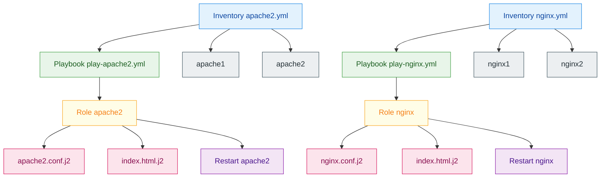

# Ansible 2026

💚 Une formation présentée par Ascent et Andromed.

<div class="pt-12">
  <span @click="next" class="px-2 p-3 rounded cursor-pointer hover:bg-white hover:bg-opacity-10 neon-border">
    Appuyez sur espace pour la page suivante <carbon:arrow-right class="inline"/>
  </span>
</div>


<div class="absolute flex gap-x-2 bottom-0 left-0 p-4 z-50">
      <SlideCurrentNo
        class="dark:!text-white !text-[8px] p-1 w-5 h-5 items-center justify-center flex rounded-full bg-white/10 backdrop-blur-sm border border-gray-600 opacity-80"
      />
      <span class="text-gray-400">/</span>
  <SlideTotal
        class="dark:!text-white !text-[8px] p-1 w-5 h-5 items-center justify-center flex rounded-full bg-white/10 backdrop-blur-sm border border-gray-600 opacity-80"
      />
</div>


<div class="absolute bottom-0 right-0 z-50 flex flex-col gap-y-2 p-2">
<div class="hover:bg-white hover:bg-opacity-10 neon-border border-2 rounded-xl w-[200px] p-2 flex flex-col gap-y-2">
  </img>
  <span class="text-gray-400 text-xs">Programme : <b>4-047</b></span>
  <span class="text-gray-400 text-xs">Lot: <b>4</b></span>
</div>
</div>


---
layout: presenter
eventLogo: 'https://img2.storyblok.com/352x0/f/84560/2388x414/23d8eb4b8d/vue-amsterdam-with-name.png'
eventUrl: 'https://vuejs.amsterdam/'
twitter: '@jimmylansrq'

twitterUrl: 'https://twitter.com/jimmylansrq'
presenterImage: 'https://legacy.andromed.fr/images/fondator.jpg'
---

# Jimmylan Surquin

Fondateur <a  href="https://www.andromed.fr/"><logos-storyblok-icon  mr-1/>Andromed</a>

- Lille, France 🇫🇷
- Création de contenu sur <a href="https://www.youtube.com/channel/jimmylansrq"> <logos-youtube-icon mr-1 /> jimmylansrq </a>
- Blog & Portfolio <a href="https://jimmylan.fr"> jimmylan.fr </a>

---
layout: text-image
media: 'https://i.pinimg.com/originals/f5/5e/80/f55e8059ea945abfd6804b887dd4a0af.gif'
caption: 'ANSIBLE'
---

# Vous connaissez Puppet ? Parfait ! 🎭

### Vous avez déjà les bons réflexes

- ✅ Infrastructure as Code
- ✅ Idempotence
- ✅ Automatisation

**Les différences clés avec Ansible** :
- 🚀 **Agentless** : Pas d'agent à installer (juste SSH)
- 📝 **YAML** : Plus simple que le DSL Puppet
- ⚡ **Push** : Exécution à la demande (vs pull)
- 🎯 **Séquentiel** : Ordre naturel (vs dépendances explicites)

---
layout: two-cols
---

# Comparaison rapide ⚖️

### DSL Puppet

```puppet
class apache {
  package { 'apache2':
    ensure => installed,
  }
  
  service { 'apache2':
    ensure => running,
    enable => true,
    require => Package['apache2'],
  }
}
```

::right::

### YAML Ansible

```yaml
- name: Apache
  hosts: webservers
  tasks:
    - name: Install
      apt:
        name: apache2
        state: present
    
    - name: Start
      service:
        name: apache2
        state: started
```

---

#### Transposition Puppet → Ansible 🔄

<small>

| Puppet | Ansible |
|--------|---------|
| Manifests | Playbooks |
| Classes | Roles |
| Modules | Modules |
| Hiera | Variables/Vault |
| Templates (ERB) | Templates (Jinja2) |
| Facts | Facts |
| Forge | Galaxy |
| Puppet Master | Pas besoin ! |

**Bonne nouvelle** : Les concepts sont les mêmes, seule la syntaxe change ! 🎉

</small>

---

# DISCLAIMER 🐧

### Dans cette formation nous allons voir les commandes principales et les bonnes pratiques d'Ansible en 2026.

---
layout: text-image
media: 'https://media.giphy.com/media/3o7qDEq2bMbcbPRQ2c/giphy.gif'
---

# Pourquoi Docker dans cette formation Ansible ? 🤔

### Docker = Notre infrastructure de test

**Le défi** : Pour apprendre Ansible, il faut plusieurs serveurs à gérer.

**Solutions classiques** :
- ❌ 10 machines virtuelles → Lourd, lent, coûteux
- ❌ Cloud providers → Coûte de l'argent  
- ❌ Vagrant → Encore une techno à installer

---

# Notre solution : Docker comme lab 🐳

### Approche pratique et moderne

**Notre choix** :
- ✅ Docker Compose = 10 containers en 30 secondes
- ✅ Chaque container = Un serveur Linux simulé
- ✅ Ansible les gère comme de vrais serveurs
- ✅ Léger, gratuit, destructible à volonté

**💡 Important** : Docker est juste l'infrastructure de test, **pas le sujet principal** !

En production, vous remplacerez ces containers par de vrais serveurs (VMs, cloud, bare metal).

---

# Setup de notre lab 🔧

### Notre environnement d'entraînement

```yaml
# docker-compose-lab.yml - Infrastructure pour les exercices
# Note: version: obsolète en Docker Compose 2026, on commence directement par services:
services:
  web-server-1:
    image: ubuntu:22.04
    hostname: web01
    command: sleep infinity
  
  web-server-2:
    image: ubuntu:22.04
    hostname: web02
    command: sleep infinity
  
  db-server-1:
    image: ubuntu:22.04
    hostname: db01
    command: sleep infinity
  
  # ... Jusqu'à 10 serveurs selon les besoins
```

---

# Lancement du lab 🚀

### Démarrage rapide de l'infrastructure

```bash
# 1. Lancer tous nos "serveurs" de test
docker-compose -f docker-compose-lab.yml up -d

# 2. Vérifier que tout est up
docker ps

# 3. Tester la connexion à un serveur
docker exec -it web-server-1 bash

# 4. Voilà ! Vous avez 10 serveurs prêts pour Ansible
```

**Résultat** : Infrastructure multi-serveurs opérationnelle en quelques secondes ! 🎉

**Analogie** : C'est comme avoir un datacenter miniature sur votre laptop.

---

# Ansible voit des serveurs, pas des containers 🎯

### La magie de l'abstraction

```yaml
# inventory.yml - Ansible ne sait même pas que ce sont des containers !
all:
  children:
    webservers:
      hosts:
        web01: {ansible_host: web-server-1}
        web02: {ansible_host: web-server-2}
    databases:
      hosts:
        db01: {ansible_host: db-server-1}
```

**Pour Ansible** : Ce sont de vrais serveurs.

**Pour nous** : Ce sont des containers pratiques pour apprendre.

**En prod** : Ce seront vos vraies machines !

---
layout: two-cols
routeAlias: 'sommaire'
---

<a name="SOMMAIRE" id="sommaire"></a>

# SOMMAIRE ANSIBLE 📜

<br>

<div class="flex flex-col gap-2">
<Link to="intro-ansible">🚀 1. Introduction à Ansible</Link>
<Link to="installation-setup">⚙️ 2. Installation et Setup 2026</Link>
<Link to="ci-cd-integration">🔄 3. Intégration CI/CD</Link>
<Link to="inventaires">📋 4. Inventaires et serveurs</Link>
<Link to="playbooks">🎭 5. Playbooks</Link>
<Link to="modules">📦 6. Modules essentiels</Link>
<Link to="variables">🔧 7. Variables</Link>
<Link to="templates">📄 8. Templates Jinja2</Link>
</div>

::right::

<div class="flex flex-col gap-2">
<Link to="roles">📦 9. Rôles</Link>
<Link to="handlers">🎯 10. Handlers</Link>
<Link to="collections">🌐 11. Collections</Link>
<Link to="vault">🔐 12. Ansible Vault</Link>
<Link to="debugging">🐛 13. Debugging & Troubleshooting</Link>
<Link to="bonnes-pratiques">🚀 14. Optimisation & Bonnes pratiques (Bonus)</Link>
<Link to="tags">🏷️ 15. Tags et exécution sélective (Bonus)</Link>
<br/>
<Link to="exercices-ansible">🎯 Exercices pratiques</Link>
<Link to="qcm-ansible">✅ QCM de validation</Link>
<Link to="cheatsheet">📝 Cheatsheet - Référence rapide</Link>
<Link to="cheatsheet-changed">📝 Cheatsheet - Les changed Ansible</Link>
<Link to="cheatsheet-command-shell-raw">📝 Cheatsheet — command, shell et raw</Link>
<Link to="cheatsheet-yaml-anchors">📝 Cheatsheet — ancres YAML (&amp; / *)</Link>
<Link to="cheatsheet-tasks">🚀 CheatSheet - toutes les tâches possible en playbook</Link>
<Link to="exercice-groupe-modules">🚀 Exercice de groupe - modules</Link>
<a target="_blank" href="https://github.com/JSurquin/ansible">📝 Github - Le lien de la formation</a>
</div>

---
layout: two-cols
---

#### PROGRAMME 2 JOURS 📅

> 💡 **Note** : Docker sert uniquement d'infrastructure de test pour simuler plusieurs serveurs. En production, vous utiliserez de vraies machines !

**Jour 1 - Fondamentaux Ansible**

- Introduction à Ansible
- Architecture et concepts
- Installation et configuration
- Inventaires et groupes
- Modules essentiels
- Premiers playbooks
- Variables et facts
- Exercices pratiques niveau 1 & 2

::right::

**Jour 2 - Ansible avancé**

- Roles et organisation
- Templates Jinja2
- Handlers et notifications
- Ansible Vault
- Bonnes pratiques 2026
- Exercices pratiques niveau 3
- Projet final
- QCM de validation

---
src: './pages/ansible.md'
---

---
src: './pages/14-exercices-ansible.md'
---

---
src: './pages/ansible-qcm.md'
---

---
routeAlias: 'cheatsheet'
---

# Cheatsheet Ansible 📝

### Référence rapide des concepts clés

Une aide-mémoire pour retrouver rapidement les concepts essentiels !

---

# Playbook

**Décrit quoi faire et sur quelles machines**

```yaml
- hosts: web
  tasks:
    - name: Installer nginx
      apt: name=nginx state=present
```

---

# Inventory

**Liste des machines ciblées**

```ini
[web]
192.168.1.10
```

---

# Task

**Action unique exécutée par Ansible**

```yaml
- apt: name=nginx state=present
```

---

# Module

**Outil utilisé par une task**

```yaml
- service: name=nginx state=started
```

---

# Role

**Organisation réutilisable de configuration**

```
roles/nginx/tasks/main.yml
```

```yaml
- apt: name=nginx state=present
```

---

# Handler

**Action déclenchée après un changement**

```yaml
- name: restart nginx
  service: name=nginx state=restarted
```

---

# Variable

**Valeur paramétrable**

```yaml
nginx_port: 80
```

---

# Facts

**Infos système automatiques**

```jinja
{{ ansible_hostname }}
```

---

# Template

**Fichier généré dynamiquement**

```nginx
server {
  listen {{ nginx_port }};
}
```

---

# Vault

**Secret chiffré**

```yaml
db_password: !vault |
  $ANSIBLE_VAULT;1.1;AES256
```

---

# Fin de la formation 🎉

### Merci et bon déploiement avec Ansible !

N'oubliez pas : l'automatisation est votre meilleur ami ! 🚀

---
src: './pages/cheatsheet-changed-ansible.md'
---

---
src: './pages/cheatsheet-command-shell-raw.md'
---

---
src: './pages/cheatsheet-yaml-anchors-ansible.md'
---

---
routeAlias: 'exercice-groupe-modules'
---

#### Énoncé de l'exercice

🎯 Objectif de l'exercice

Mettre en place une infrastructure Ansible composée de 4 serveurs :
- 2 serveurs Apache2
- 2 serveurs Nginx

Chaque type de serveur :
- utilise son propre playbook
- est défini dans un inventaire dédié
- possède ses templates spécifiques
- déclenche ses handlers spécifiques

---

#### Exercice de groupe - modules



---

#### Pour vous aider si vous avez un peu de mal avec la structure de l'exercice :

```bash
group_vars/
└── all.yml

inventories/
├── apache2.yml
└── nginx.yml

playbooks/
├── play-apache2.yml
└── play-nginx.yml

roles/
├── apache2/
│   ├── tasks/
│   │   └── main.yml
│   ├── handlers/
│   │   └── main.yml
│   ├── templates/
│   │   ├── apache2.conf.j2
│   │   └── index.html.j2
│   └── vars/
│       └── main.yml
│
└── nginx/
    ├── tasks/
    │   └── main.yml
    ├── handlers/
    │   └── main.yml
    ├── templates/
    │   ├── nginx.conf.j2
    │   └── index.html.j2
    └── vars/
        └── main.yml
```

---
routeAlias: 'correction-exercice-groupe'
---

# 📝 Correction de l'exercice

### La solution complète est disponible dans le dossier `correction/`

---

## 🎯 Démarrage rapide de la correction

### En 4 commandes

```bash
# 1. Se placer dans le dossier correction
cd correction

# 2. Lancer l'infrastructure (4 containers)
docker-compose up -d

# 3. Attendre que les containers soient prêts
sleep 5

# 4. Lancer le script de test automatique
./test.sh
```

**Avec le lab du dépôt** (`docker-compose-lab.yml` à la racine du projet) : `docker compose -f docker-compose-lab.yml up -d` puis `cd correction && ./test-lab.sh` (inventaires `inventories/lab/*.yml`).

---

## 📁 Structure de la correction

```bash
correction/
├── ansible.cfg                 # Config Ansible (chemins)
├── group_vars/all.yml          # Variables globales (doc)
├── inventories/
│   ├── apache2.yml             # 2 serveurs Apache
│   └── nginx.yml               # 2 serveurs Nginx
├── playbooks/
│   ├── play-apache2.yml        # Playbook Apache
│   └── play-nginx.yml          # Playbook Nginx
├── roles/
│   ├── apache2/                # Rôle complet Apache2
│   └── nginx/                  # Rôle complet Nginx
├── docker-compose.yml          # Infrastructure de test
└── test.sh                     # Script de test auto
```

---

## 🔑 Points clés de la solution

### 1. Configuration Ansible (`ansible.cfg`)

```ini
[defaults]
roles_path = ./roles
inventory = ./inventories
host_key_checking = False
stdout_callback = default
result_format = yaml
```

---

### 2. Inventaires avec connexion Docker

### Apache2 (`inventories/apache2.yml`)

```yaml
all:
  vars:
    ansible_connection: docker
  children:
    apache_servers:
      hosts:
        apache1:
          ansible_host: apache-server-1
          server_id: 1
        apache2:
          ansible_host: apache-server-2
          server_id: 2
```

---

### Nginx (`inventories/nginx.yml`)

```yaml
all:
  vars:
    ansible_connection: docker
  children:
    nginx_servers:
      hosts:
        nginx1:
          ansible_host: nginx-server-1
          server_id: 1
        nginx2:
          ansible_host: nginx-server-2
          server_id: 2
```

---

## 3. Playbooks dédiés

### Apache2 (`playbooks/play-apache2.yml`)

```yaml
---
- name: Configuration des serveurs Apache2
  hosts: apache_servers
  become: yes
  roles:
    - apache2
```

---

### Nginx (`playbooks/play-nginx.yml`)

```yaml
---
- name: Configuration des serveurs Nginx
  hosts: nginx_servers
  become: yes
  roles:
    - nginx
```

---

## 4. Rôle Apache2 - Tasks

### `roles/apache2/tasks/main.yml`

```yaml
---
- name: Mettre à jour le cache APT
  apt:
    update_cache: yes
    cache_valid_time: 3600

- name: Installer Apache2
  apt:
    name: "{{ apache_package }}"
    state: present

- name: Créer le répertoire du site web
  file:
    path: "{{ apache_document_root }}"
    state: directory
    mode: '0755'
```

---

### `roles/apache2/tasks/main.yml` (suite)

```yaml
- name: Déployer la configuration Apache2
  template:
    src: apache2.conf.j2
    dest: "{{ apache_config_path }}"
    mode: '0644'
  notify: restart apache2

- name: Déployer la page d'accueil
  template:
    src: index.html.j2
    dest: "{{ apache_document_root }}/index.html"
    mode: '0644'

- name: S'assurer qu'Apache2 est démarré
  service:
    name: "{{ apache_service }}"
    state: started
    enabled: yes
```

---

## 5. Rôle Apache2 - Handlers

### `roles/apache2/handlers/main.yml`

```yaml
---
- name: restart apache2
  service:
    name: "{{ apache_service }}"
    state: restarted

- name: reload apache2
  service:
    name: "{{ apache_service }}"
    state: reloaded
```

---

## 6. Rôle Apache2 - Variables

### `roles/apache2/vars/main.yml`

```yaml
---
apache_package: apache2
apache_service: apache2
apache_document_root: /var/www/html
apache_config_path: /etc/apache2/sites-available/000-default.conf
apache_server_name: apache.local
apache_port: 80
admin_email: admin@example.com
```

💡 **Les variables sont dans les rôles pour la portabilité**

---

## 7. Rôle Apache2 - Template Config

### `roles/apache2/templates/apache2.conf.j2`

```apache
<VirtualHost *:{{ apache_port }}>
    ServerAdmin {{ admin_email }}
    ServerName {{ apache_server_name }}
    DocumentRoot {{ apache_document_root }}

    <Directory {{ apache_document_root }}>
        Options Indexes FollowSymLinks
        AllowOverride All
        Require all granted
    </Directory>

    ErrorLog ${APACHE_LOG_DIR}/error.log
    CustomLog ${APACHE_LOG_DIR}/access.log combined

    # Configuration générée par Ansible
    # Server ID: {{ server_id }}
    # Hostname: {{ ansible_facts['hostname'] }}
</VirtualHost>
```

💡 **Syntaxe Ansible 2026** : `ansible_facts['hostname']`

---

## 8. Structure identique pour Nginx

### Le rôle Nginx suit la même organisation :

- `roles/nginx/tasks/main.yml` - Installation et config
- `roles/nginx/handlers/main.yml` - Restart/reload
- `roles/nginx/vars/main.yml` - Variables spécifiques
- `roles/nginx/templates/nginx.conf.j2` - Config Nginx
- `roles/nginx/templates/index.html.j2` - Page d'accueil

---

## 🧪 Tester la correction

### Commandes de test

```bash
# Tester la connexion
ansible -i inventories/apache2.yml all -m ping
ansible -i inventories/nginx.yml all -m ping

# Exécuter les playbooks
ansible-playbook -i inventories/apache2.yml playbooks/play-apache2.yml
ansible-playbook -i inventories/nginx.yml playbooks/play-nginx.yml

# Vérifier les services
docker exec apache-server-1 service apache2 status
docker exec nginx-server-1 service nginx status
```

---

## 🌐 Accès aux serveurs

### Depuis votre navigateur

- **Nginx 1** : http://localhost:9080
- **Nginx 2** : http://localhost:9081

### Depuis les containers

```bash
# Apache
docker exec apache-server-1 curl http://localhost

# Nginx
docker exec nginx-server-1 curl http://localhost:8080
```

---

## ✅ Test d'idempotence

### Exécuter deux fois le même playbook

```bash
# Première exécution (fait des changements)
ansible-playbook -i inventories/apache2.yml playbooks/play-apache2.yml

# Deuxième exécution (ne doit rien changer)
ansible-playbook -i inventories/apache2.yml playbooks/play-apache2.yml
```

**Résultat attendu** : `changed=0` ✅

---

## 📚 Fichiers de documentation

### Dans le dossier `correction/`

- **QUICKSTART.md** : Démarrage en 2 minutes
- **README.md** : Documentation complète
- **COMMANDS.md** : Toutes les commandes utiles
- **EXPLICATIONS.md** : Concepts détaillés et architecture
- **INDEX.md** : Vue d'ensemble et FAQ
- **test.sh** : Script de test automatique

---

## 💡 Concepts Ansible 2026 illustrés

### Cette correction démontre :

1. ✅ **ansible.cfg** : Configuration du projet (chemins, options)
2. ✅ **Inventaires** : Organisation avec `ansible_connection: docker`
3. ✅ **Playbooks** : Orchestration des déploiements
4. ✅ **Rôles** : Variables encapsulées et réutilisables
5. ✅ **Templates** : Nouvelle syntaxe `ansible_facts['hostname']`
6. ✅ **Handlers** : Gestion intelligente des redémarrages
7. ✅ **Idempotence** : Exécutions répétées sans effets de bord
8. ✅ **Séparation des responsabilités** : Clean Architecture

---

## 🎓 Pour aller plus loin

### Exercices complémentaires

1. Ajouter un 3ème serveur Apache
2. Créer un rôle MySQL
3. Ajouter Ansible Vault pour les secrets
4. Créer un playbook qui déploie tout en une fois

---

## 🎓 Points importants pour 2026

### Nouveautés appliquées :

1. **ansible.cfg** : Configuration du projet
   ```ini
   roles_path = ./roles
   result_format = yaml
   ```

2. **ansible_facts** : Nouvelle syntaxe obligatoire
   ```jinja
   ❌ {{ ansible_hostname }}
   ✅ {{ ansible_facts['hostname'] }}
   ```

3. **Variables encapsulées** : Dans `roles/*/vars/main.yml`

4. **ansible_connection** : Directement dans les inventaires

---

## 📝 Récapitulatif des fichiers clés

### 3 fichiers essentiels à comprendre :

1. **ansible.cfg** → Configuration Ansible
2. **inventories/*.yml** → Serveurs + `ansible_connection`
3. **roles/*/vars/main.yml** → Variables du rôle

### Les templates utilisent :
- Variables : `{{ apache_port }}`
- Facts : `{{ ansible_facts['hostname'] }}`
- Variables d'inventaire : `{{ server_id }}`

---

## 🔧 Nettoyage

### Arrêter l'infrastructure

```bash
# Depuis le dossier correction/
docker-compose down

# Avec suppression des volumes
docker-compose down -v
```
